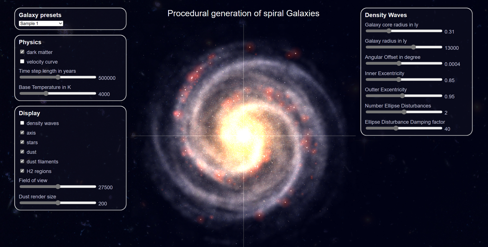



## Andromeda Milky Way collision ✨

 

In roughly four and a half billion years, our Milky Way galaxy 
[will collide](https://en.wikipedia.org/wiki/Andromeda%E2%80%93Milky_Way_collision) with our nearest neighbour, the [Andromeda galaxy](https://en.wikipedia.org/wiki/Andromeda_Galaxy). 

The demo below simulates this future collision. It is based on a very simple model:

👉 Both galaxy's contain only a very limited amount of stars compared
  to the real amounts in both galaxy's (1400 for the Milky way and 2800 for the Andromeda) 
👉 No [super-massive black holes](https://en.wikipedia.org/wiki/Supermassive_black_hole) at the center of either galaxy 
👉 Masses and positions of stars are randomly picked from a normal distribution 
(with a [Box-Müller transform](https://en.wikipedia.org/wiki/Box%E2%80%93Muller_transform)). 
👉 [VPython](https://vpython.org/)&apos;s [`simple_sphere`](https://www.glowscript.org/docs/VPythonDocs/sphere.html#simple-sphere) 
  objects are used to optimize performance.



## Additional information

 

- Even more spectacular and realistic pictures and
  [animations](https://youtu.be/fMNlt2FnHDg) can be found on
  [nasa.gov](https://science.nasa.gov/missions/hubble/nasas-hubble-shows-milky-way-is-destined-for-head-on-collision/).
  
  

- Wikipedia also contains many pictures and a lot of background information on the upcoming
  [Andromeda and Milky Way collision](https://en.wikipedia.org/wiki/Andromeda%E2%80%93Milky_Way_collision)
- [This article](https://www.astronomy.com/science/the-andromeda-and-milky-way-collision-explained/) summarizes
  shortly the possible scenarios for our solar system as well. However, by that time all life will have
  disappeared already on planet Earth, as the sun's luminosity will have increased by over 30% by that time,
  boiling and evaporating the oceans into oblivion.

## Spiral galaxy renderer

 

On this site, you can also find a live demo of a way more advanced 2D spiral galaxy simulator
that is based on the density wave theory (on GitHub &rarr; 
[Galaxy renderer](https://github.com/beltoforion/Galaxy-Renderer-Typescript)). 
It is written by [Ingo Berg](https://github.com/beltoforion) in Typescript. 
Click on the image below to activate this demo!

<figure style="float: center; text-align: center;">
  
  <figcaption>Click on the image to play with a live demo of a way more advanced 2D spiral galaxy renderer!
  </figcaption>
</figure>

