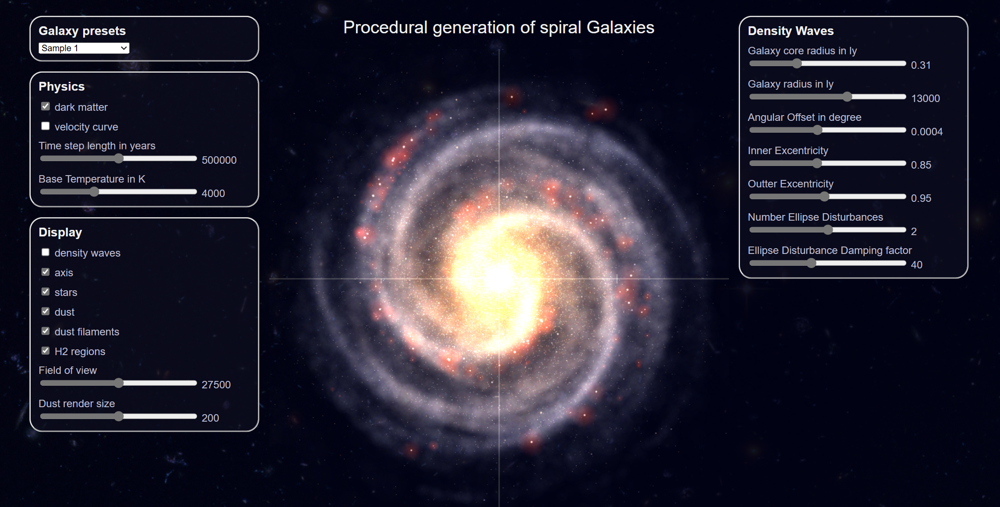



## Andromeda Milky Way collision ✨

 

In roughly four and a half billion years, our Milky Way galaxy 
[will collide](https://en.wikipedia.org/wiki/Andromeda%E2%80%93Milky_Way_collision) with our nearest neighbour, the [Andromeda galaxy](https://en.wikipedia.org/wiki/Andromeda_Galaxy). 

The demo below simulates this future collision. It is based on a very simple model:

👉 No star-star interaction, only gravitational forces from the galaxy cores (= sum of all masses)
👉 Very limited amount of stars compared
  to the real amounts in both galaxy's (1400 for Milky way, 2800 for Andromeda) 
👉 No [super-massive black holes](https://en.wikipedia.org/wiki/Supermassive_black_hole) at the center of either galaxy 
👉 Masses and positions of stars are randomly picked from a normal distribution 
(with a [Box-Müller transform](https://en.wikipedia.org/wiki/Box%E2%80%93Muller_transform)), 
circular velocities are $v=\sqrt{GM/r}$ 

  <canvas class="applicationCanvas" id="galacticCollisionCanvas" style="aspect-ratio: 19/12"></canvas>
  
Click to start the animation!

### 🌌 What am I looking at

 

In this model we use:

$$\begin{equation}
a = \frac{GM}{r^2}
\end{equation}$$

As a consequence

* Inner stars → small $r$ → strong bonding
* Outer stars → big $r$ → weak bonding

The **bonding energy** of a star in a point mass potentiaal is:

$$\begin{equation}
E = -\frac{GMm}{2r}
\end{equation}$$

So as $r$ increases, the energy becomes less negative ⇒ stars are less tightly bound and easier to be slurred away.

#### 💥 During collision

When to two cores approach:

1. Outer stars experience a strong **differential gravitational field**
2. The other galaxy pulls relatively stronger on the outside
3. Tidal forces are being created

This causes:

* Tidal tails
* Material that is being pulled apart
* Thin strands that wind far away.

And since this simulation is based on a 

* A point mass model
* Does not have star-star interaction
* Lacks a dark matter halo 

We observe this effect even stronger than in realistic simulations.

In reality a dark matter halo leads to $v(r) \approx \text{constant}$.
Instead, in this model we have $v(r) \sim \frac{1}{\sqrt{r}}$.
As a consequence, the outer stars are relatively even weaker bound.

## Additional information

 

- Even more spectacular and realistic pictures and
  [animations](https://youtu.be/fMNlt2FnHDg) can be found on
  [nasa.gov](https://science.nasa.gov/missions/hubble/nasas-hubble-shows-milky-way-is-destined-for-head-on-collision/).
  
  

- Wikipedia also contains many pictures and a lot of background information on the upcoming
  [Andromeda and Milky Way collision](https://en.wikipedia.org/wiki/Andromeda%E2%80%93Milky_Way_collision)
- [This article](https://www.astronomy.com/science/the-andromeda-and-milky-way-collision-explained/) summarizes
  shortly the possible scenarios for our solar system as well. However, by that time all life will have
  disappeared already on planet Earth, as the sun's luminosity will have increased by over 30% by that time,
  boiling and evaporating the oceans into oblivion.

## Spiral galaxy renderer

 

On this site, you can also find a live demo of a way more advanced 2D spiral galaxy simulator
that is based on the density wave theory (on GitHub &rarr; 
[Galaxy renderer](https://github.com/beltoforion/Galaxy-Renderer-Typescript)). 
It is written by [Ingo Berg](https://github.com/beltoforion) in TypeScript. 
Click on the image below to activate this demo!

<figure style="float: center; text-align: center;">
  
  <figcaption>Click on the image to play with a live demo of a way more advanced 2D spiral galaxy renderer!
  </figcaption>
</figure>

