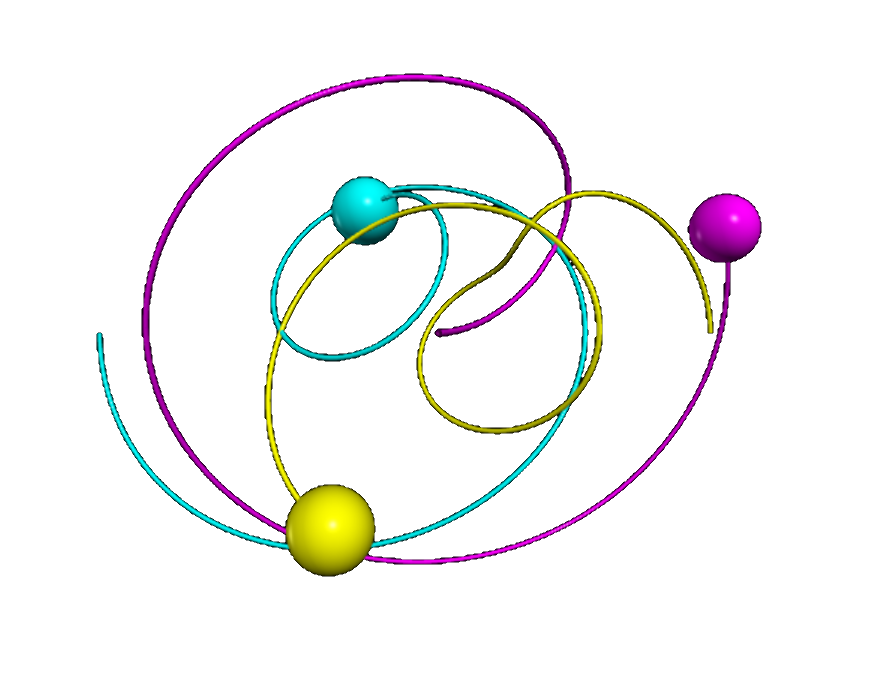



# Astrophysics

 

<blockquote>
We can allow satellites, planets, suns, universe, nay whole systems of universes, 
to be governed by laws, but the smallest insect, we wish to be created at once by 
special act. &mdash; <a href="https://en.wikipedia.org/wiki/Charles_Darwin">Charles Darwin</a>
</blockquote> 

### Daylight variations &mdash; sun-earth-moon model

 

<figure style="float: center; text-align: center;">
  
  <figcaption>A not accurate to scale sun-earth-moon model, but very detailed and instructive!
  It&apos;s main goal is visualizing the change in day length during the course of a year.</figcaption>
</figure>

### Kepler's law &amp; the three-body problem

 

<figure class="left_image">
  
  <figcaption>"You teach your daughters the diameters of the planets and wonder when 
  you are done that they do not delight in your company." &mdash; 
  <a href="https://en.wikipedia.org/wiki/Samuel_Johnson">Samuel Johnson</a></figcaption>
</figure>
<figure class="right_image">
  
  <figcaption><a href="https://en.wikipedia.org/wiki/Kepler%27s_laws_of_planetary_motion">Kepler&apos;s laws</a>
    of planetary motion: "I believe the geometric proportion served the creator as an idea when He 
    introduced the continuous generation of similar objects from similar objects" &mdash; 
    <a href="https://en.wikipedia.org/wiki/Johannes_Kepler">Johannes Kepler</a>.
  </figcaption>
</figure>

### The three-body problem &amp; galactic collision

 

<figure class="left_image">
  
  <figcaption>The well-known <a href="https://en.wikipedia.org/wiki/Three-body_problem">three-body problem</a>,
  for which there exists no analytical solution, so we have to solve it numerically. 
  <a href="https://en.wikipedia.org/wiki/Euler%27s_three-body_problem">Euler&apos;s version</a>
  is exactly solvable though.</figcaption>
</figure>
<figure class="right_image">
  
  <figcaption>The future collision between our own Milky Way and the Andromeda galaxy.</figcaption>
</figure>

### Pulsar

 

<figure class="left_image">
  
  <figcaption>"A pulsar (pulsating star, on the model of quasar) is a highly magnetized rotating 
  neutron star that emits beams of 
  <a href="https://en.wikipedia.org/wiki/Electromagnetic_radiation">electromagnetic radiation</a>
  out of its 
  <a href="https://en.wikipedia.org/wiki/Poles_of_astronomical_bodies#Magnetic_poles">magnetic poles.</a>" 
  &mdash; <a href="https://en.wikipedia.org/wiki/Pulsar">Wikipedia</a></figcaption>
</figure>
<figure class="right_image">
  
  <figcaption>"X-ray binaries are a class of binary stars that are luminous in 
  <a href="https://en.wikipedia.org/wiki/X-ray">X-rays</a>." 
  &mdash; <a href="https://en.wikipedia.org/wiki/X-ray_binary">Wikipedia</a></figcaption>
</figure>


