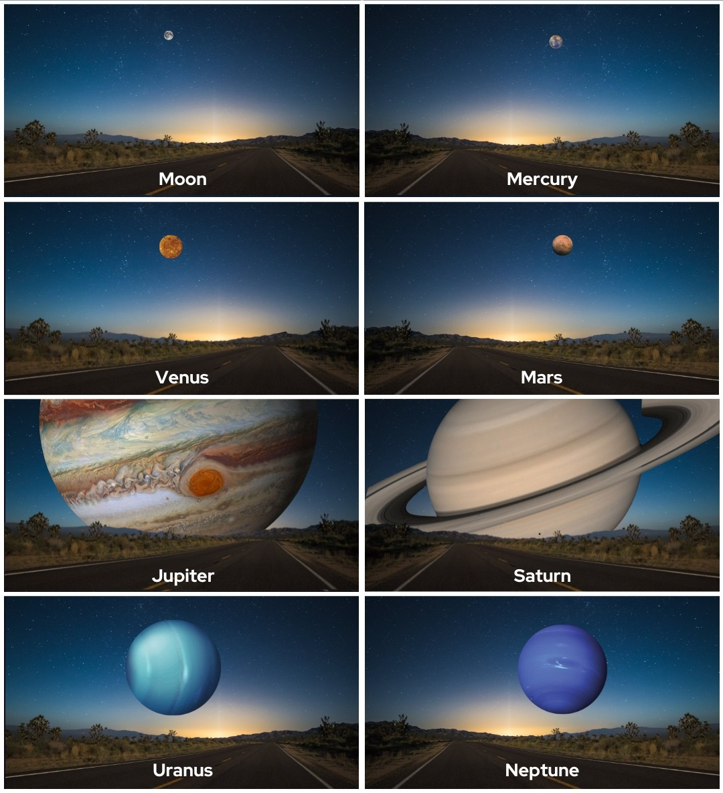
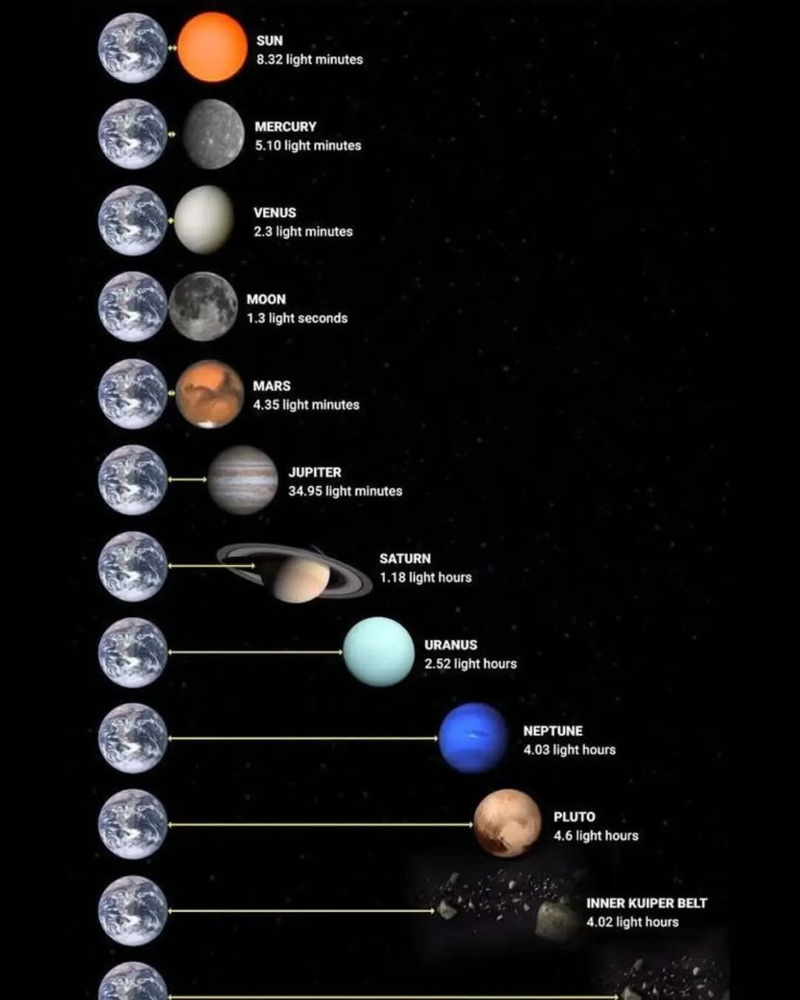
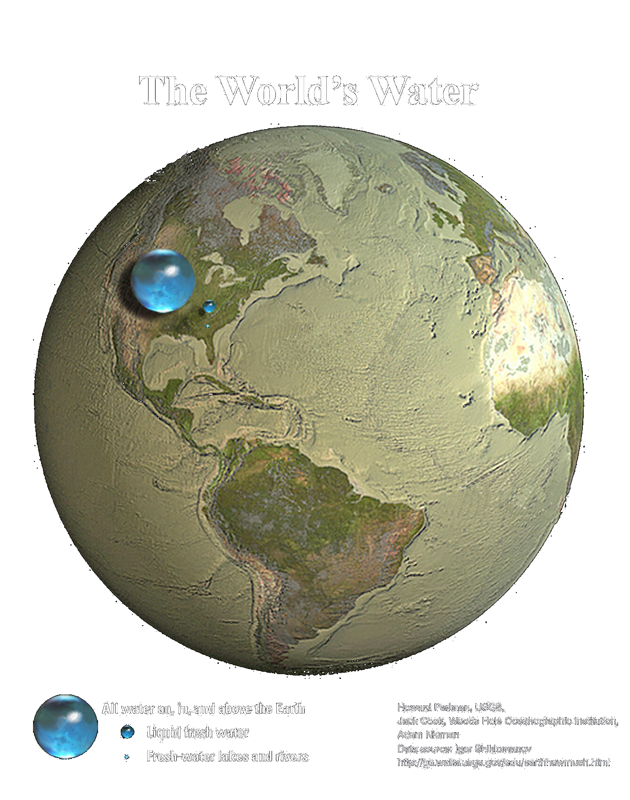



## The planets that make up our solar system

 



### Planet size comparison

 

<figure class="left_image">
  
  <figcaption>View from earth if one of the planets replaced our moon.</figcaption>
</figure>
<figure class="right_image">
  
  <figcaption>Distance to planets expressed in terms of the speed of light.</figcaption>
</figure>

### All water on, in, and above the Earth

 

