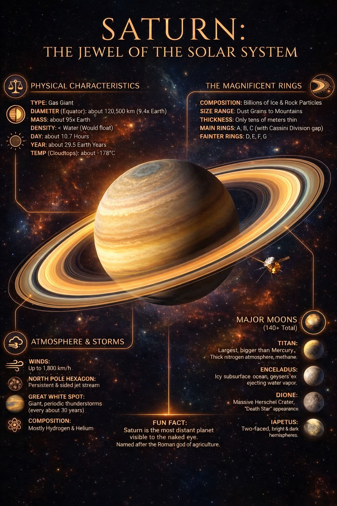



## Saturn rings 🪐

 

Saturn rings modelled as a set of point-like particles.



### Saturn

 

<figure style="text-align: center;">
  
  <figcaption>This excellent visual guide originates from 
    <a href="https://www.facebook.com/HouseOfPhysics/">House of Physics</a>.
  </figcaption>
</figure>



