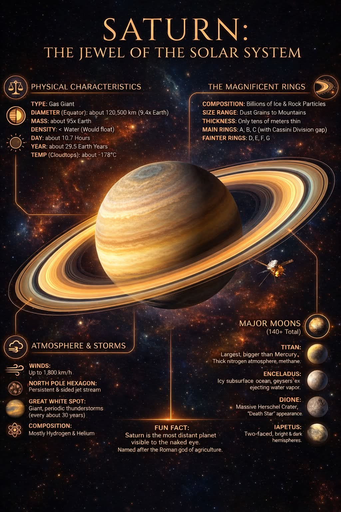



## Solar system

 

&nbsp;&nbsp;
&nbsp;&nbsp;
&nbsp;&nbsp;

🎯 Improved understanding of planetary motions and eclipses 
🔧 [Newton-Raphson method](https://en.wikipedia.org/wiki/Newton%27s_method) for realistic (elliptic) orbits 
🧠 Inspired on [solar-system](https://github.com/lukekulik/solar-system) by [Luke Kulik](https://github.com/lukekulik/), [threex.planets](https://github.com/jeromeetienne/threex.planets) by [Jemore Etienne](https://github.com/jeromeetienne/), and
[solarsystem](https://github.com/pint-drinker/solarsystem) by [Dana Wensberg](https://github.com/pint-drinker/) 
👉 Includes tilt, spin and tidal locking of applicable moons e.g. Earth’s moon 
🚀 Features advanced techniques for rendering earth clouds &amp; subtle corona breathing driven by magnetic turbulence 
🐍 A [VPython demo](https://www.glowscript.org/#/user/zeger.hendrikse/folder/Astrophysics/program/SolarSystem) is available as well, see [solar_system.py](https://github.com/zhendrikse/physics-in-python/blob/main/vpython/solar_system.py) 

  

    <button data-body="sun">🔅 Sun</button>
    <button data-body="mercury">Mercury</button>
    <button data-body="venus">Venus</button>
    <button data-body="earth">🌍 Earth</button>
    <button data-body="mars">Mars</button>
    <button id="farField1">🔭</button>
  

  <canvas class="applicationCanvas" id="planetsCanvas" style="background: black; aspect-ratio: 19 / 12;"></canvas>
  

    <button id="farField2">💫</button>
    <button data-body="jupiter">Jupiter</button>
    <button data-body="saturn">🪐 Saturn</button>
    <button data-body="uranus">Uranus</button>
    <button data-body="neptune">🔱 Neptune</button>
    <button id="zoomIn">🔎</button>
  

## Our planets

 

### Saturn

 

<figure style="text-align: center;">
  
  <figcaption>This excellent visual guide originates from 
    <a href="https://www.facebook.com/HouseOfPhysics/">House of Physics</a>.
  </figcaption>
</figure>

