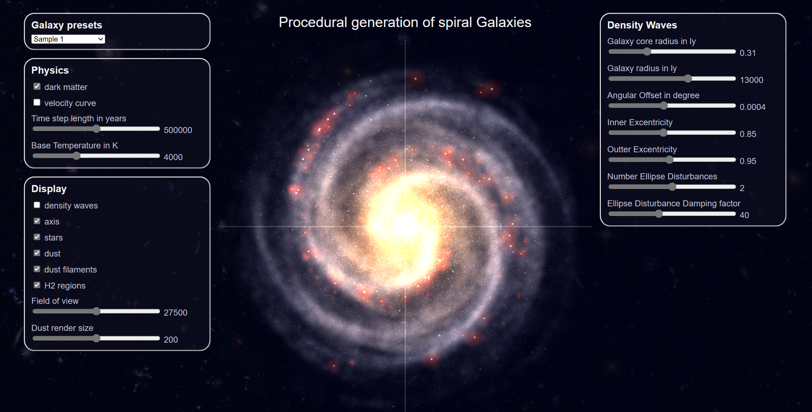



## Spiral galaxy visualization ✨

 

🔧 Original [galaxy_3d_Medium.py](https://gist.github.com/rlvaugh/a49bf875890581f338a000c2b5c3a2bb) by [Lee Vaughan](https://towardsdatascience.com/author/lee_vaughan/)  
⭐ The (theory behind the) code is thoroughly explained in his [accompanying article](https://towardsdatascience.com/create-3-d-galactic-art-with-matplotlib-a7534148a319/)  
👉 [spiral_galaxy.js](https://github.com/zhendrikse/science/blob/main/astrophysics/spiral_galaxy.js) is a port to JavaScript and [Three.js](https://threejs.org/)  
🔥 JavaScript version has been extended with coloring and fading ([Zeger Hendrikse](https://www.hendrikse.name/))

<canvas class="applicationCanvas" id="galaxyCanvas" style="aspect-ratio: 19 / 12"></canvas>

👉 **Core / Bulge (Central Region)** 
Warm yellow-white coloration due to the extremely high stellar density in the galactic core.
Although the core is dominated by older stellar populations, the combined light of many stars produces a bright, smooth, slightly warm appearance rather than distinctly red individual stars.

👉 **Spiral Arms (Mid-disk)** 
Bluish-white coloration representing regions of active star formation.
The spiral arms contain young, hot, massive stars that appear brighter and more point-like, producing a sharper, higher-contrast structure compared to the core.

👉 **Outer Disk and Fading Regions** 
Gradually decreasing brightness and visibility with increasing distance from the center.
Stars become sparser and less luminous, causing the outer regions to fade smoothly into darkness rather than forming a distinct, visible halo.

## Spiral galaxy renderer

 

On this site, you can also find a live demo of a way more advanced 2D spiral galaxy simulator
that is based on the density wave theory (on GitHub &rarr; 
[Galaxy renderer](https://github.com/beltoforion/Galaxy-Renderer-Typescript)). 
It is written by [Ingo Berg](https://github.com/beltoforion) in TypeScript. 
Click on the image below to activate this demo!

<figure style="text-align: center;">
  
  <figcaption>Click on the image to play with a live demo of a way more advanced 2D spiral galaxy renderer!
  </figcaption>
</figure>

## About spiral galaxies

 

<blockquote>
Hubble distinguished between elliptical galaxies and spiral galaxies. 
The elliptical galaxies were rated based on their eccentricity and given identifiers ranging from E0 to E7 
with the eccentricity increasing towards E7.

The type S0 is an intermediary form of galaxy that marks the transition to the spiral galaxies. 
Spiral galaxies were separated into two categories on their own. The spiral galaxies and (Sa bis Sc) 
and the barred spiral galaxies (SBa bis SBc). &mdash; 
<a href="https://beltoforion.de/en/spiral_galaxy_renderer/">Rendering a Galaxy with the density wave theory</a>
</blockquote> 

<figure style="float: center; text-align: center;">
  
  <figcaption>Classification of galaxies according to Edwin Hubble; Courtesy of: Ville Koistinen (CC BY-SA 3.0) </figcaption>
</figure>

