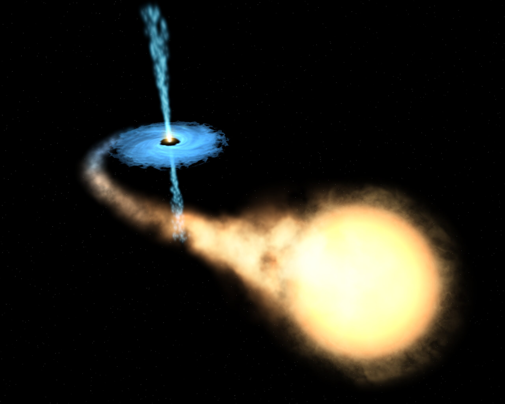



## X-ray Binary Stars

 

<blockquote>
A special class of binary stars is the X-ray binaries, so-called because they emit X-rays. 
X-ray binaries are made up of a normal star and a collapsed star (a white dwarf, neutron star, or black hole). 
These pairs of stars produce X-rays if the stars are close enough together that material is pulled off the normal 
star by the gravity of the dense, collapsed star. The X-rays come from the area around the collapsed star 
where the material that is falling toward it is heated to very high temperatures (over a million degrees!). &mdash;
<a href="https://imagine.gsfc.nasa.gov/science/objects/binary_stars1.html">nasa.gov</a>
</blockquote>

This simulation shows such a binary star system. 
Matter from the red giant is spilling through the [Roche lobe](https://en.wikipedia.org/wiki/Roche_lobe) 
onto the collapsed star, via a hot spot and an accretion disk.



### Artist impression of an X-ray binary system

 

