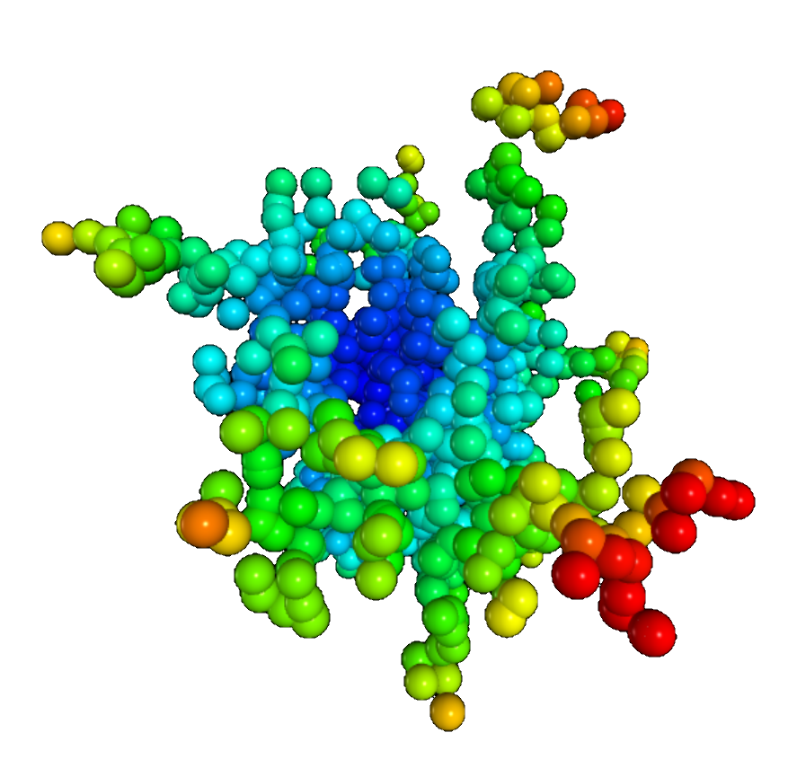



# Two- and three-dimensional diffusion limited aggregation (DLA)

 

### DLA starting from a circle / sphere

 

<figure class="left_image">
  
  <figcaption>Two-dimensional diffusion limited aggregation.</figcaption>
</figure>
<figure class="right_image">
  
  <figcaption>Three-dimensional diffusion limited aggregation.</figcaption>
</figure>

### Slowly descending particles

 

<figure class="left_image">
  
  <figcaption>Growing coral-like structures using diffusion limited aggregation.</figcaption>
</figure>
<figure class="right_image">
  <!-- SPACE RESERVED FOR FUTURE APPLICATION
    -->
</figure>


