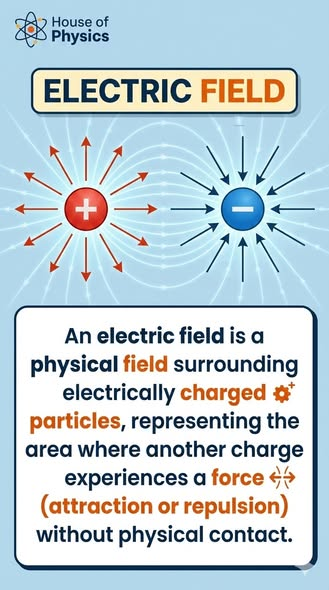
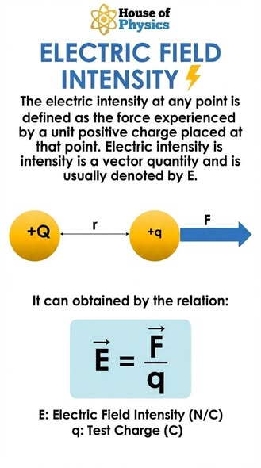



## Electric dipole field

 



## Understanding electric fields

 

<figure class="left_image">
  
  <figcaption>This visual originates from 
    <a href=https://www.facebook.com/HouseOfPhysics/">House of Physics</a>.</figcaption>
</figure>
<figure class="right_image">
  
  <figcaption>This visual originates from 
    <a href=https://www.facebook.com/HouseOfPhysics/">House of Physics</a>.</figcaption>
</figure>



