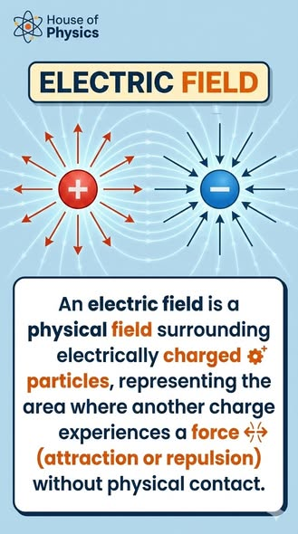
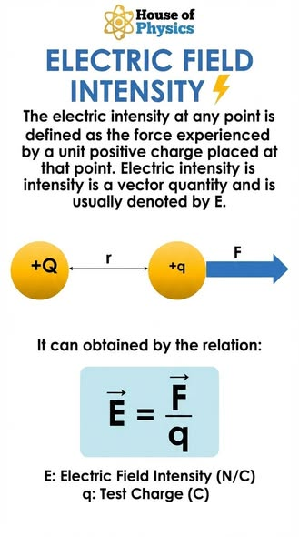



## Electric dipole field

 

&nbsp;&nbsp;
&nbsp;&nbsp;
&nbsp;&nbsp;

🎯 Visualization of electric dipole field:

$$
\vec{E} ( \vec{r} ) = -\dfrac {1} {4\pi\epsilon_0} \nabla \bigg( \dfrac{\vec{r}  \cdot \vec{p}} {r^3} \bigg),\quad \vec{p}=+q(\vec{r}_+) + -q(\vec{r}_-)
$$

<canvas id="dipoleCanvas" class="applicationCanvas" style="aspect-ratio: 2/1;"></canvas>

    <label for="fieldStrength">Field </label><input type="range" id="fieldStrength" min="0.1" max="2" step="0.01" value="1"/>
    <label for="autoRotate">Auto-rotate </label><input type="checkbox" id="autoRotate"/>

🐍 A [VPython demo](https://www.glowscript.org/#/user/zeger.hendrikse/folder/Electromagnetism/program/Electricdipolefield) is available as well, see [dipole_field.py](https://github.com/zhendrikse/physics-in-python/blob/main/vpython/circular_aperture.py) 

### Understanding electric fields

 

<figure class="left_image">
  
  <figcaption>This visual originates from 
    <a href="https://www.facebook.com/HouseOfPhysics/">House of Physics</a>.</figcaption>
</figure>
<figure class="right_image">
  
  <figcaption>This visual originates from 
    <a href="https://www.facebook.com/HouseOfPhysics/">House of Physics</a>.</figcaption>
</figure>



