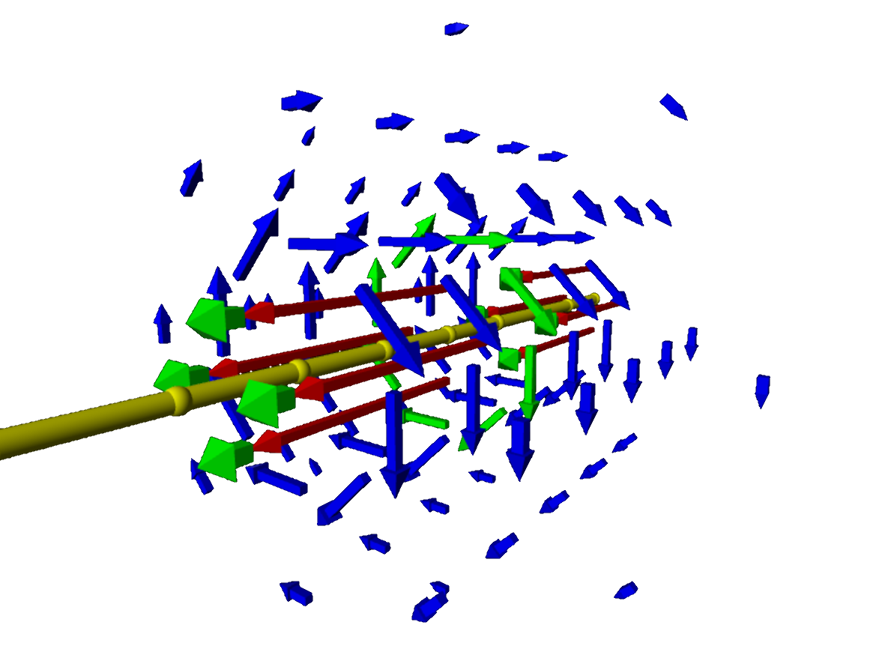



# Electromagnetism

 

<blockquote>
Nothing is too wonderful to be true if it be consistent with the laws of nature. &mdash;
<a href="https://en.wikipedia.org/wiki/Michael_Faraday">Michael Faraday</a>
</blockquote> 

### Electron movement in electric fields

 

<figure class="left_image">
  
  <figcaption>Electron moving around a charged sheet.</figcaption>
</figure>
<figure class="right_image">
  
  <figcaption>If the atomic nucleus were a charged ring&#x2026;</figcaption>
</figure>

### Charged particle behaviour in magnetic and electric fields

 

<figure class="left_image">
  
  <figcaption> Discover how a particle&apos;s velocity and the electric field strength influence one another.</figcaption>
</figure>
<figure class="right_image">
  
  <figcaption>Playfully discover how a charged particle behaves in a magnetic field.</figcaption>
</figure>

### Electric dipole and electromagnetic waves

 

<figure class="left_image">
  
  <figcaption>Electromagnetic waves propagating from an antenna.</figcaption>
</figure>
<figure class="right_image">
  
  <figcaption><a href="https://en.wikipedia.org/wiki/Electric_dipole_moment">Electric dipole moment.</a></figcaption>
</figure>

  
<a>&dArr; Background: electric fields around dipoles and point charges &dArr;</a>

For dipoles the field is given by

$$\vec{E} ( \vec{r} ) = \dfrac {1} {4\pi\epsilon_0} \dfrac {Q} {r^2} \hat{r}, \text{ with } \vec{F}(\vec{r}) = q \vec{E} (\vec{r}) = \dfrac {1} {4\pi\epsilon_{0}} \dfrac {qQ} {r^2}\hat{r} \text{ }$$

and for point charges by

$$\vec{E} ( \vec{r} ) = -\dfrac {1} {4\pi\epsilon_0} \nabla \bigg( \dfrac{\vec{r}  \cdot \vec{p}} {r^3} \bigg), \text{ where } \vec{p} = +q(\vec{r_{+}}) + -q(\vec{r_{-})}$$

### Electric and magnetic fields

 

<figure class="left_image">
  
  <figcaption>Visualization of Faraday's law by running an electric current (of electric charges) through a wire.</figcaption>
</figure>
<figure class="right_image">
    
  <figcaption>Visualization of an electric field inside a series of charged rings.</figcaption>
</figure>



