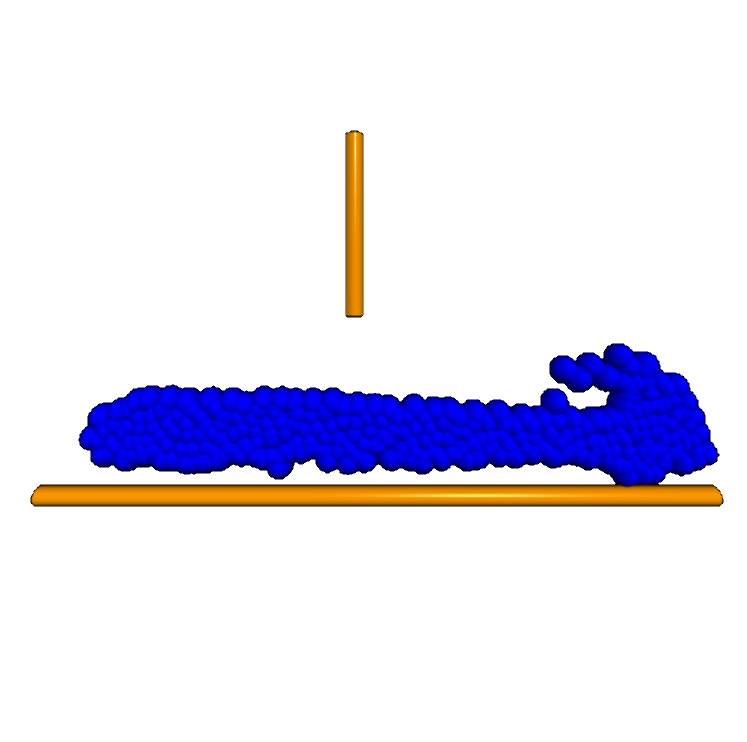
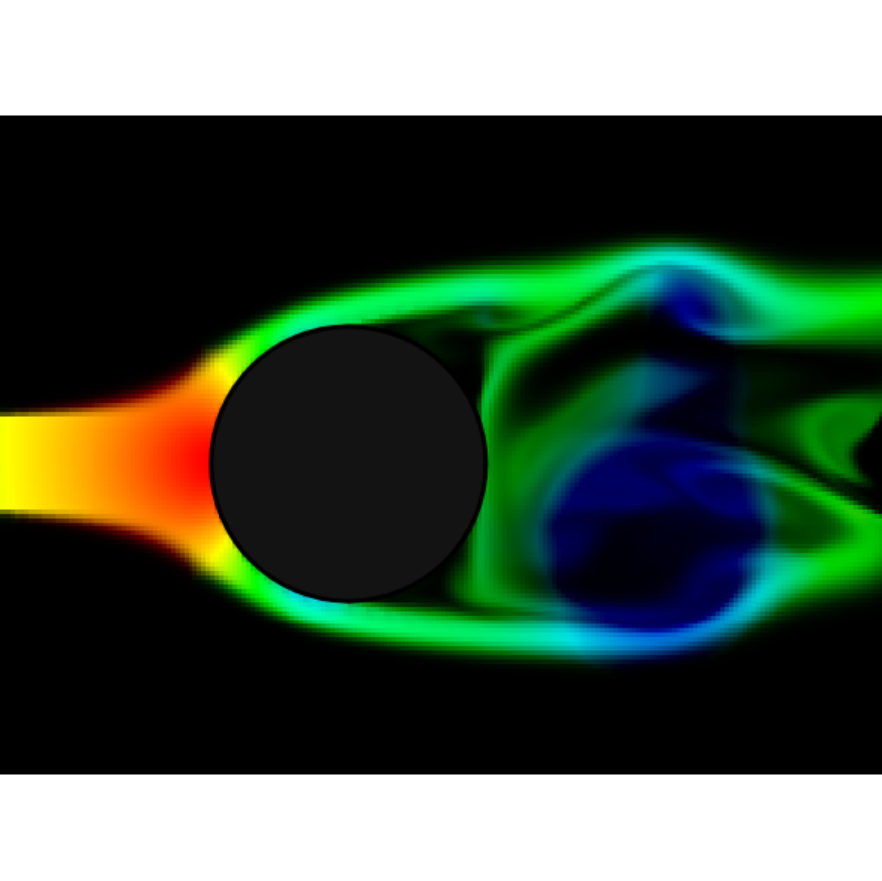



# Computational fluid dynamics

 

### Non-mixing fluids and smoothed particle hydrodynamics

 

<figure class="left_image">
  
  <figcaption>A simulation that shows the separation of non-mixing fluids.</figcaption>
</figure>
<figure class="right_image">
  
  <figcaption>A fluid simulation using <a href="https://en.wikipedia.org/wiki/Smoothed-particle_hydrodynamics">smoothed particle hydrodynamics</a>.</figcaption>
</figure>

### Fluid simulation

 

<figure class="left_image">
  
  <figcaption>A fluid simulation in pure Javascript.</figcaption>
</figure>
<figure class="right_image">
    <!-- SPACE RESERVED FOR FUTURE APPLICATIONS 
      -->
</figure>


