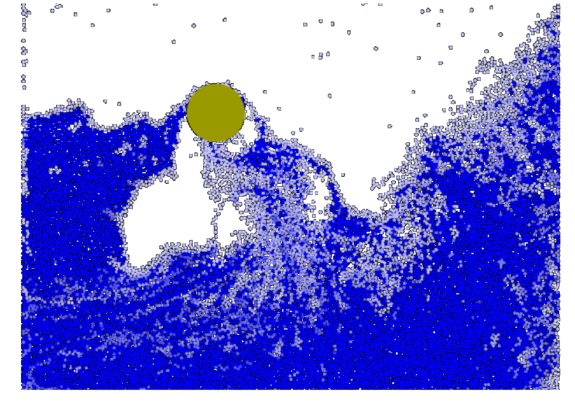



## Smoothed Particle Hydrodynamics (SPH)

 



## A more sophisticated simulation in pure Javascript

 

[Matthias Müller](https://www.matthiasMueller.info/tenMinutePhysics) wrote
a more sophisticated fluid simulation that is implemented using a so-called grid-based 
or Eulerian approach. He personally elaborates on this simulation 
in [this video](https://www.youtube.com/watch?v=XmzBREkK8kY) 
on his [Ten Minute Physics](https://www.youtube.com/c/TenMinutePhysics) YouTube channel.

<figure style="float: center; text-align: center;">
  
  <figcaption>Click on the above image to activate the Euler-based water simulation 
  which was implemented using pure Javascript by 
  <a href="https://www.matthiasMueller.info/tenMinutePhysics">Matthias Müller</a>.</figcaption>
</figure>

## Smoothed Particle Hydrodynamics explained

 

Smoothed Particle Hydrodynamics (SPH) was originally 
designed for astrophysical simulation some decades ago, 
but is finding a place more and more for simulations of things like water.
It is a way of modeling fluids by representing a
fluid by a collection of particles. Subsequently, we can compute the forces on each particle.
SPH is widely used in gaming platforms such as [Algodoo](https://en.wikipedia.org/wiki/Algodoo).

If we were to choose a grid-based approach (also termed "Eulerian approach"), 
we would have to have a grid with some particular size and could only have fluid inside that grid. 
With the particle-based approach (termed a "Lagrangian approach") adopted by SPH, we don’t have to 
worry about a grid in order to calculate our forces
(this isn’t completely true though, as we will see with some performance considerations later). 

Also, the convection term from the previous section is completely absent in this approach because 
all the information about the fluid is stored in the particles themselves and moves when the particles move. 
This means a little less computation for us. The only big downside to SPH is that without a correction 
(which isn’t going to be done here because the results are still fine for a basic implementation), 
the compressibility constraint we wanted to satisfy isn’t exactly going to be honored. 
The fluid will compress and decompress sometimes. SPH works by a method of weighting forces between two 
adjacent particles based on a non-linear weighting kernel which ends up being a radial basis function 
of distance between particles. 

All of this said, the above, basic SPH system is much simpler, 
easier to understand, and gives pretty good results. It also contains many 
implicit/possible extension points.  

We are going to compute a few quantities for every particle, 
and then use these data to derive the forces. The radius of 
support for the weights is used makes sure that all particles 
outside this radius of support have no contribution.


