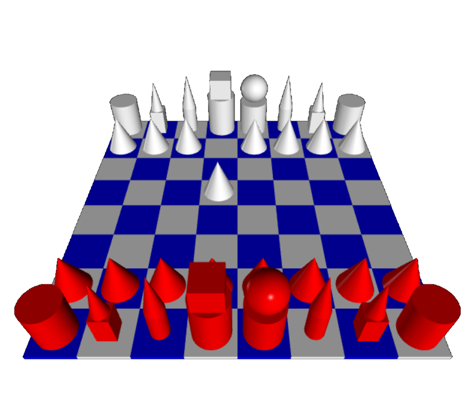

git 

# Fun stuff with [VPython](https://vpython.org/) 

 

### Chessboard & animated face

 

<figure class="left_image">
    
  <figcaption>Animated face.</figcaption>
</figure>
<figure class="left_image">
  
  <figcaption>Simple chess game with moving pieces.</figcaption>
</figure>

### Rubik&apos;s cube &amp; turtle robot

 

<figure class="left_image">
  
  <figcaption> “If you are curious, you'll find the puzzles around you 
  If you are determined, you will solve them. &mdash; Erno Rubik.” </figcaption>
</figure>
<figure class="right_image">
  
  <figcaption> 
  <a href="https://github.com/possibly-wrong/vturtle">VPython-based robot simulator and turtle graphics engine</a>
  ported from installed VPython to the web.
  </figcaption>
</figure>

### Odysseus

 

<figure>
  
  <figcaption>Odysseus, created by Maximillian DeMarr.</figcaption>
</figure>



