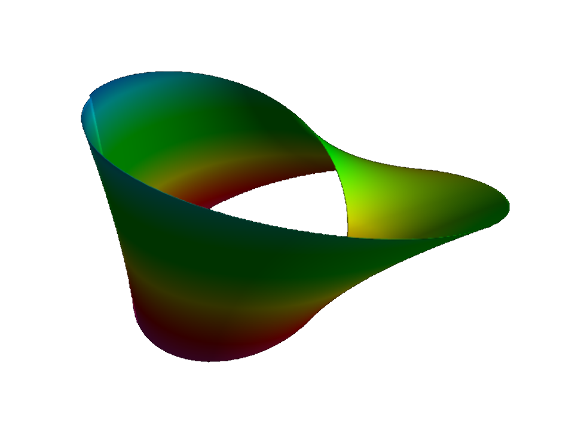
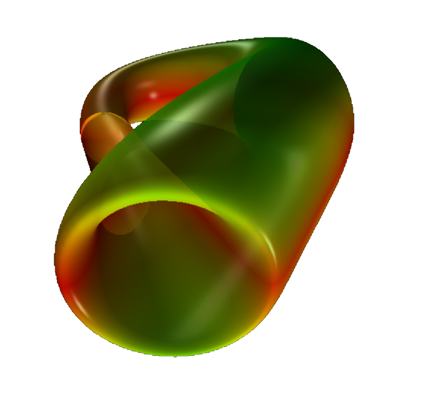

<blockquote>
Philosophy is written in this grand book &mdash; I mean universe &mdash; which stands continuously open to our gaze, 
but which cannot be understood unless one first learns to comprehend the language in which it is written. 
It is written in the language of mathematics, and its characters are triangles, circles and other geometric figures, 
without which it is humanly impossible to understand a single word of it; without these, one is wandering about 
in a dark labyrinth. &mdash; 
<a href="https://en.wikipedia.org/wiki/Galileo_Galilei">Galileo Galilei</a> (1623).
</blockquote>

 

# Welcome to my Math Art Gallery 

All geometric shapes below were created with basically the same plotting software 
that I have written in VPython.

## Toroids

 

<figure style="float: left; width: 50%; text-align: center">
  
  <figcaption>A torus, a connected orientable surface of 
    <a href="https://en.wikipedia.org/wiki/Genus_%28mathematics%29">genus one</a>.
  </figcaption>
</figure>
<figure style="float: right; width: 50%; text-align: center">
  
  <figcaption><a href="https://en.wikipedia.org/wiki/Trefoil_knot">Trefoil knot</a>, the simplest
  (non-trivial) knot.</figcaption>
</figure>

<figure style="float: left; width: 50%; text-align: center">
  
  <figcaption>Double torus.</figcaption>
</figure>
<figure style="float: right; width: 50%; text-align: center">
  
  <figcaption>A twisted torus.</figcaption>
</figure>

## Non-orientable surfaces

 

### Möbius strip &amp; Klein&apos;s bottle

 

<figure style="float: right; width: 50%; text-align: center">
  
  <figcaption>The well-known <a href="https://en.wikipedia.org/wiki/M%C3%B6bius_strip">Möbius strip</a>,
  perhaps the most well-known non-orientable surface.</figcaption>
</figure>
<figure style="float: right; width: 50%; text-align: center">
  
  <figcaption><a href="https://en.wikipedia.org/wiki/Klein_bottle">Klein&apos;s bottle</a> can be
  obtained by gluing two Möbius strips together.</figcaption>
</figure>

### The real projective plane

 

<figure style="float: left; width: 50%; text-align: center">
  
  <figcaption>Self-intersecting plane.</figcaption>
</figure>
<figure style="float: right; width: 50%; text-align: center">
  <!--
  
  <figcaption><a href="https://paulbourke.net/geometry/crosscap/">Paul Bourke&apos;s parametrization</a> 
  for the <a href="https://mathworld.wolfram.com/Cross-Cap.html">cross cap</a>.</figcaption>
  -->
</figure>

## Spirals

 

<!--details>
  
<a>&dArr; Click for more information on these geometric objects &uArr;</a>

  Dini&apos;s spiral, Dini&apos;s surface, or twisted pseudo-sphere 
  is characterized by a surface of constant (negative) curvature 
  and is named after Ulisse Dini.
</details-->

<figure style="float: left; width: 50%; text-align: center">
  
  <figcaption>Dini&apos;s spiral, <a href="https://en.wikipedia.org/wiki/Dini%27s_surface">Dini&apos;s surface</a>, 
  or twisted pseudo-sphere: characterized by a surface of constant (negative) curvature, 
  named after Ulisse Dini.</figcaption>
</figure>
<figure style="float: right; width: 50%; text-align: center">
  
  <figcaption>Nature meets mathematics: a purely mathematically generated seashell, with the parametrization 
  found on <a href="https://paulbourke.net/geometry/spiral">Paul Bourke&apos;s</a> site.
  </figcaption>
</figure>

## Miscellaneous

 

<figure style="float: left; width: 50%; text-align: center">
  
  <figcaption>A dented object.</figcaption>
</figure>
<figure style="float: right; width: 50%; text-align: center">
  
  <figcaption>Arc.</figcaption>
</figure>

<figure style="float: left; width: 50%; text-align: center">
  
  <figcaption>Combined ball and torus.</figcaption>
</figure>
<figure style="float: right; width: 50%; text-align: center">
  
  <figcaption>Lemniscate of Gerono, defined by $x^4 - x^2 + y^2 + z^2 = 0$.</figcaption>
</figure>


