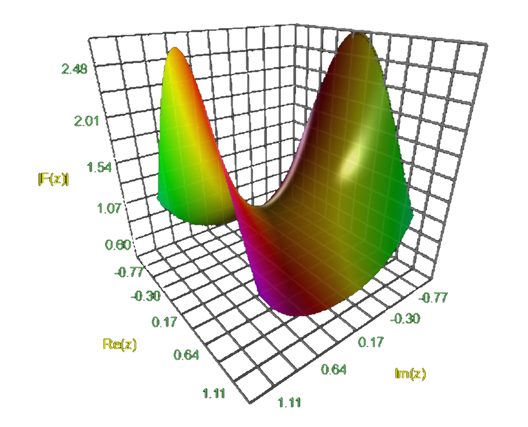
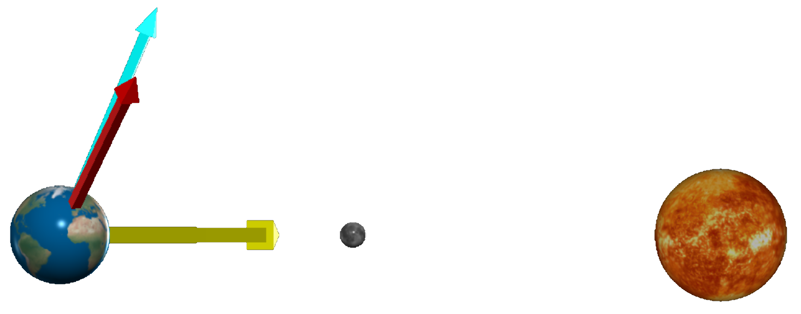
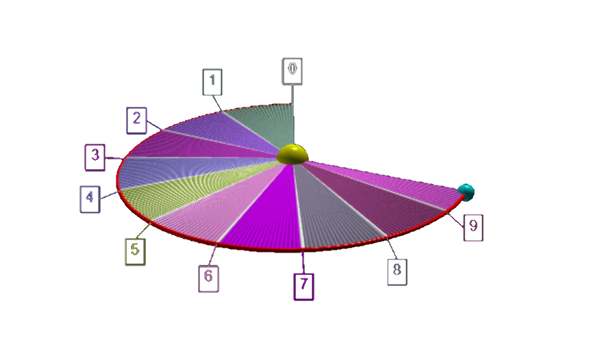
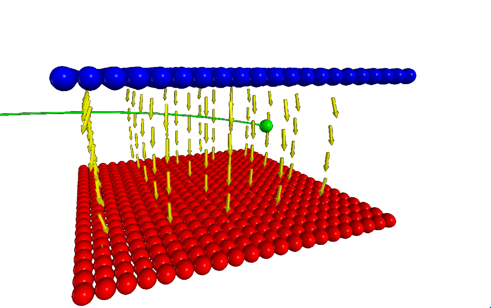
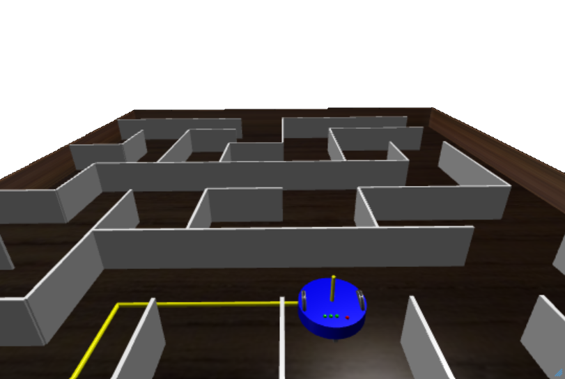



<blockquote>
The feeling of awed wonder that science can give us is one of the highest experiences 
of which the human psyche is capable. It is a deep aesthetic passion to rank with the 
finest that music and poetry can deliver. &mdash;
<a href="https://en.wikipedia.org/wiki/Richard_Dawkins">Richard Dawkins</a> in 
<a href="https://en.wikipedia.org/wiki/Unweaving_the_Rainbow">Unweaving the Rainbow</a>, 1998.
</blockquote> 

# Mathematics

 

  

    <h2><a href="mathematics/index.html">3D function plots</a></h2>
    

      <figure class="left_image">
        &nbsp;&nbsp;&nbsp;
      </figure>
      <figure class="right_image">
        
      </figure>
    

    

      <figure class="left_image">
        
      </figure>
      <figure class="right_image">
        
      </figure>
      
<a style="font-color: red; font-weight: bold;" href="mathematics/index.html">Learn more &#x2026;</a>

    

  

  

    <h2><a href="mathematics/gallery/index.html">Topological surfaces</a></h2>
    

      <figure class="left_image">
        
      </figure>
      <figure class="right_image">
        
      </figure>
    

    

      <figure class="left_image">
        
      </figure>
      <figure class="right_image">
        
      </figure>
    

  

  

# Physics

 

<!--                 -->
<!-- Astro and Waves -->
<!--                 -->

  

    <h2><a href="astrophysics/index.html">Astrophysics</a></h2>
    

      <figure class="left_image">
        
      </figure>
      <figure class="right_image">
        
      </figure>
    

    

      <figure class="left_image">
        
      </figure>
      <figure class="right_image">
        <!-- RESERVED FOR FUTURE APPLICATION -->
      </figure>
    

  

  

    <h2><a href="waves/index.html">Waves</a></h2>
    

      <figure class="left_image">
       
      </figure>
      <figure class="right_image">
       
      </figure>
    

    

      <figure class="left_image">
        
      </figure>
      <figure class="right_image">
        <!-- RESERVED FOR FUTURE APPLICATION -->
      </figure>
    

  

  

<!--                              -->
<!-- Nature and molecular physics -->
<!--                              -->

  

    <h2><a href="nature/index.html">Our daily environment</a></h2>
    

      <figure class="left_image">
        
      </figure>
      <figure class="right_image">
        
      </figure>
    

    

      <figure class="left_image">
        
      </figure>
      <figure class="right_image">
        
      </figure>
    

    

      <figure class="left_image">
        
      </figure>
      <figure class="right_image">
        
      </figure>
    

  

  

    <h2><a href="molecularphysics/index.html">Atomic &amp; molecular physics</a></h2>
    

      <figure class="left_image">
       
      </figure>
      <figure class="right_image">
       
      </figure>
    

    

      <figure class="left_image">
        
      </figure>
      <figure class="right_image">
        
      </figure>
    

  

  

<!--                            -->
<!-- Quantum and thermodynamics -->
<!--                            -->

  

    <h2><a href="quantumphysics/index.html">Quantum physics</a></h2>
    

      <figure class="left_image">
        
      </figure>
      <figure class="right_image">
        
      </figure>
    

    

      <figure class="left_image">
        
      </figure>
      <figure class="right_image">
        <!-- RESERVED FOR FUTURE APPLICATION -->
      </figure>
    

  

  

    <h2><a href="thermodynamics/index.html">Statistical physics</a></h2>
    

      <figure class="left_image">
       
      </figure>
      <figure class="right_image">
       
      </figure>
    

  

  

<!--                                 -->
<!-- Electromagnetism and kinematics -->
<!--                                 -->

  

    <h2><a href="electromagnetism/index.html">Electric &amp; magnetic fields</a></h2>
    

      <figure class="left_image">
        
      </figure>
      <figure class="right_image">
        
      </figure>
    

    

      <figure class="left_image">
        
      </figure>
      <figure class="right_image">
        
      </figure>
    

    

      <figure class="left_image">
        
      </figure>
      <figure class="right_image">
        
      </figure>
    

    

      <figure class="left_image">
        
      </figure>
      <figure class="right_image">
        
      </figure>
    

  

  

    <h2><a href="kinematics/index.html">Kinematics</a></h2>
    

      <figure class="left_image">
        
      </figure>
      <figure class="right_image">
        
      </figure>
    

    

      <figure class="left_image">
        
      </figure>
      <figure class="right_image">
        
      </figure>
    

    

      <figure class="left_image">
        
      </figure>
      <figure class="right_image">
        
      </figure>
    

    

      <figure class="left_image">
        
      </figure>
      <figure class="right_image">
        
      </figure>
    

  

  

# Fun

 

<!--           -->
<!-- Fun stuff -->
<!--           -->

  

    <h2><a href="fun/index.html">Fun stuff</a></h2>
    

      <figure class="left_image">
        
      </figure>
      <figure class="right_image">
        
      </figure>
    

  

  

    <h2><a href="obsolete/index.html">Obsolete</a></h2>
    

      <figure class="left_image">
       
      </figure>
      <figure class="right_image">
       
      </figure>
    

    

      <figure class="left_image">
       
      </figure>
      <figure class="right_image">
       
      </figure>
    

  

  

