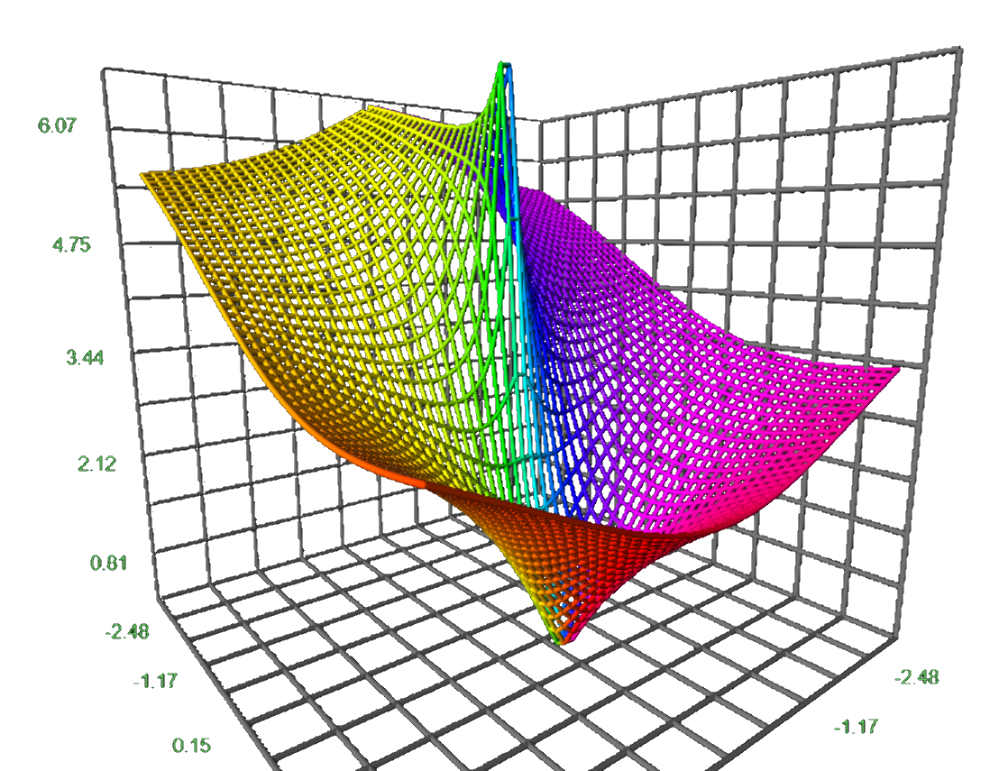
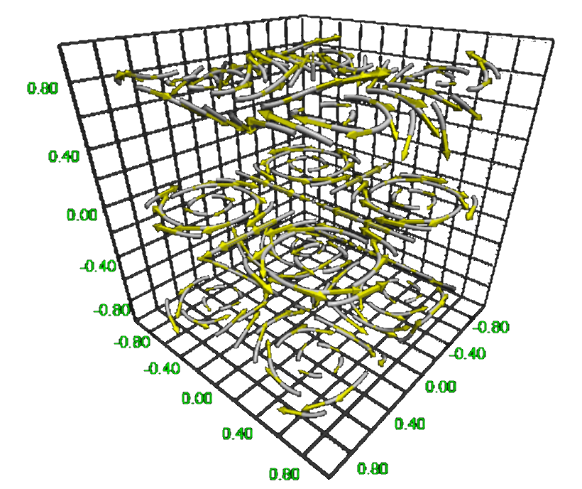
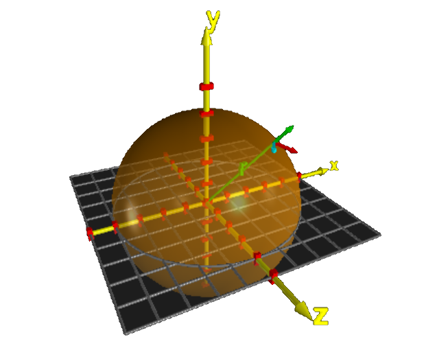
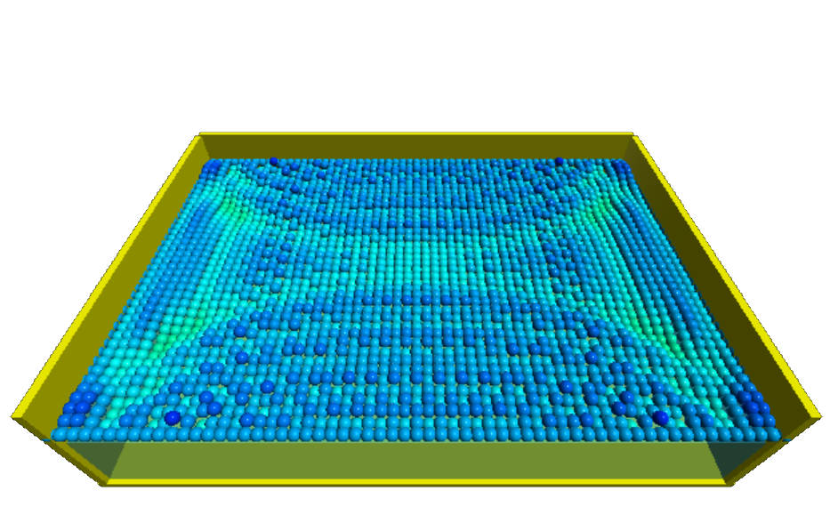
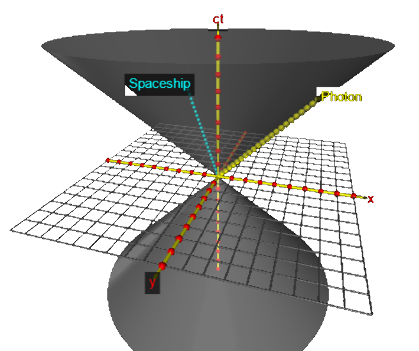
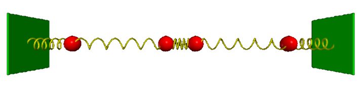
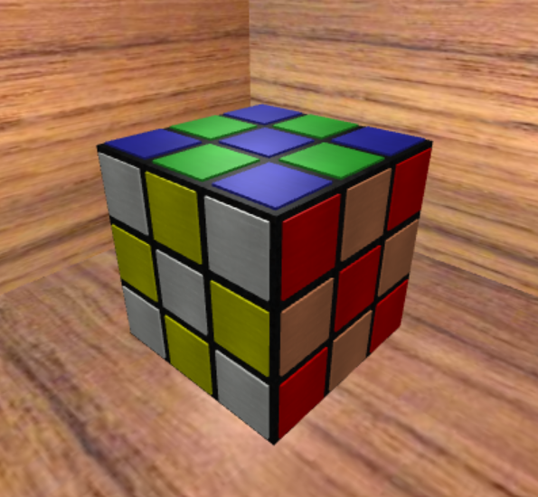



<blockquote>
The feeling of awed wonder that science can give us is one of the highest experiences 
of which the human psyche is capable. It is a deep aesthetic passion to rank with the 
finest that music and poetry can deliver. &mdash;
<a href="https://en.wikipedia.org/wiki/Richard_Dawkins">Richard Dawkins</a> in 
<a href="https://en.wikipedia.org/wiki/Unweaving_the_Rainbow">Unweaving the Rainbow</a>, 1998.
</blockquote> 

# Mathematics

 

  

    <h3><a href="mathematics/index.html#multivariate_functions">$f(x, y) \rightarrow \mathbb{R}$</a></h3>
    

      <figure class="left_image">
        &nbsp;&nbsp;&nbsp;
      </figure>
      <figure class="right_image">
        
      </figure>
    

  

  

    <h3><a href="mathematics/gallery/index.html#toroids">Toroids</a></h3>
    

      <figure class="left_image">
        
      </figure>
      <figure class="right_image">
        
      </figure>
    

  

  

    <h3><a href="mathematics/index.html#complex_functions">$f(z) \rightarrow \mathbb{C}$</a></h3>
    

      <figure class="left_image">
        
      </figure>
      <figure class="right_image">
        
      </figure>
    

  

  

    <h3><a href="mathematics/gallery/index.html#non_orientables">Non-orientable surfaces</a></h3>
    

      <figure class="left_image">
        
      </figure>
      <figure class="right_image">
        
      </figure>
    

  

  

    <h3><a href="mathematics/index.html#fields">$f(x, y, z) \rightarrow \mathbb{R}^3$</a></h3>
    

      <figure class="left_image">
        
      </figure>
      <figure class="right_image">
        <!-- SCALAR FIELDS ARE GOING HERE
        -->
      </figure>
    

  

  

    <h3><a href="mathematics/gallery/index.html#spirals">Spirals</a></h3>
    

      <figure class="left_image">
        
      </figure>
      <figure class="right_image">
        
      </figure>
    

  

  

    <h3><a href="mathematics/gallery/index.html#toroids#spherical_harmonics">Spherical harmonics</a></h3>
    

      <figure class="left_image">
        
      </figure>
      <figure class="right_image">
        
      </figure>
    

  

  

    <h3><a href="mathematics/gallery/index.html#real_projective_plane">The real projective plane</a></h3>
    

      <figure class="left_image">
        
      </figure>
      <figure class="right_image">
        
      </figure>
    

  

  

    <h3><a href="mathematics/index.html#polar_coordinates">Polar coordinates</a></h3>
    

      <figure class="left_image">
        
      </figure>
      <figure class="right_image">
        
      </figure>
    

  

  

    <h3><a href="mathematics/index.html#mandelbrot">Mandelbrot sets</a></h3>
    

      <figure class="left_image">
        
      </figure>
      <figure class="right_image">
        <!-- RESERVED FOR FUTURE APPLICATION 
          -->
      </figure>
    

  

# Physics

 

<!--                             -->
<!-- Astro and Molecular physics -->
<!--                             -->

  

    <h3><a href="astrophysics/index.html">Astrophysics</a></h3>
    

      <figure class="left_image">
        
      </figure>
      <figure class="right_image">
        
      </figure>
    

    

      <figure class="left_image">
        
      </figure>
      <figure class="right_image">
        
      </figure>
    

  

  

    <h3><a href="molecularphysics/index.html">Atomic &amp; molecular physics</a></h3>
    

      <figure class="left_image">
        
      </figure>
      <figure class="right_image">
       
      </figure>
    

    

      <figure class="left_image">
        
      </figure>
      <figure class="right_image">
        
      </figure>
    

  

<!--                                 -->
<!-- Our daily environment and waves -->
<!--                                 -->

  

    <h3><a href="nature/index.html">Our daily environment</a></h3>
    

      <figure class="left_image">
        
      </figure>
      <figure class="right_image">
        
      </figure>
    

    

      <figure class="left_image">
        
      </figure>
      <figure class="right_image">
        
      </figure>
    

    

      <figure class="left_image">
        
      </figure>
      <figure class="right_image">
        
      </figure>
    

  

  

    <h3><a href="waves/index.html">Waves &amp; vibrations</a></h3>
    

      <figure class="left_image">
       
      </figure>
      <figure class="right_image">
       
      </figure>
    

    

      <figure class="left_image">
        
      </figure>
      <figure class="right_image">
        
      </figure>
    

    

      <figure class="left_image">
        
      </figure>
      <figure class="right_image">
        <!-- RESERVED FOR FUTURE APPLICATION -->
      </figure>
    

  

<!--                            -->
<!-- Quantum and thermodynamics -->
<!--                            -->

  

    <h3><a href="quantumphysics/index.html">Quantum physics</a></h3>
    

      <figure class="left_image">
        
      </figure>
      <figure class="right_image">
        
      </figure>
    

    

      <figure class="left_image">
        
      </figure>
      <figure class="right_image">
        
      </figure>
    

  

  

    <h3><a href="thermodynamics/index.html">Statistical physics</a></h3>
    

      <figure class="left_image">
       
      </figure>
      <figure class="right_image">
        
      </figure>
    

    

      <figure class="left_image">
        
      </figure>
      <figure class="right_image">
        
      </figure>
    

    

      <figure class="left_image">
       
      </figure>
      <figure class="right_image">
        <!-- SPACE RESERVED FOR FUTURE APPLICATION
          -->
      </figure>
    

  

<!--                                 -->
<!-- Relativity                      -->
<!--                                 -->

  

    <h3><a href="relativity/index.html#special_relativity">Special relativity</a></h3>
    

      <figure class="left_image">
        
      </figure>
      <figure class="right_image">
        
      </figure>
    

  

  

    <h3><a href="relativity/index.html#general_relativity">General relativity</a></h3>
    

      <figure class="left_image">
        
      </figure>
      <figure class="right_image">
        
      </figure>
    

  

<!--                                 -->
<!-- Electromagnetism and kinematics -->
<!--                                 -->

  

    <h3><a href="electromagnetism/index.html">Electromagnetism</a></h3>
    

      <figure class="left_image">
        
      </figure>
      <figure class="right_image">
        
      </figure>
    

    

      <figure class="left_image">
        
      </figure>
      <figure class="right_image">
        
      </figure>
    

    

      <figure class="left_image">
        
      </figure>
      <figure class="right_image">
        
      </figure>
    

    

      <figure class="left_image">
        
      </figure>
      <figure class="right_image">
        
      </figure>
    

    

      <figure class="left_image">
        
      </figure>
      <figure class="right_image">
        
      </figure>
    

  

  

    <h3><a href="kinematics/index.html">Classical mechanics</a></h3>
    

      <figure class="left_image">
        
      </figure>
      <figure class="right_image">
        
      </figure>
    

    

      <figure class="left_image">
        
      </figure>
      <figure class="right_image">
        
      </figure>
    

    

      <figure class="left_image">
        
      </figure>
      <figure class="right_image">
        
      </figure>
    

    

      <figure class="left_image">
        
      </figure>
      <figure class="right_image">
        
      </figure>
    

    

      <figure class="left_image">
        
      </figure>
      <figure class="right_image">
        <!-- RESERVED FOR FUTURE APPLICATION
          -->
      </figure>
    

  

# Fun

 

<!--           -->
<!-- Fun stuff -->
<!--           -->

  

    <h3><a href="fun/index.html">Fun stuff</a></h3>
    

      <figure class="left_image">
        
      </figure>
      <figure class="right_image">
        
      </figure>
    

    

      <figure class="left_image">
        
      </figure>
      <figure class="right_image">
        
      </figure>
    

    <figure>
      
    </figure>
  

  

    <h3><a href="obsolete/index.html">Superseded</a></h3>
    

      <figure class="left_image">
       
      </figure>
      <figure class="right_image">
       
      </figure>
    

    

      <figure class="left_image">
       
      </figure>
      <figure class="right_image">
       
      </figure>
    

    

      <figure class="left_image">
       
      </figure>
      <figure class="right_image">
        <!-- RESERVED FOR FUTURE APPLICATION -->
      </figure>
    

  





