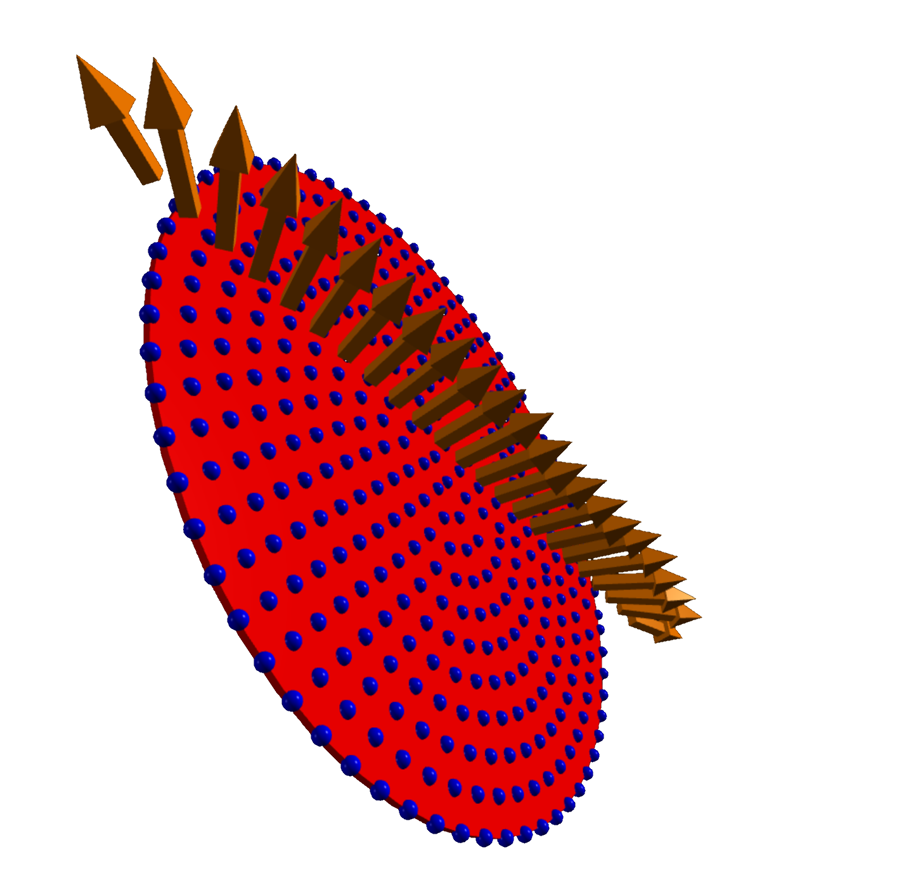
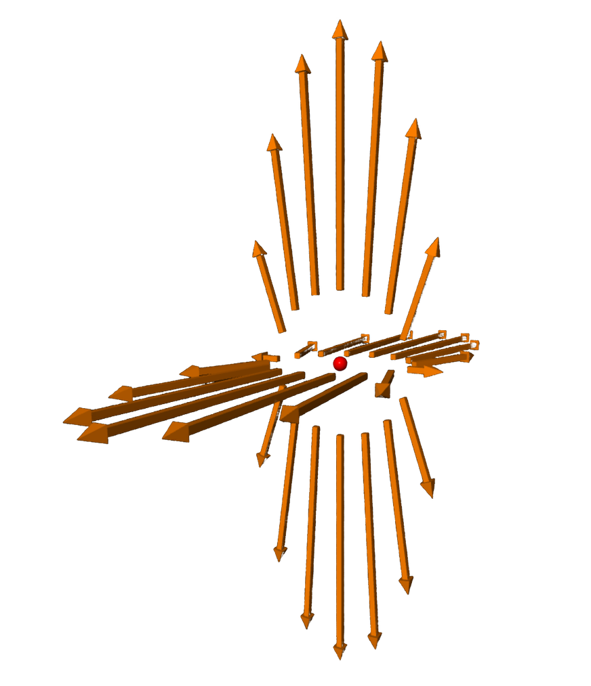
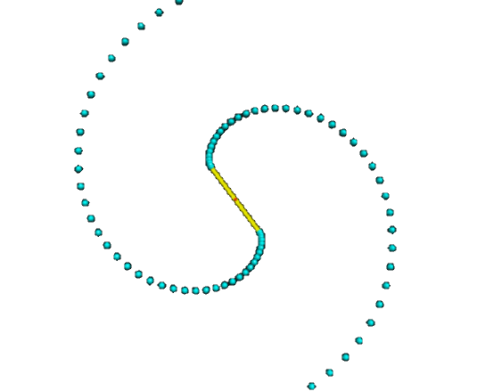

<blockquote>
The feeling of awed wonder that science can give us is one of the highest experiences 
of which the human psyche is capable. It is a deep aesthetic passion to rank with the 
finest that music and poetry can deliver. &mdash;
<a href="https://en.wikipedia.org/wiki/Richard_Dawkins">Richard Dawkins</a> in 
<a href="https://en.wikipedia.org/wiki/Unweaving_the_Rainbow">Unweaving the Rainbow</a>, 1998.
</blockquote>

## Contents

[Astrophysics](#astrophysics) &mdash; [Electromagnetism](#electromagnetism) &mdash;
[Kinematics](#kinematics) &mdash; [Mathematics](#mathematics) &amp; separate
[Math Art Gallery](geometry.html) &mdash; [Nature models](#nature) &mdash;
[Quantum and particle physics](#quantum) &mdash; [Special relativity](#relativity) &mdash;
[Thermodynamics](#thermodynamics) &mdash;[Waves](#waves) &mdash; [Fun stuff](fun.html) &mdash;
[references &amp; acknowledgements](#references).

# Astrophysics

 

The code pertaining to the demos in this section is also available under the 
[astrophysics tab](https://glowscript.org/#/user/zeger.hendrikse/folder/Astrophysics/)
on [glowscript.org](https://glowscript.org/#/user/zeger.hendrikse/).

### Daylight variations &mdash; sun-earth-moon model

 

<figure style="float: center; text-align: center;">
  
  <figcaption>A not accurate to scale sun-earth-moon model, but very detailed and instructive!
  It&apos;s main goal is visualizing the change in day length during the course of a year.</figcaption>
</figure>

###  Kepler's law &amp; the three-body problem

 

<figure style="float: left; width: 50%; text-align: center">
  
  <figcaption><a href="https://en.wikipedia.org/wiki/Kepler%27s_laws_of_planetary_motion">Kepler&apos;s laws</a>
    of planetary motion: "I believe the geometric proportion served the creator as an idea when He 
    introduced the continuous generation of similar objects from similar objects" &mdash; Johannes Kepler.
  </figcaption>
</figure>
<figure style="float: right; width: 50%; text-align: center">
  
  <figcaption>The well-known <a href="https://en.wikipedia.org/wiki/Three-body_problem">three-body problem</a>,
  for which there exists no analytical solution, hence numerical methods to the rescue!</figcaption>
</figure>

# Mathematics

 

<blockquote>
Mathematics directs the flow of the universe, lurks behind its shapes and curves, 
holds the reins of everything from tiny atoms to the biggest stars. &mdash; 
<a href="https://en.wikipedia.org/wiki/Edward_Frenkel">Edward Frenkel</a>
</blockquote> 

The code pertaining to the demos in this section is available under the 
[mathematics tab](https://glowscript.org/#/user/zeger.hendrikse/folder/Math/)
on [glowscript.org](https://glowscript.org/#/user/zeger.hendrikse/).

### Dynamic 3D-plots of multivariate and complex functions

 

<figure style="float: left; width: 50%; text-align: center">
  &nbsp;&nbsp;&nbsp;
  <figcaption>Plotting <a href="https://en.wikipedia.org/wiki/Function_of_several_real_variables">multivariate functions</a> $F(x, y)$.</figcaption>
</figure>
<figure style="float: right; width: 50%; text-align: center">
  
  <figcaption>Plotting <a href="https://en.wikipedia.org/wiki/Complex_analysis">complex functions</a> $F(z)$.</figcaption>
</figure>

  
<a>&dArr; Python code snippets with which to generate the plots &uArr;</a>

The formula for the above image is given by:

$$\psi(x, y, t) = \sin\left(\sqrt{x^2+y^2}\right)$$

The following Python code was used to plot the graph belonging to this multivariate function: 

<pre class="highlight"><code>def sine_sqrt():
    resolution = 50
    x = y = np.linspace(-2 * pi, 2 * pi, resolution)
    xx, yy = np.meshgrid(x, y)
    x_2_plus_y_2 = xx.multiply(xx).add(yy.multiply(yy))
    zz = np.sin(np.sqrt(x_2_plus_y_2)).multiply(5)

    return xx, yy, zz

xx, yy, zz = sine_sqrt()
plot = Plot3D(xx, yy, zz)
</code></pre>

The 
<a href="https://matplotlib.org/stable/gallery/mplot3d/surface3d_radial.html#sphx-glr-gallery-mplot3d-surface3d-radial-py">mexican hat</a> 
is most easily obtained by using polar coordinates:

$$\begin{pmatrix} x \\ y \\ z \end{pmatrix}=\begin{pmatrix} r\cos(\phi) \\ \sin(\phi)) \\ (r^2 - 1)^2 \end{pmatrix}$$

 This leads to the following Python code 

<pre class="highlight"><code>def mexican_hat():
    r = np.linspace(0, 1.25, 50)
    p = np.linspace(-pi, 1.05 * pi, 50)
    R, P = np.meshgrid(r, p)
    Z = R.multiply(R).subtract(1).multiply(R.multiply(R).subtract(1))
    X, Y = np.cos(P).multiply(R), np.sin(P).multiply(R)
    return X, Y, Z

xx, yy, zz = mexican_hat()
plot = Plot3D(xx, yy, zz)
</code></pre>

Similarly, many different geometric shapes such as a <a href="https://www.mattiagiuri.com/2020/11/20/plotting-a-torus-with-python/">torus</a> 
can be generated (select the torus from the drop-down menu in the application):

$$\begin{pmatrix} x \\ y \\ z\end{pmatrix}=\begin{pmatrix} (c + a \cos(v))\cdot\cos(u) \\ (c + a \cos(v))\cdot\sin(u) \\ a \sin(v) \end{pmatrix}$$

 This leads to the following Python code 

<pre class="highlight"><code>def torus():
    c = 3
    a = 1
    xx = yy = np.linspace(-pi, 1.05 * pi, 75)
    U, V = np.meshgrid(xx, yy)
    X = (np.cos(V).multiply(a).add(c)).multiply(np.cos(U))
    Y = (np.cos(V).multiply(a).add(c)).multiply(np.sin(U))
    Z = np.sin(V).multiply(a)
    return X, Y, Z

xx, yy, zz = torus()
plot = Plot3D(xx, yy, zz)
</code></pre>

### Polar coordinates &amp; [geometrical shapes](geometry.html)

 

Polar coordinates not only enable us to much more easily solve spherically symmetric problems in 
both physics and mathematics, they also provide us a way to parameterize complex geometrical shapes, such
as the [Möbius strip](geomettry#non_orientables) and 
[Klein&apos;s bottle](geometry#non_orientables). 
Get further enchanted in my [Math Art Gallery](geometry.html)! 

<figure style="float: left; width: 50%; text-align: center">
  
  <figcaption>Polar coordinates frequently simplify the tackling of rotationally symmetric problems.</figcaption>
</figure>
<figure style="float: right; width: 50%; text-align: center">
  
  <figcaption>The well-known <a href="https://en.wikipedia.org/wiki/M%C3%B6bius_strip">Möbius strip</a>.
  For more geometrical shapes like this, visit my <a href="geometry.html">Math Art Gallery</a>.</figcaption>
</figure>

# Nature models

 

The code pertaining to the demos in this section is available under the 
[miscellaneous tab](https://www.glowscript.org/#/user/zeger.hendrikse/folder/MyPrograms/)
on [glowscript.org](https://glowscript.org/#/user/zeger.hendrikse/).

### Flocking birds &amp; falling raindrops

 

<figure style="float: left; width: 50%; text-align: center">
  
  <figcaption>Simulation of a flock of birds: "Eagles commonly fly alone. They are crows, daws, 
  and starlings that flock together" &mdash; John Webster </figcaption>
</figure>
<figure style="float: right; width: 45%; text-align: center">
  
  <figcaption>"There are holes in the sky. Where the rain gets in. But they're ever so small. 
  That's why the rain is thin" &mdash; Spike Milligan.</figcaption>
</figure>

# Particle and quantum physics

 

<blockquote>
If you think you understand quantum mechanics, you don't understand quantum mechanics.
&mdash; <a href="https://en.wikipedia.org/wiki/Richard_Feynman">Richard P. Feynman</a> 
</blockquote> 

The code pertaining to the demos in this section is available under the 
[quantum tab](https://glowscript.org/#/user/zeger.hendrikse/folder/Quantum/)
on [glowscript.org](https://glowscript.org).

### Visualizing plane waves $\psi(x, t) = A \cdot e^{i(k x - \omega t)}$ &amp; spherical harmonics

 

<figure style="float: left; width: 50%; text-align: center">
  
  <figcaption>Complex plane waves play a pivotal role in quantum mechanics!</figcaption>
</figure>
<figure style="float: right; width: 50%; text-align: center">
  
  <figcaption>Spherical harmonics are solutions of the Schr&#246;dinger equation for the hydrogen atom.</figcaption>
</figure>

  
<a>&dArr; For a plane wave, we can easily derive the Schr&#246;dinger equation &uArr;</a>

According to <a href="https://en.wikipedia.org/wiki/Matter_wave">De Broglie</a> we have:

$$p = \dfrac{h}{\lambda} = \dfrac{h}{2\pi} \dfrac{2\pi}{\lambda} = \hbar k \Rightarrow \hbar k = \hbar \dfrac{\partial}{\partial x} \psi(x,t) = p \psi(x, t) \Rightarrow p = \hbar \dfrac{\partial}{\partial x}$$

The Kinetic energy can be expressed as:

$$K = \dfrac{p^2}{2m} = -\dfrac{\hbar^2}{2m}\dfrac{\partial^2}{\partial x^2} \psi(x,t)$$

The total energy is given by the <a href="https://en.wikipedia.org/wiki/Planck_relation">Planck-Einstein relation</a>:

$$E = hf = \dfrac{h}{2\pi}\dfrac{2\pi}{T} = \hbar \omega \Rightarrow -i\hbar\dfrac{\partial}{\partial t} \psi(x,t) = E \psi(x,t) \Rightarrow E = -i\hbar\dfrac{\partial}{\partial t}$$

From this we arrive at the <a href="https://en.wikipedia.org/wiki/Schr%C3%B6dinger_equation">Schr&#246;dinger equation</a>:

$$(KE + PE)\Psi(x,,t) = E\Psi(x,t) = -i\hbar \dfrac{\partial}{\partial t}\Psi(x, t) = -\dfrac{\hbar^2}{2m}\dfrac{\partial^2}{\partial x^2} \Psi(x,t) + V(x)\Psi(x,t)$$

In three-dimensional space this is then generalized to:

$$i\hbar\dfrac{\partial}{\partial t}\Psi(\vec{r}, t) = \left(-\frac{\hbar^2}{2m}\nabla^2 + V(\vec{r, t}\right)\Psi(\vec{r}, t)$$

 

  
<a>&dArr; Python code snippet for plotting spherical harmonics &uArr;</a>

The spherical harmonic function is given by

$$\begin{cases} \rho &amp; = 4 \cos^2(2\theta)\sin^2(\phi) \\  \theta &amp; = [0, 2\pi] \\ \phi &amp; = [0, \pi]  \end{cases}$$

This can then easily be translated to the graphing software, that can also be 
seen in the mathematics section on this page:

<pre class="highlight"><code>def sphere_harmonics():
    theta = np.linspace(-1.1 * pi, pi, 100)
    phi = np.linspace(0, pi, 100)
    U, V = np.meshgrid(theta, phi)
    
    R1 = np.cos(U.multiply(2)).multiply(np.cos(U.multiply(2)))
    R2 = np.sin(V).multiply(np.sin(V))
    R = R1.multiply(R2).multiply(4)
    
    X = np.sin(U).multiply(np.cos(V)).multiply(R)
    Y = np.sin(U).multiply(np.sin(V)).multiply(R)
    Z = np.cos(U).multiply(R)
    return X, Y, Z, None, None

xx, yy, zz = sphere_harmonics()
plot = Plot3D(xx, yy, zz)

</code></pre>

 

### One-dimensional quantum particle bound by an infinite square well

 

<figure>
  
</figure>

<a>&dArr; Background: particle in a box, i.e. confined by a infinite square well &uArr;</a>

Although the one-dimensional particle-in-a-box problem does not correspond to any
real-world system, it illustrates quite well some (fundamental) 
quantum mechanical features nonetheless.

The box is modeled by an infinite square well, so that the particle cannot escape 
beyond the boundaries of the box.

Inside the box, the potential energy $V$ is zero (or constant). Substituting this together with the
formula for the plane wave $\psi(x,t) = Ae^{ik x}e^{-i\omega t}$ into the Schrödinger equation, we get:

$$\dfrac{\partial^2\psi}{\partial x^2} + \dfrac{8\pi^2m}{h^2}(E - 0)\psi=0 \Rightarrow \bigg(\dfrac{-h^2}{8\pi^2m}\bigg)\dfrac{\partial^2\psi}{\partial x^2}=E\psi$$

Which function does give itself (times $E$) when differentiated twice _and_ is zero at both boundaries of the box?

$$\psi = A\sin(ax) \Rightarrow \dfrac{h^2a^2}{8\pi^2m}\psi=E\psi \Rightarrow E=\dfrac{h^2a^2}{8\pi^2m}$$

To get $a$, we note that the wave function equals zero at the box boundaries:

$$\psi=A\sin(ax) = 0 \Rightarrow a=\dfrac{n\pi}{L} \Rightarrow \psi_n = A\sin\bigg(\dfrac{n\pi x}{L}\bigg) \Rightarrow E_n=\dfrac{h^2n^2}{8mL^2}$$

Normalizing the wave function results in an expression for $A$:

$$\int_0^L \psi \cdot  \psi dx = 1 \Rightarrow A^2 \int_0^L\sin^2\bigg(\dfrac{n\pi x}{L}\bigg) dx=1 \Rightarrow A^2\bigg(\dfrac{L}{2}\bigg)=1 \Rightarrow A=\sqrt{\dfrac{2}{L}}$$

So summarizing, we have

$$E=\dfrac{h^2a^2}{8\pi^2m} \text{ and } \psi_n=\sqrt{\dfrac{2}{L}}\sin(nkx), \text{where } k=\dfrac{\pi}{L}$$

These energy eigenstates (and superpositions thereof) are used in the visualization software.

### The quantum harmonic oscillator

 

The quantum harmonic oscillator is visualized in a semi-classical way below.

<figure>
  
</figure>

### Charged particle moving in two electric fields

 

<figure style="float: left; width: 50%; text-align: center">
  
  <figcaption>If the atomic nucleus were a charged ring, as opposed to a point, then ...</figcaption>
</figure>
<figure style="float: right; width: 50%; text-align: center">
  
  <figcaption>Discover how a particle&apos;s velocity and the electric field strength influence one another.</figcaption>
</figure>

### Rutherford scattering & charged particle in magnetic field

 

<figure style="float: left; width: 50%; text-align: center">
  
  <figcaption><a href="https://en.wikipedia.org/wiki/Rutherford_scattering_experiments#Rutherford_scattering">Rutherford scattering</a>,
  which lead to the first atomic model with a nucleus and electrons spinning around it.</figcaption>
</figure>
<figure style="float: right; width: 50%; text-align: center">
  
  <figcaption>Playfully discover how a charged particle behaves in a magnetic field.</figcaption>
</figure>

# Electromagnetism

 

The code pertaining to the demos in this section is available under the 
[electromagnetism tab](https://glowscript.org/#/user/zeger.hendrikse/folder/Electromagnetism/)
on [glowscript.org](https://glowscript.org).

### Electric fields of dipoles and point charges

 

<figure style="float: left; width: 50%; text-align: center">
  
  <figcaption><a href="https://en.wikipedia.org/wiki/Electric_dipole_moment">Electric field around a point charge.</a></figcaption>
</figure>
<figure style="float: right; width: 50%; text-align: center">
  
  <figcaption><a href="https://en.wikipedia.org/wiki/Electric_dipole_moment">Electric dipole moment.</a></figcaption>
</figure>

  
<a>&dArr; Background: electric fields around dipoles and point charges &dArr;</a>

For dipoles the field is given by

$$\vec{E} ( \vec{r} ) = \dfrac {1} {4\pi\epsilon_0} \dfrac {Q} {r^2} \hat{r}, \text{ with } \vec{F}(\vec{r}) = q \vec{E} (\vec{r}) = \dfrac {1} {4\pi\epsilon_{0}} \dfrac {qQ} {r^2}\hat{r} \text{ }$$

and for point charges by

$$\vec{E} ( \vec{r} ) = -\dfrac {1} {4\pi\epsilon_0} \nabla \bigg( \dfrac{\vec{r}  \cdot \vec{p}} {r^3} \bigg), \text{ where } \vec{p} = +q(\vec{r_{+}}) + -q(\vec{r_{-})}$$

### Electric and magnetic fields

 

<figure style="float: left; width: 50%; text-align: center">
  
  <figcaption>Visualization of Faraday's law by running an electric current (of electric charges) through a wire.</figcaption>
</figure>
<figure style="float: right; width: 50%; text-align: center">
    
  <figcaption>Visualization of an electric field inside a series of charged rings.</figcaption>
</figure>

### Charged disk and accompanying builder

 

<figure style="float: left; width: 50%; text-align: center">
  
  <figcaption>Visualization of the electric field around a disk.</figcaption>
</figure>
<figure style="float: right; width: 50%; text-align: center">
  
  <figcaption>Build up an electric field yourself by incrementally adding a charged rings.</figcaption>
</figure>

## Electromagnetic waves

 

<figure style="float: left; width: 50%; text-align: center">
  
  <figcaption>Electromagnetic waves propagating from an antenna.</figcaption>
</figure>
<figure style="float: right; width: 50%; text-align: center">
  
  <figcaption>Electromagnetic waves propagating through empty space.</figcaption>
</figure>

# Thermodynamics

 

The code pertaining to the demos in this section is available under the 
[thermodynamics tab](https://glowscript.org/#/user/zeger.hendrikse/folder/Thermodynamics/)
on [glowscript.org](https://glowscript.org).

### Boltzmann gas &amp; cubic symmetry planes

 

<figure>
  
  
</figure>

### Two-dimensional Ising spin model

 

This demo models the magnetization at various temperatures using a two-dimensional Ising spin lattice.

<figure>
  
</figure>

# Waves

 

### Doppler effect

 

# Special relativity

 

<blockquote>
We should make things as simple as possible, but not simpler. &mdash; Albert Einstein
</blockquote> 

The code pertaining to the demos in this section is available under the 
[relativity tab](https://glowscript.org/#/user/zeger.hendrikse/folder/Relativity/)
on [glowscript.org](https://glowscript.org).

### Lightcone animation and electric field of a fast moving proton

 

<figure style="float: left; width: 50%; text-align: center">
    &nbsp;&nbsp;&nbsp;&nbsp;&nbsp;&nbsp;&nbsp;&nbsp;&nbsp;
    <figcaption>A three-dimensional lightcone is animated by simultaneously 
    sending off both a photon and a spaceship from the origin.</figcaption>
</figure>
<figure style="float: right; width: 50%; text-align: center">
    
    <figcaption>An electric field of a fast moving (relativistic) proton.</figcaption>
</figure>

### Galilean transformation of relative motions in Euclidean plane

 

Before diving into (special) relativity, let's first get acquainted with 
the so-called Galilean transformation.

# Kinematics

 

The code pertaining to the demos in this section is available under the 
[kinematics tab](https://glowscript.org/#/user/zeger.hendrikse/folder/Kinematics/)
on [glowscript.org](https://glowscript.org).

### Fun with springs

 

The applications of a simple harmonic oscillator are almost endless. 
You may be surprised though to find out what happens when you drop such a simple harmonic oscillator!! 

<figure style="float: left; width: 50%; text-align: center">
    
    <figcaption>Ball being dropped onto a spring.</figcaption>
</figure>
<figure style="float: right; width: 50%; text-align: center">
    
    <figcaption>Can you guess which part of the slinky is going to move first, if any?</figcaption>
</figure>

### The $N$-body coupled oscillator with adjustable $N$

 

<figure style="float: center; text-align: center;">
  
  <figcaption>Discover what happens by changing the number of bodies.</figcaption>
</figure>

### Newton&apos;s pendulum and cannonball

 

<figure style="float: left; width: 50%; text-align: center">
  
  <figcaption>Newton&apos; pendulum.</figcaption>
</figure>
<figure style="float: right; width: 50%; text-align: center">
  
  <figcaption>Which velocity is needed to shoot a cannon ball into orbit?</figcaption>
</figure>

### Model of chain drop from table

 

<figure>
  
</figure>

### Ball on sliding ramp &amp; ball hitting block

 

<figure style="float: left; width: 60%; text-align: center">
     &nbsp;&nbsp;&nbsp;&nbsp;&nbsp;
    <figcaption>Simulating a ball on a sliding ramp, including friction!</figcaption>
</figure>
<figure style="float: right; width: 40%; text-align: center">
    
    <figcaption>Demonstration of angular momentum.</figcaption>
</figure>

### Water sprinkler and floating block

 

<figure style="float: left; width: 60%; text-align: center">
  &nbsp;&nbsp;&nbsp;&nbsp;&nbsp;&nbsp;&nbsp;&nbsp;&nbsp;&nbsp;&nbsp;
  <figcaption>Movement of a floating block in water.</figcaption>
</figure>
<figure style="float: right; width: 40%; text-align: center">
  
  <figcaption>Simulation of a water sprinkler</figcaption>
</figure>

# Acknowledgements

 

- [Ruth Chabay and Bruce Sherwood](https://www.aapt.org/aboutaapt/Chabay_Sherwood_2014-Halliday-Resnick-Award.cfm)
- [Rhett Allain](https://en.wikipedia.org/wiki/Rhett_Allain)
- [Rob Salgado](https://www.linkedin.com/in/robertobsalgado)
- [Steve Spicklemire](https://github.com/sspickle)

# References

 

- Check this out &rarr; [QMsolve: A module for solving and visualizing the Schrödinger equation](https://github.com/quantum-visualizations/qmsolve)
- [MyScript](https://webdemo.myscript.com/): enter text, equations, or diagrams by hand, and effortlessly convert 
  it to MathML, LaTeX, etc.!
- Just for fun: [online electric circuit construction kit](https://phet.colorado.edu/sims/html/circuit-construction-kit-ac/latest/circuit-construction-kit-ac_all.html).
Make sure to check it out, it simply is brilliant.
- [Manim](https://github.com/3b1b/manim), an animation engine for explanatory math videos

## Other VPython apps

- [Glowscript apps](https://www.glowscript.org/#/user/matterandinteractions/folder/matterandinteractions/) belonging to the book [Matter and Interactions](https://matterandinteractions.org/)
- Glowscript apps written by [Bob Salgado](https://www.glowscript.org/#/user/Rob_Salgado/folder/My_Programs/)
- Glowscript apps written by [Steve Spicklemire](https://www.glowscript.org/#/user/spicklemire/)
- Glowscript apps written by [Dr Harrell Pane](https://www.glowscript.org/#/user/dr.harrell.pane/)
- Glowscript apps written by [X9Z3](https://glowscript.org/#/user/X9Z3/folder/X9Z3Publications/)
- Glowscript apps written by [priisdk](https://glowscript.org/#/user/priisdk/)
- Some [Glowscript games](https://glowscript.org/#/user/Guhan/folder/MyPrograms/) 
- [VPython user contributed programs](https://vpython.org/contents/contributed.html)
- [Physics simulations GitHub repository](https://github.com/Humboldt-Penguin/Physics_Simulations) of [Humboldt-Penguin](https://github.com/Humboldt-Penguin/)
- [Physics through Glowscript - An introductory course](https://bphilhour.trinket.io/physics-through-glowscript-an-introductory-course), an excellent tutorial!
- [VPython lecture demos](https://lectdemo.github.io/virtual/index.html) (based on deprecated (V)Python versions)

## Other resources

- [3D Modeling with VPython](https://rsehosting.reading.ac.uk/courses/py3d-basic/)
- [Hydrogen wavefunctions](https://github.com/ssebastianmag/hydrogen-wavefunctions)
- [VPython Applications for Teaching Physics](https://www.visualrelativity.com/vpython/) by Rob Salgado
- [VPython Docs](https://www.beautifulmathuncensored.de/static/GlowScript/VPythonDocs/)
- [Glowscript documentation](https://www.glowscript.org/docs/VPythonDocs/index.html)
