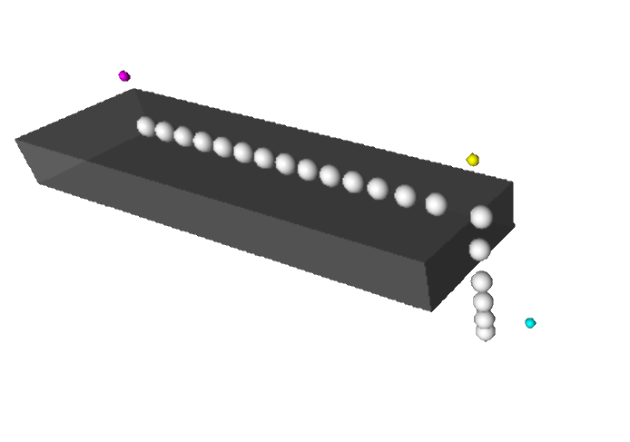

# Kinematics

 

### Fun with springs

 

The applications of a simple harmonic oscillator are almost endless. 
You may be surprised though to find out what happens when you drop such a simple harmonic oscillator!! 

<figure style="float: left; width: 50%; text-align: center">
    
    <figcaption>Ball being dropped onto a spring.</figcaption>
</figure>
<figure style="float: right; width: 50%; text-align: center">
    
    <figcaption>Can you guess which part of the slinky is going to move first, if any?</figcaption>
</figure>

### The $N$-body coupled oscillator with adjustable $N$

 

<figure style="float: center; text-align: center;">
  
  <figcaption>Discover what happens by changing the number of bodies.</figcaption>
</figure>

### Newton&apos;s pendulum and cannonball

 

<figure style="float: left; width: 50%; text-align: center">
  
  <figcaption>Newton&apos; pendulum.</figcaption>
</figure>
<figure style="float: right; width: 50%; text-align: center">
  
  <figcaption>Which velocity is needed to shoot a cannonball into orbit?</figcaption>
</figure>

### Model of chain drop from table

 

<figure>
  
</figure>

### Ball on sliding ramp &amp; ball hitting block

 

<figure style="float: left; width: 60%; text-align: center">
     &nbsp;&nbsp;&nbsp;&nbsp;&nbsp;
    <figcaption>Simulating a ball on a sliding ramp, including friction!</figcaption>
</figure>
<figure style="float: right; width: 40%; text-align: center">
    
    <figcaption>Demonstration of angular momentum.</figcaption>
</figure>

### Water sprinkler and floating block

 

<figure style="float: left; width: 60%; text-align: center">
  &nbsp;&nbsp;&nbsp;&nbsp;&nbsp;&nbsp;&nbsp;&nbsp;&nbsp;&nbsp;&nbsp;
  <figcaption>Movement of a floating block in water.</figcaption>
</figure>
<figure style="float: right; width: 40%; text-align: center">
  
  <figcaption>Simulation of a water sprinkler</figcaption>
</figure>

