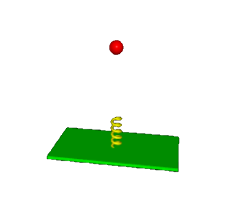
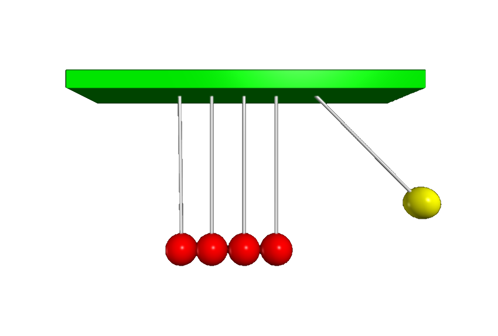

# Classical mechanics

 

<blockquote>
I can calculate the motion of heavenly bodies but not the madness of people.
&mdash; <a href="https://en.wikipedia.org/wiki/Isaac_Newton">Isaac Newton</a>.
</blockquote> 

### Fun with springs

 

The applications of a simple harmonic oscillator are almost endless. 
You may be surprised though to find out what happens when you drop such a simple harmonic oscillator!! 

<figure class="left_image">
    
    <figcaption>Ball being dropped onto a spring.</figcaption>
</figure>
<figure class="right_image">
    
    <figcaption> Can you guess which part of the slinky is going to move first, if any?</figcaption>
</figure>

### The $N$-body coupled oscillator with adjustable $N$

 

<figure style="float: center; text-align: center;">
  
  <figcaption>Discover what happens by changing the number of bodies.</figcaption>
</figure>

### Newton&apos;s pendulum and cannonball

 

<figure class="left_image">
  
  <figcaption>"[...] and to every action there is always an equal and opposite or contrary, reaction”
  &mdash; <a href="https://en.wikipedia.org/wiki/Isaac_Newton">Isaac Newton</a>.</figcaption>
</figure>
<figure class="right_image">
  
  <figcaption>Which velocity is needed to shoot a cannonball into orbit?</figcaption>
</figure>

### Ball on sliding ramp &amp; ball hitting block

 

<figure class="left_image">
     &nbsp;&nbsp;&nbsp;&nbsp;&nbsp;
    <figcaption>Simulating a ball on a sliding ramp, including friction!</figcaption>
</figure>
<figure class="right_image">
    
    <figcaption>Demonstration of angular momentum.</figcaption>
</figure>

### Model of floating block

 

<figure>
  &nbsp;&nbsp;&nbsp;&nbsp;&nbsp;&nbsp;&nbsp;&nbsp;&nbsp;&nbsp;&nbsp;
  <figcaption>Movement of a floating block in water.</figcaption>
</figure>

