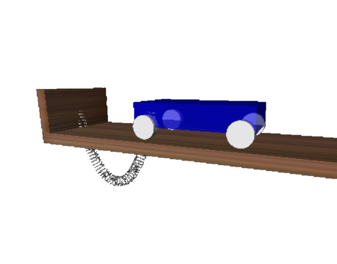
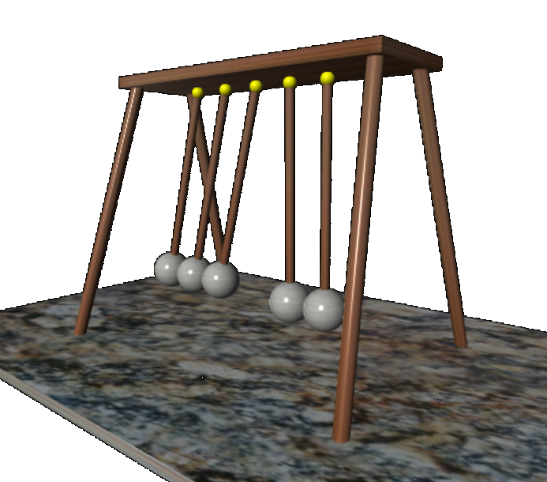
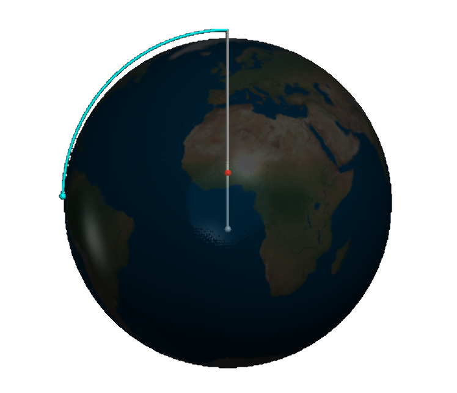
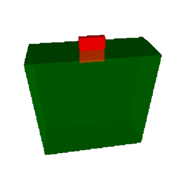



# Classical mechanics

 

> I can calculate the motion of heavenly bodies but not the madness of people.
&mdash; [Isaac Newton](https://en.wikipedia.org/wiki/Isaac_Newton)

### Fun with springs

 

The applications of a simple harmonic oscillator are almost endless. 
You may be surprised though to find out what happens when you drop such a simple harmonic oscillator!! 

<figure class="left_image">
    
    <figcaption>Ball being dropped onto a spring.</figcaption>
</figure>
<figure class="right_image">
    
    <figcaption> Can you guess which part of the slinky is going to move first, if any?</figcaption>
</figure>

### Cart on spring &amp; chain drop from table

 

  <figure class="left_image">
    &nbsp;&nbsp;&nbsp;&nbsp;&nbsp;&nbsp;&nbsp;&nbsp;&nbsp;&nbsp;&nbsp;
    <figcaption>Pull the cart and find out what happens!.</figcaption>
  </figure>
  <figure class="right_image">
    
    <figcaption>Chain falling from table, based on the original <a href="https://www.youtube.com/watch?v=vXp1hW_t-bo">video</a> by 
    <a href="https://rhettallain.com/">Rhett Allain</a>.</figcaption>
  </figure>

### Newton&apos;s cradle and cannonball

 

<figure class="left_image">
  
  <figcaption>"[...] and to every action there is always an equal and opposite or contrary, reaction”
  &mdash; <a href="https://en.wikipedia.org/wiki/Isaac_Newton">Isaac Newton</a>.</figcaption>
</figure>
<figure class="right_image">
  
  <figcaption>You have to make the rules, not follow them.
  &mdash; <a href="https://en.wikipedia.org/wiki/Isaac_Newton">Isaac Newton</a>.</figcaption>
</figure>

### Ball on sliding ramp &amp; ball hitting block

 

<figure class="left_image">
     &nbsp;&nbsp;&nbsp;&nbsp;&nbsp;
    <figcaption>Simulating a ball on a sliding ramp, including friction!</figcaption>
</figure>
<figure class="right_image">
    
    <figcaption>Demonstration of angular momentum.</figcaption>
</figure>

### Floating block &amp; three-body problem

 

<figure class="left_image">
  &nbsp;&nbsp;&nbsp;&nbsp;&nbsp;&nbsp;&nbsp;&nbsp;&nbsp;&nbsp;&nbsp;
  <figcaption>Movement of a floating block in water.</figcaption>
</figure>
<figure class="right_image">
  
  <figcaption>The well-known <a href="https://en.wikipedia.org/wiki/Three-body_problem">three-body problem</a>,
  for which there exists no analytical solution, so we have to solve it numerically. 
  <a href="https://en.wikipedia.org/wiki/Euler%27s_three-body_problem">Euler&apos;s version</a>
  is exactly solvable though.</figcaption>
</figure>

### Bouncing ball

 

<figure class="left_image">
  &nbsp;&nbsp;&nbsp;&nbsp;&nbsp;&nbsp;&nbsp;&nbsp;&nbsp;&nbsp;&nbsp;
  <figcaption>Bouncing ball.</figcaption>
</figure>
<figure class="right_image">
  &nbsp;&nbsp;&nbsp;&nbsp;&nbsp;&nbsp;&nbsp;&nbsp;&nbsp;&nbsp;&nbsp;
  <figcaption>Moment of inertia.</figcaption>
</figure>


