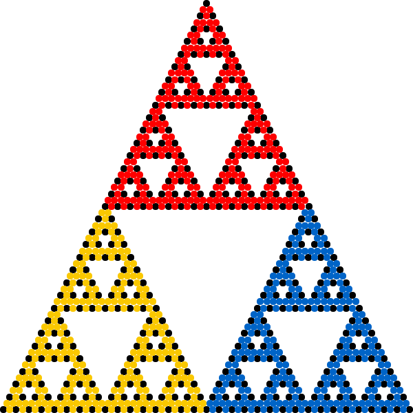
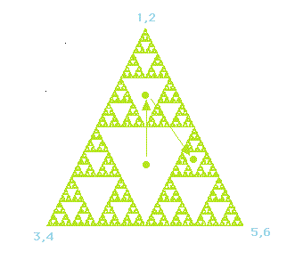



## Chaos game
<div class="header_line"><br/></div>

The chaos game is an iterative procedure $s_i\rightarrow s_{i+1}$ that can be written
as an [affine transformation](https://en.wikipedia.org/wiki/Affine_transformation)

$s_{i+1}=T_js_i+r_j$

where the set of pairs {$(T_j, r_j) | j=1,2,\dots$} with matrices $T_j$ and $r_j$
characterize the chosen ruleset and $j$ denotes a (per iteration) randomly chosen index.
The famous [Barnsley fern](https://www.hendrikse.name/science/nature/fern.html) 
is generated in a similar way.



<p style="clear: both;"></p>

### Why do fractals arise from the chaos game
<div style="border-top: 1px solid #999999"><br/></div>

The chaos game is an iterative process of placing dots on a canvas
using certain fixed locations (vertices) that are chosen randomly. For example,
in the animation below,
the position of each new dot is halfway between the current position and one of the three
fixed corners of a triangle.

<figure style="float: center; text-align: center;">
  <a href="https://en.wikipedia.org/wiki/Chaos_game#/media/File:Sierpinski_Chaos.gif">
    
  </a>
  <figcaption>
    Source <a href="https://en.wikipedia.org/wiki/Chaos_game#/media/File:Sierpinski_Chaos.gif">Wikipedia</a>
  </figcaption>
</figure>

<p style="clear: both;"></p>

Let's assume we start with a point that is located in one of the areas that will eventually be empty, 
see the figure below.

<figure style="float: center; text-align: center;">
  <a href="https://math.bu.edu/DYSYS/chaos-game/node3.html">
    
  </a>
  <figcaption>
    Source <a href="https://math.bu.edu/DYSYS/chaos-game/node3.html">BU Math</a>
  </figcaption>
</figure>

After one iteration, the point will jump to either one of the three smaller empty triangles. 
Eventually after a couple of iterations, the point will enter a small triangle that is so small that, 
given the finite resolution of the screen and the pixels it contains, it will disappear.

In a certain sense, the fractal itself is a kind of 
[strange attractor](https://www.hendrikse.name/science/mathematics/index.html#strange_attractors)!

### Example Python code
<div style="border-top: 1px solid #999999"><br/></div>

```python
jump_points = [(-.5, .433), (.5, -.433), (0, .3)] # triangle vertices
colors = [color.green, color.cyan, color.red] 

for i in range(40000):
    index = int(random() * 3) # random vertex to jump to
    x = .5 * (x + jump_points[index][0])
    y = .5 * (y + jump_points[index][1])
    pixels.append(pos=vec(x, y, 0), color=colors[index])
```

### References
<div style="border-top: 1px solid #999999"><br/></div>

- Chaos game [Wikipedia page](https://en.wikipedia.org/wiki/Chaos_game)
- [Chaos Game &mdash; Numberphile](https://www.youtube.com/watch?v=kbKtFN71Lfs)
- [A 1.58-Dimensional Object &mdash; Numberphile](https://www.youtube.com/watch?v=FnRhnZbDprE)
- [Fractal Dimensions (extra footage) - Numberphile](https://www.youtube.com/watch?v=Yz06NW6DwsE)

<p style="clear: both;"></p>

