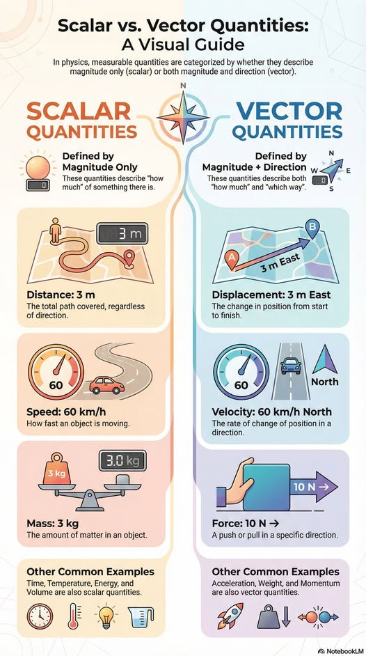



## Divergence and curl demo

 

### What are you looking at?

This is a dynamic particle and vector field simulation where points interact with 
sources, sinks, and swirling currents. Every particle moves according to the 
invisible forces around it, tracing the flow of this small, colorful universe. 

Click on the canvas to start the animation and watch the field come alive!



⭐ [Original idea](https://www.glowscript.org/#/user/wlane/folder/Physicsin3D/program/water-flow-curl) by [Let&apos;s code physics](https://www.youtube.com/@LetsCodePhysics) 
🔧 Ported to [div_curl_demo.html](https://github.com/zhendrikse/science/blob/main/mathematics/code/div_curl_demo.html) by [Zeger Hendrikse](https://www.hendrikse.name) 
👉 A [VPython](https://www.vpython.org/) version is also available as [div_curl_demo.py](https://github.com/zhendrikse/physics-in-python/blob/main/vpython/div_curl_demo.py).

## Scalar versus Vector Quantities: A Visual Guide

 

<figure style="text-align: center;">
  
  <figcaption>This excellent visual guide originates from 
    <a href=https://www.facebook.com/HouseOfPhysics/">House of Physics</a>.
  </figcaption>
</figure>

### Background information

 

$$
\text{Divergence: }\vec{\nabla} =\begin{pmatrix} \partial/\partial x \\ \partial/\partial y \\  \partial/\partial y \end{pmatrix} \Rightarrow \vec{\nabla} \cdot \vec{V} = \dfrac{\partial V_x}{\partial x} + \dfrac{\partial V_y}{\partial y} + \dfrac{\partial V_z}{\partial z}
$$

$$
\text{Curl: } \vec{\nabla} \times \vec{V} = \begin{vmatrix} \hat{x} & \hat{y} & \hat{z} \\ \dfrac{\partial}{\partial x} & \dfrac{\partial}{\partial y} & \dfrac{\partial}{\partial z} \\ V_x & V_y & v_z \end{vmatrix} = \begin{pmatrix} \partial V_z/\partial y - \partial F_y/\partial z \\ \partial V_x/\partial z - \partial F_z/\partial x \\ \partial V_y/\partial x - \partial F_x/\partial y\end{pmatrix} 
$$

