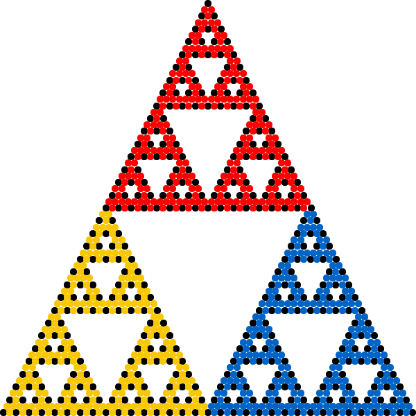
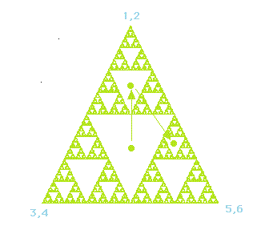



## Fractals &amp; turtle graphics  🐢

 

&nbsp;&nbsp;
&nbsp;&nbsp;

🎯 Learn how to draw fractals using [turtle graphics](https://en.wikipedia.org/wiki/Turtle_graphics) 
🧠 Inspired by [github.com/jeffvun/fractals](https://github.com/jeffvun/fractals/)  
🐍 A [VPython](https://vpython.org) version is available as well, see [fractals.py](https://github.com/zhendrikse/physics-in-python/blob/main/vpython/fractals.py)

    <canvas class="applicationCanvas2D" id="fractalsCanvas"></canvas>

  <button id="kochSnowflake">Koch snowflake ❄️</button>
  <button id="cesaroFractal">Cesaro fractal 🏛️</button>
  <button id="sierpinskiTriangle">Sierpinski triangle 🔺️️</button>

  <button id="tSquareFractal">T-square fractal 🔶</button>
  <button id="dragonCurve">Dragon curve 🐦‍🔥</button>



## Chaos game 🎮

 

&nbsp;&nbsp;
&nbsp;&nbsp;

🎯 Improved understanding of the [chaos game](https://en.wikipedia.org/wiki/Chaos_game) 
🧠 Inspired by [nnakul/chaos-game](https://github.com/nnakul/chaos-game/tree/master) by [Nikhil Nakul](https://github.com/nnakul/) 
🐍 A [VPython](https://vpython.org) version is available as well, see [chaos_game.py](https://github.com/zhendrikse/physics-in-python/blob/main/vpython/chaos_game.py)

    <canvas class="applicationCanvas2D" id="chaosGameCanvas"></canvas>

        
  <button id="cantorDust"><label for="cantorDust">Cantor dust 🧹</label></button>
  <button id="fractal1"><label for="fractal1">Fractal star ⭐</label></button>
  <button id="fractal2"><label for="fractal2">Fractal flower 🌻</label></button>
  <button id="sierpinskiCarpet"><label for="sierpinskiCarpet">Sierpinski carpet 🧶</label></button>

        
  <button id="sierpinskiTriangle2"><label for="sierpinskiTriangle2">Sierpinski triangle ⚠️</label></button>
  <button id="tSquareFractal2"><label for="tSquareFractal2">T-square fractal 🏻</label></button>
  <button id="vicsekFractal"><label for="vicsekFractal">Vicsek fractal 🌀</label></button>
  <button id="barnsleyFern"><label for="barnsleyFern">Barnsley fern 🌿</label></button>

The chaos game is an iterative procedure $s_i\rightarrow s_{i+1}$ that can be written
as an [affine transformation](https://en.wikipedia.org/wiki/Affine_transformation)

$$\begin{equation}
s_{i+1}=T_js_i+r_j
\end{equation}$$

where the set of pairs {$(T_j, r_j) | j=1,2,\dots$} with matrices $T_j$ and $r_j$
characterize the chosen ruleset and $j$ denotes a (per iteration) randomly chosen index.
The famous [Barnsley fern](https://www.hendrikse.name/science/nature/fern.html) is generated in a similar way.

### Why do fractals arise from the chaos game

 

The chaos game is an iterative process of placing dots on a canvas
using certain fixed locations (vertices) that are chosen randomly. For example,
in the animation below,
the position of each new dot is halfway between the current position and one of the three
fixed corners of a triangle.

<figure style="margin: 0 auto; text-align: center;">
  
  <figcaption>
    Source <a href="https://en.wikipedia.org/wiki/Chaos_game#/media/File:Sierpinski_Chaos.gif">Wikipedia</a>
  </figcaption>
</figure>

Let's assume we start with a point that is located in one of the areas that will eventually be empty,
see the figure below.

<figure style="margin: 0 auto; text-align: center;">
  
  <figcaption>
    Source <a href="https://math.bu.edu/DYSYS/chaos-game/node3.html">BU Math</a>
  </figcaption>
</figure>

After one iteration, the point will jump to either one of the three smaller empty triangles.
Eventually after a couple of iterations, the point will enter a small triangle that is so small that,
given the finite resolution of the screen and the pixels it contains, it will disappear.

In a certain sense, the fractal itself is a kind of
[strange attractor](https://www.hendrikse.name/science/mathematics/index.html#strange_attractors)!

### References

 

- Chaos game [Wikipedia page](https://en.wikipedia.org/wiki/Chaos_game)
- [Chaos Game &mdash; Numberphile](https://www.youtube.com/watch?v=kbKtFN71Lfs)
- [A 1.58-Dimensional Object &mdash; Numberphile](https://www.youtube.com/watch?v=FnRhnZbDprE)
- [Fractal Dimensions (extra footage) - Numberphile](https://www.youtube.com/watch?v=Yz06NW6DwsE)


