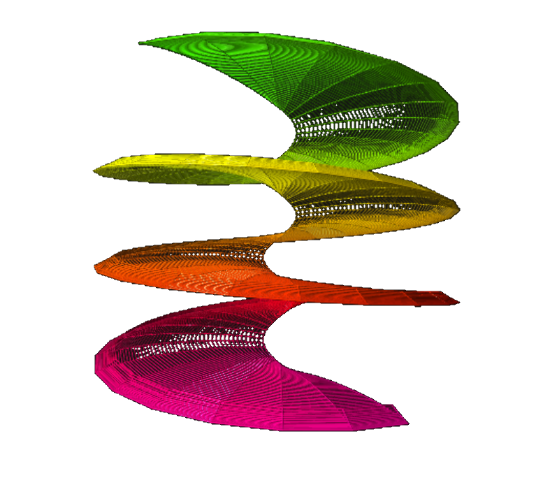
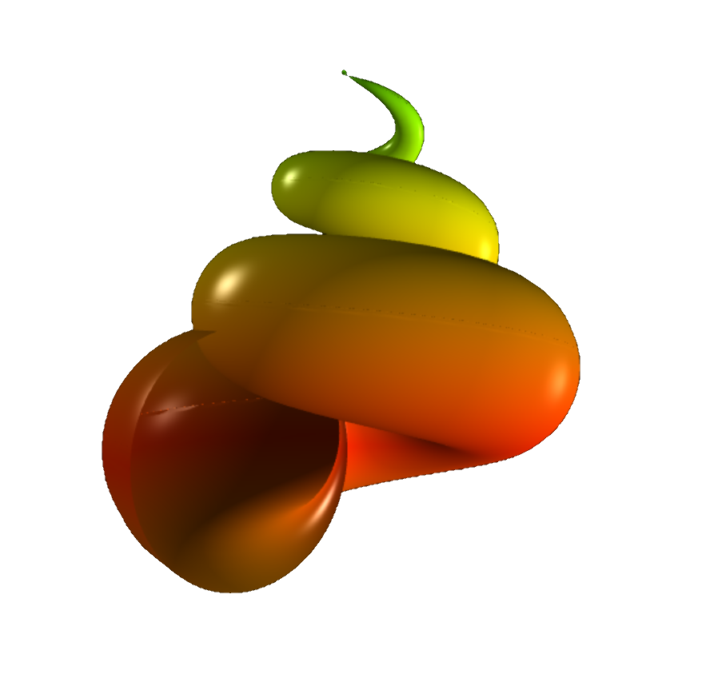
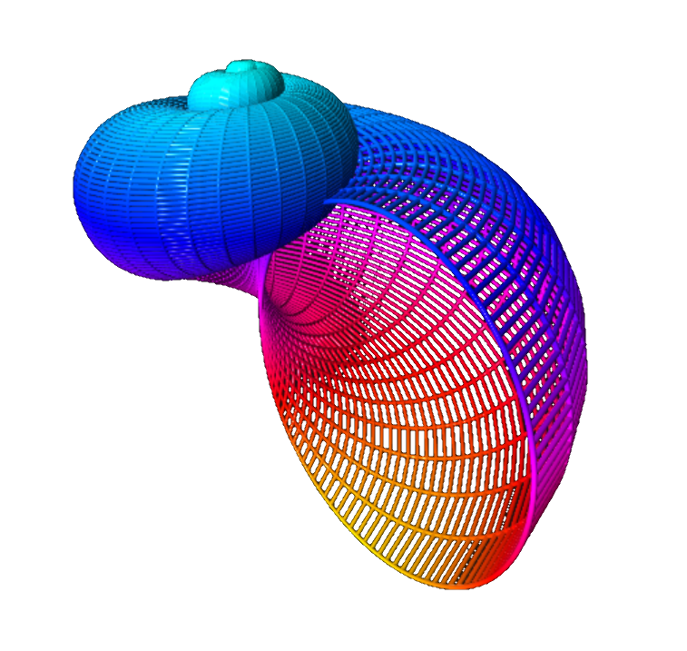
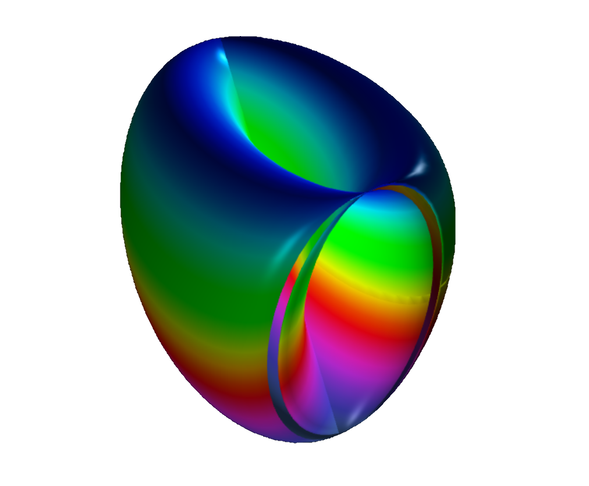



<blockquote>
Philosophy is written in this grand book &mdash; I mean universe &mdash; which stands continuously open to our gaze, 
but which cannot be understood unless one first learns to comprehend the language in which it is written. 
It is written in the language of mathematics, and its characters are triangles, circles and other geometric figures, 
without which it is humanly impossible to understand a single word of it; without these, one is wandering about 
in a dark labyrinth. &mdash; 
<a href="https://en.wikipedia.org/wiki/Galileo_Galilei">Galileo Galilei</a> (1623).
</blockquote>

# Welcome to my Math Art Gallery 

All geometric shapes below were created with basically the same plotting software 
that I have written in VPython.

## Toroids

 

<figure class="left_image">
  
  <figcaption>The torus is the simplest toroid and hence is frequently seen in topological contexts.</figcaption>
</figure>
<figure class="right_image">
  
  <figcaption>A torus, a trivial example of a connected orientable surface of 
    <a href="https://en.wikipedia.org/wiki/Genus_%28mathematics%29">genus one</a>.
  </figcaption>
</figure>

<figure class="left_image">
  
  <figcaption>The 
    <a href="https://en.wikipedia.org/wiki/Bow_Curve">Bow curve</a>.
  </figcaption>
</figure>
<figure class="right_image">
  
  <figcaption><a href="https://en.wikipedia.org/wiki/Trefoil_knot">Trefoil knot</a>, the simplest
  example of a (non-trivial) knot.</figcaption>
</figure>

<figure class="left_image">
  
  <figcaption>The limpet torus.</figcaption>
</figure>
<figure class="right_image">
  
  <figcaption>Elliptic torus.</figcaption>
</figure>

<figure class="left_image">
  
  <figcaption>Double torus.</figcaption>
</figure>
<figure class="right_image">
  
  <figcaption>A twisted torus.</figcaption>
</figure>

## Non-orientable surfaces

 

### Möbius strip &amp; Klein&apos;s bottle

 

<figure class="left_image">
  
  <figcaption>The famous <a href="https://en.wikipedia.org/wiki/M%C3%B6bius_strip">Möbius strip</a>,
  perhaps the most well-known non-orientable surface.</figcaption>
</figure>
<figure class="right_image">
  
  <figcaption>The most well-known embedding of 
  <a href="https://en.wikipedia.org/wiki/Klein_bottle">Klein&apos;s bottle</a> 
  in three-dimensional space.</figcaption>
</figure>

<figure class="left_image">
  
  <figcaption><a href="https://en.wikipedia.org/wiki/Klein_bottle">Klein&apos;s bottle</a> also can be
  obtained by gluing two Möbius strips together.</figcaption>
</figure>
<figure class="right_image">
  
  <figcaption><a href="https://www.blendswap.com/blend/8068">Grays Klein&apos;s bottle</a>.</figcaption>
</figure>

### The real projective plane

 

<figure class="left_image">
  
  <figcaption><a href="https://paulbourke.net/geometry/crosscap/">Paul Bourke&apos;s parametrization</a> 
  for the <a href="https://mathworld.wolfram.com/Cross-Cap.html">cross cap</a>.</figcaption>
</figure>
<figure class="right_image">
  
  <figcaption>A sliced cross-capped disk is 
  <a href="https://en.wikipedia.org/wiki/Homeomorphism">homeomorphic</a> to a self-intersecting disk.</figcaption>
</figure>

### Spherical harmonics

 

Spherical harmonics are of the form 
$r = \sin(m_0\phi)^{m_1} + \cos(m_2\phi)^{m_3} + \sin(m_4\theta)^{m_5} + \cos(m_6\theta)^{m_7}$
where 
- the angles $\phi \in [0, \pi]$ (latitude), and $\theta \in [0, 2\pi]$ (longitude), 
- the parameters $m_0$, $m_1$, $m_2$, $m_3$, $m_4$, $m_5$, $m_6$, and $m_7$ are all integers and $\geq 0$,
- and where $r$ is the radius.  

<figure class="left_image">
  
  <figcaption><a href="https://paulbourke.net/geometry/sphericalh/">Spherical harmonic</a> 
  that was generated for .....</figcaption>
</figure>
<figure class="right_image">
  
  <figcaption><a href="https://paulbourke.net/geometry/sphericalh/">Spherical harmonic</a> 
  that was generated for .....</figcaption>
</figure>

<figure class="left_image">
  
  <figcaption><a href="https://paulbourke.net/geometry/sphericalh/">Spherical harmonic</a> 
  that was generated for .....</figcaption>
</figure>
<figure class="right_image">
  
  <figcaption><a href="https://paulbourke.net/geometry/sphericalh/">Spherical harmonic</a> 
  that was generated for .....</figcaption>
</figure>

## Spirals

 

<figure class="left_image">
  
  <figcaption>Dini&apos;s spiral, <a href="https://en.wikipedia.org/wiki/Dini%27s_surface">Dini&apos;s surface</a>, 
  or twisted pseudo-sphere: characterized by a surface of constant (negative) curvature, 
  named after Ulisse Dini.</figcaption>
</figure>
<figure class="right_image">
  
  <figcaption>Contour plot of Dini&apos;s spiral, where this time the scope of the parameter $\phi$ 
  has been enlarged to generate more stages.</figcaption>
</figure>

<figure class="left_image">
  
  <figcaption>Nature meets mathematics: a purely mathematically generated seashell, with the parametrization 
  found on <a href="https://paulbourke.net/geometry/spiral">Paul Bourke&apos;s</a> site.
  </figcaption>
</figure>
<figure class="right_image">
  
  <figcaption>Another seashell, rendered with contours and generated with another parametrization from the website of <a href="https://doc.sagemath.org/html/en/reference/plot3d/sage/plot/plot3d/parametric_surface.html">Sage Math</a>.
  </figcaption>
</figure>

## Miscellaneous

 

<figure class="left_image">
  
  <figcaption>A dented object.</figcaption>
</figure>
<figure class="right_image">
  
  <figcaption>Arc.</figcaption>
</figure>

<figure class="left_image">
  
  <figcaption>Combined ball and torus.</figcaption>
</figure>
<figure class="right_image">
  
  <figcaption>A surface of revolution.</figcaption>
</figure>



