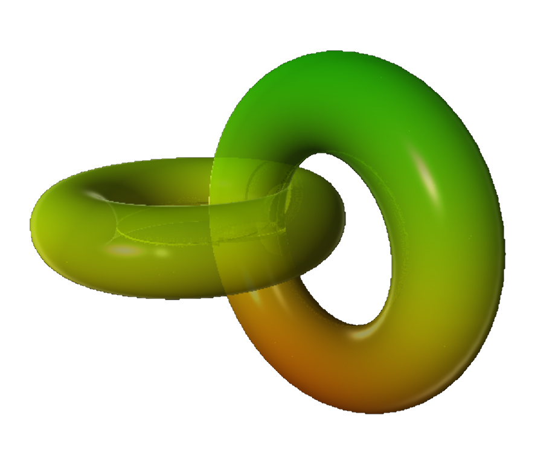



# Mathematics

 

<blockquote>
Mathematics directs the flow of the universe, lurks behind its shapes and curves, 
holds the reins of everything from tiny atoms to the biggest stars. &mdash; 
<a href="https://en.wikipedia.org/wiki/Edward_Frenkel">Edward Frenkel</a>
</blockquote> 

### Dynamic surface and contour plots for $f(x, y) \rightarrow \mathbb{R}$

 

<figure class="left_image">
  &nbsp;&nbsp;&nbsp;
  <figcaption>Surface plot for $f(x, y) = \sin(\pi x)\cos(\pi y)$.</figcaption>
</figure>
<figure class="right_image">
  
  <figcaption> Contour plot for $f(x, y) = \sin(\sqrt{x^2+y^2})$.</figcaption>
</figure>

### Dynamic surface and contour plots for $f(z) \rightarrow \mathbb{C}$

 

The colors in the 3D renderings of complex functions represent 
the phase of the complex function values, hence colors can't be
modified by the user.

<figure class="left_image">
  
  <figcaption>Surface plot for $f(z) = \exp(-z^2)$.</figcaption>
</figure>
<figure class="right_image">
  
  <figcaption>Contour plot for $f(z) = log(z)$.</figcaption>
</figure>

### Rendering vector fields $f(x, y, z) \rightarrow \mathbb{R}^3$

 

<figure class="left_image">
  
  <figcaption>Rendering of 3D vector field and implied flow.</figcaption>
</figure>
<figure class="right_image">
  <!-- RESERVER FOR FUTURE APPLICATION 
    -->
</figure>

### Topology and my [Math Art Gallery](gallery/index.html)

 

<figure class="left_image">
  
  <figcaption>Surface plot of twisted torus. For more surfaces, visit the <a href="gallery/index.html">Math Art Gallery</a>.</figcaption>
</figure>
<figure class="right_image">
  
  <figcaption>Contour plot of <a href="https://en.wikipedia.org/wiki/Real_projective_plane">self-intersecting disk</a>.
  For more surfaces, visit the <a href="gallery/index.html">Math Art Gallery</a>.</figcaption>
</figure>

### Double shapes

<figure class="left_image">
  
  <figcaption>Double torus surface plot. For more surfaces, visit the <a href="gallery/index.html">Math Art Gallery</a>.</figcaption>
</figure>
<figure class="right_image">
  
  <figcaption><a href="https://en.wikipedia.org/wiki/Klein_bottle">Klein&apos;s bottle</a> contour plot.
  For more surfaces, visit the <a href="gallery/index.html">Math Art Gallery</a>.</figcaption>
</figure>

### Polar coordinates &amp; spherical harmonics

 

Polar coordinates not only enable us to much more easily solve spherically symmetric problems in 
both physics and mathematics, they also provide us a way to parameterize complex topological surfaces, 
such  as [Klein&apos;s bottle](geometry#non_orientables) (shown below in the topology subsection). 

<figure class="left_image">
  
  <figcaption>Polar coordinates frequently simplify the tackling of rotationally symmetric problems.</figcaption>
</figure>
<figure class="right_image">
  
  <figcaption><a href="https://en.wikipedia.org/wiki/Spherical_harmonics">Spherical harmonics</a> 
  play an important role in both physics and mathematics.</figcaption>
</figure>

  
<a>&dArr; Python code snippet for plotting spherical harmonics &uArr;</a>

The spherical harmonic function is given by

$$\begin{cases} \rho &amp; = 4 \cos^2(2\theta)\sin^2(\phi) \\  \theta &amp; = [0, 2\pi] \\ \phi &amp; = [0, \pi]  \end{cases}$$

This can then easily be translated to the graphing software, that can also be 
seen in the mathematics section on this page:

<pre class="highlight"><code>def sphere_harmonic():
    theta = np.linspace(-1.1 * pi, pi, 100)
    phi = np.linspace(0, pi, 100)
    U, V = np.meshgrid(theta, phi) 
    R1 = np.cos(U.multiply(2)).multiply(np.cos(U.multiply(2)))
    R2 = np.sin(V).multiply(np.sin(V))
    R = R1.multiply(R2).multiply(4) 
    X = np.sin(U).multiply(np.cos(V)).multiply(R)
    Y = np.sin(U).multiply(np.sin(V)).multiply(R)
    Z = np.cos(U).multiply(R)
    return X, Y, Z, None, None
</code></pre>


