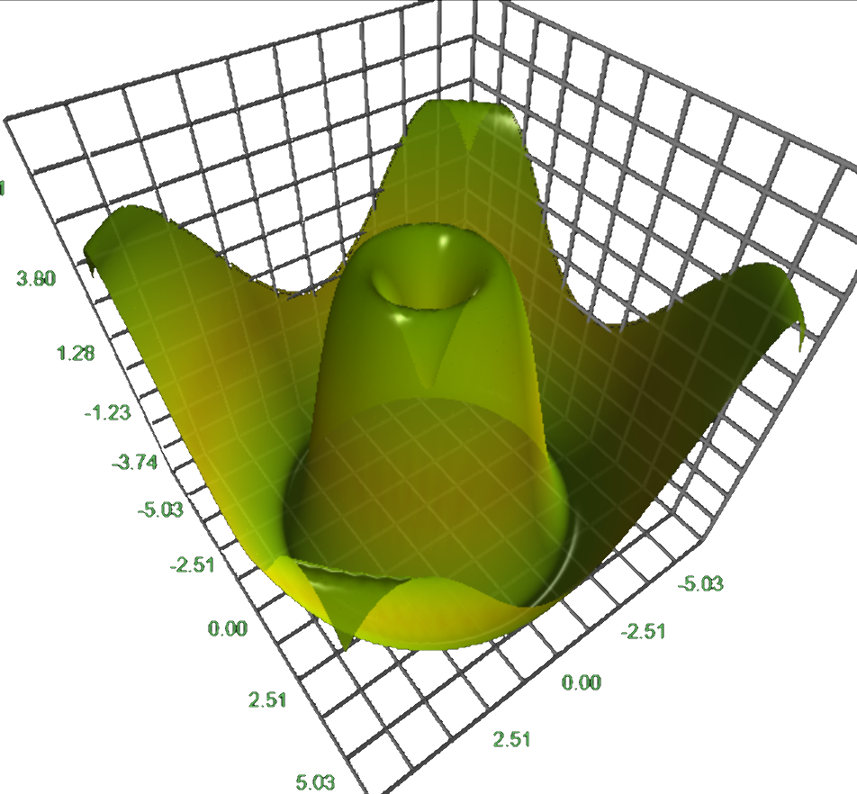
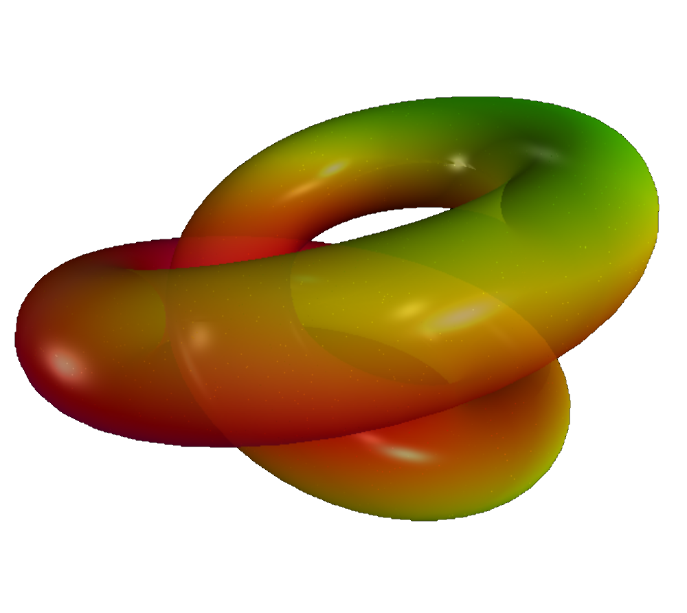
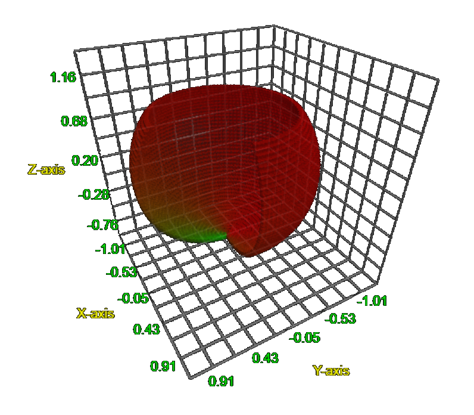
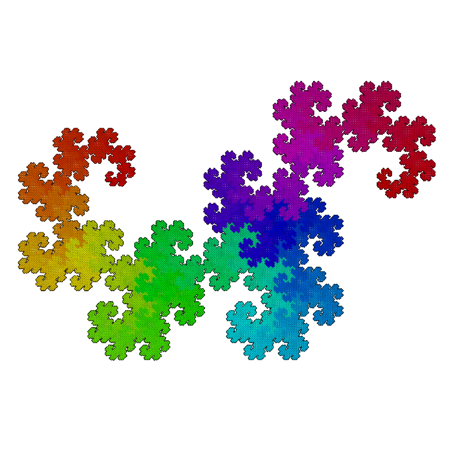
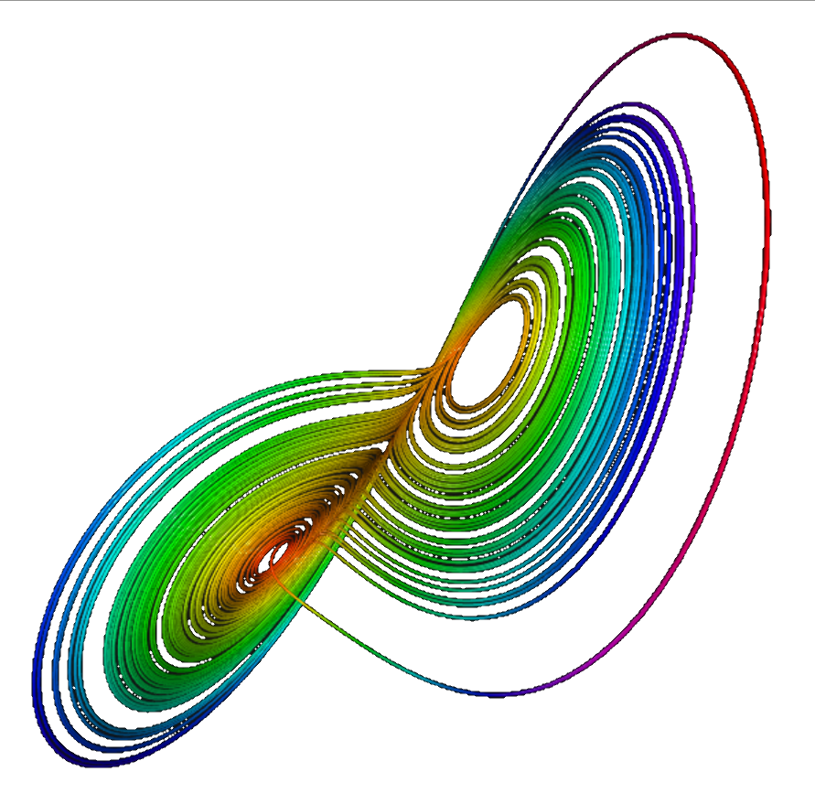
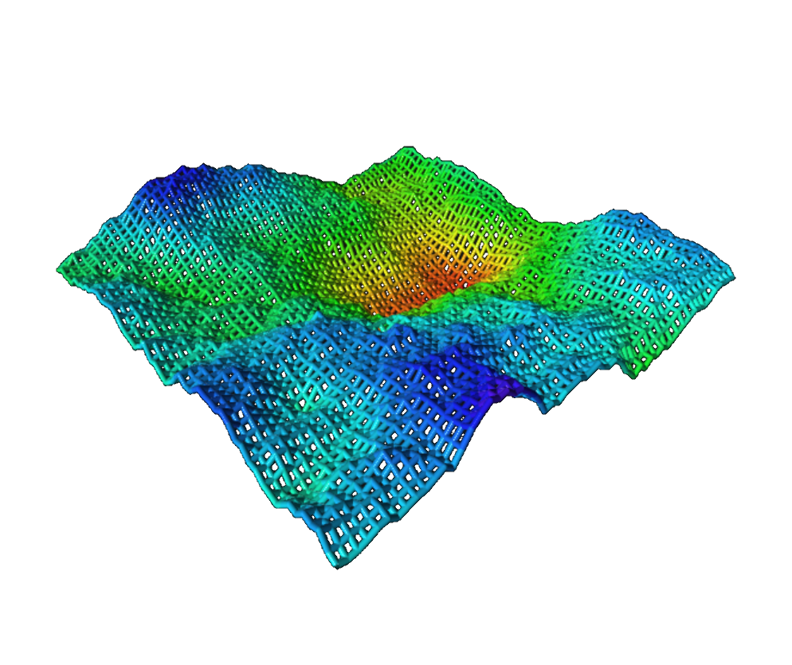



<blockquote>
Somehow it’s okay for people to chuckle about not being good at math. 
Yet, if I said “I never learned to read,” they’d say I was an illiterate dolt. &mdash;
<a href="https://en.wikipedia.org/wiki/Neil_deGrasse_Tyson">Neil deGrasse Tyson</a>
</blockquote> 

# Mathematics

 

### Dynamic surface and contour plots for $f(x, y) \rightarrow \mathbb{R}$

 

The application below let's one render functions in two real variables $x$ and $y$.
The color-coding below is associated with the height of the object and
is added purely for aesthetical purposes.

<figure class="left_image">
  &nbsp;&nbsp;&nbsp;
  <figcaption>Surface plot for $f(x, y) = \sin(\pi x)\cos(\pi y)$.</figcaption>
</figure>
<figure class="right_image">
  
  <figcaption> Contour plot for $f(x, y) = \sin(\sqrt{x^2+y^2})$.</figcaption>
</figure>

### Dynamic surface and contour plots for $f(z) \rightarrow \mathbb{C}$

 

The colors in the 3D renderings of complex functions represent 
the phase of the complex function values, hence colors can't be
modified by the user.

<figure class="left_image">
  
  <figcaption>Surface plot for $f(z) = \exp(-z^2)$.</figcaption>
</figure>
<figure class="right_image">
  
  <figcaption>Contour plot for $f(z) = log(z)$.</figcaption>
</figure>

### Scalar fields $f(x, y, z) \rightarrow \mathbb{R}$ and vector fields $f(x, y, z) \rightarrow \mathbb{R}^3$

 

A field is an algebraic structure that is defined as a non-empty collection with two 
([binary](https://en.wikipedia.org/wiki/Binary_operation)) operations: 
addition, $a+b$, and multiplication, $a\cdot b$. 

These operations are accurately defined by 
[the conditions they must suffice](https://math.libretexts.org/Bookshelves/Analysis/Mathematical_Analysis_(Zakon)/02%3A_Real_Numbers_and_Fields/2.01%3A_Axioms_and_Basic_Definitions), 
but roughly speaking they should behave similarly as we know them already from the
rational numbers $\mathbb{Q}$ and real numbers $\mathbb{R}$.

The applications below render two such fields, that are abundant in physics, namely 
[scalar fields](https://en.wikipedia.org/wiki/Scalar_field) and [vector fields](https://en.wikipedia.org/wiki/Vector_field).
The former assigns a value (scalar) to every point in space (e.g. the temperature
in a room), the latter a vector (e.g. the force and direction of the wind).

<figure class="left_image">
  
  <figcaption>Rendering a temperature distribution as a 3D scalar field.</figcaption>
</figure>
<figure class="right_image">
  
  <figcaption>Rendering of three-dimensional vector field and implied flow.</figcaption>
</figure>

## Topology and my [Math Art Gallery](gallery/index.html)

 

<figure class="left_image">
  
  <figcaption>Surface plot of twisted torus. For more surfaces, visit the <a href="gallery/index.html">Math Art Gallery</a>.</figcaption>
</figure>
<figure class="right_image">
  
  <figcaption>Contour plot of <a href="https://en.wikipedia.org/wiki/Real_projective_plane">self-intersecting disk</a>.
  For more surfaces, visit the <a href="gallery/index.html">Math Art Gallery</a>.</figcaption>
</figure>

### Double shapes

 

<figure class="left_image">
  
  <figcaption>Double torus surface plot. For more surfaces, visit the <a href="gallery/index.html">Math Art Gallery</a>.</figcaption>
</figure>
<figure class="right_image">
  
  <figcaption><a href="https://en.wikipedia.org/wiki/Klein_bottle">Klein&apos;s bottle</a> contour plot.
  For more surfaces, visit the <a href="gallery/index.html">Math Art Gallery</a>.</figcaption>
</figure>

## Polar coordinates &amp; numeric integration

 

Polar coordinates not only enable us to much more easily solve spherically symmetric problems in 
both physics and mathematics, they also provide us a way to parameterize complex topological surfaces, 
such  as [Klein&apos;s bottle](gallery/index.html#non_orientables). 

<figure class="left_image">
  
  <figcaption>Polar coordinates frequently simplify the tackling of rotationally symmetric problems.</figcaption>
</figure>
<figure class="right_image">
  
  <figcaption>Illustration of using polar coordinates when numerically integrating spherically symmetric functions.</figcaption>
</figure>

## Rendering Mandelbrot and other fractals

 

<figure class="left_image">
  
  <figcaption>VPython can also be used to generate Mandelbrot images!</figcaption>
</figure>
<figure class="right_image">
  
  <figcaption>The dragon curve and other fractals.</figcaption>
</figure>

## Sierpiński&apos;s pyramid &amp; Menger&apos;s sponge

 

<figure class="left_image">
  
  <figcaption>Sierpiński pyramid is a 3D analogue of the 
  <a href="https://en.wikipedia.org/wiki/Sierpi%C5%84ski_triangle">Sierpiński triangle</a></figcaption>
</figure>
<figure class="right_image">
  
  <figcaption><a href="https://en.wikipedia.org/wiki/Menger_sponge">Menger Sponge</a> 
  is another famous three-dimensional fractal curve.</figcaption>
</figure>

## Lorenz &amp; Rössler attractors 

 

<figure class="left_image">
  
  <figcaption><a href="https://vpython.org/">VPython program</a> that renders the 
  <a href="https://science.howstuffworks.com/math-concepts/chaos-theory4.htm">Lorenz attractor</a>.</figcaption>
</figure>
<figure class="right_image">
  
  <figcaption><a href="https://vpython.org/">VPython program</a> that renders the 
  <a href="https://en.wikipedia.org/wiki/R%C3%B6ssler_attractor">Rössler</a> attractor.</figcaption>
</figure>

## Fractal terrains

 

<figure class="left_image">
  &nbsp;&nbsp;&nbsp;
  <figcaption>Fractal terrain surface.</figcaption>
</figure>
<figure class="right_image">
  
  <figcaption>Fractal terrain contour plot.</figcaption>
</figure>

## Harmonograph

 

<figure class="left_image">
  
  <figcaption>A three-dimensional harmonograph simulator.</figcaption>
</figure>
<figure class="right_image">
  <!-- RESERVED FOR FUTURE APPLICATION
    -->
</figure>

## Spherical harmonics

 

<figure class="left_image">
  
  <figcaption><a href="https://en.wikipedia.org/wiki/Spherical_harmonics">Spherical harmonics</a> 
  play an important role in both physics and mathematics.</figcaption>
</figure>
<figure class="right_image">
  
  <figcaption><a href="https://en.wikipedia.org/wiki/Spherical_harmonics">Spherical harmonics</a> 
  play an important role in both physics and mathematics.</figcaption>
</figure>

  
<a>&dArr; Python code snippet for plotting spherical harmonics &uArr;</a>

The spherical harmonic function is given by

$$\begin{cases} \rho &amp; = 4 \cos^2(2\theta)\sin^2(\phi) \\  \theta &amp; = [0, 2\pi] \\ \phi &amp; = [0, \pi]  \end{cases}$$

This can then easily be translated to the graphing software, that can also be 
seen in the mathematics section on this page:

<pre class="highlight"><code>def sphere_harmonic():
    theta = np.linspace(-1.1 * pi, pi, 100)
    phi = np.linspace(0, pi, 100)
    U, V = np.meshgrid(theta, phi) 
    R1 = np.cos(U.multiply(2)).multiply(np.cos(U.multiply(2)))
    R2 = np.sin(V).multiply(np.sin(V))
    R = R1.multiply(R2).multiply(4) 
    X = np.sin(U).multiply(np.cos(V)).multiply(R)
    Y = np.sin(U).multiply(np.sin(V)).multiply(R)
    Z = np.cos(U).multiply(R)
    return X, Y, Z, None, None
</code></pre>

## References

 

### Computational Physics

- [Computational Physics](https://github.com/rubinhlandau/CompPhysicsNotebooks/blob/master/CP01.ipynb), a freely available online book!

### Mathematics

- [Geometry, Surfaces, Curves, Polyhedra](https://paulbourke.net/geometry/) on 
  [Paul Bourke](https://paulbourke.net/geometry/)&apos;s website.
- [Manim](https://github.com/3b1b/manim), an animation engine for explanatory math videos.
- [Sage](https://doc.sagemath.org/html/en/index.html), an open source MatLab
  on [GitHub](https://doc.sagemath.org/html/en/index.html).
  [Here](https://doc.sagemath.org/html/en/reference/plot3d/sage/plot/plot3d/parametric_plot3d.html) 
  are some 3D-plot examples.


