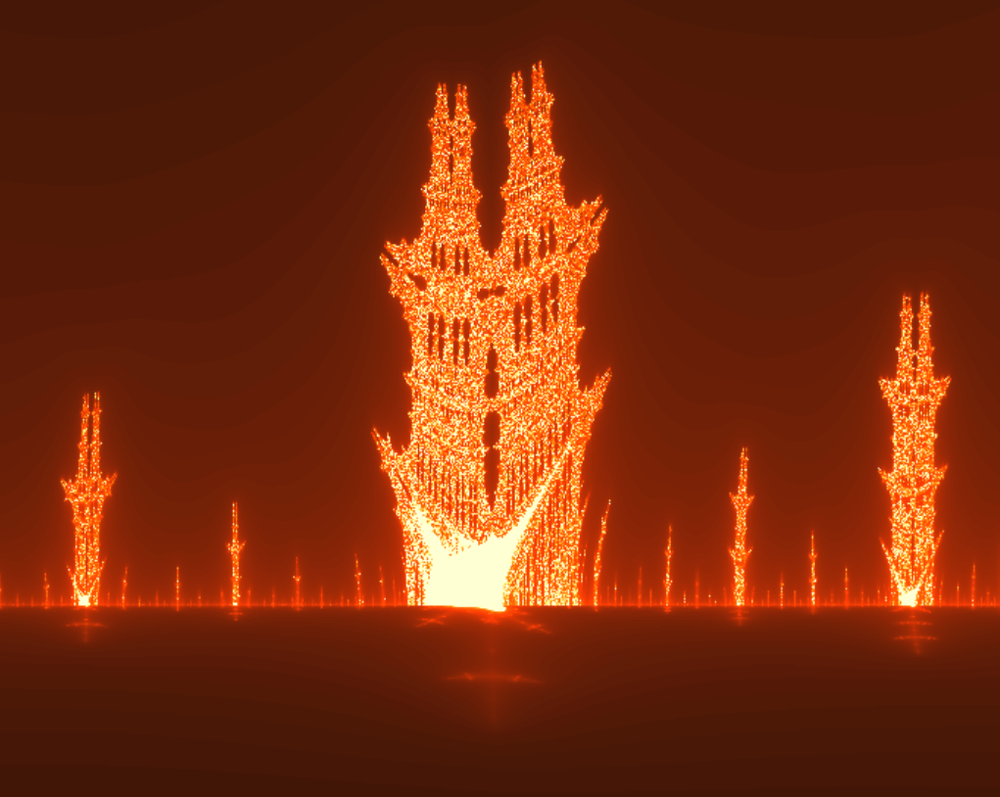



## Generating Mandelbrot images

 

🔧 Code in [mandelbrot.html](https://github.com/zhendrikse/science/blob/main/mathematics/code/mandelbrot.html) written by [Zeger Hendrikse](https://www.hendrikse.name/). 
👉 Implemented in 100% Javascript, but also ported to [VPython](https://vpython.org), see [mandelbrot.py](https://github.com/zhendrikse/physics-in-python/blob/main/vpython/mandelbrot.py). 
🎯 Click anywhere on the fractal to re-center

    <label>Action:</label>
    <button id="resetViewButton">🔄 Reset View</button>
    <button id="zoomInButton">➕ Zoom In</button>
    <button id="zoomOutButton">➖ Zoom Out</button>

    <canvas class="applicationCanvas2D" id="mandelbrotCanvas"></canvas>

    <label>Colors:</label><button id="colorSchemeButton1">scheme 1</button>
    <button id="colorSchemeButton2">scheme 2</button>&nbsp;&nbsp;&nbsp;
    <label>Canvas:</label><button id="canvasSizeButton1">small</button>
    <button id="canvasSizeButton2">big</button>
    <button id="canvasSizeButton3">huge</button>&nbsp;&nbsp;&nbsp;

  <label for="mandelbrotToggle"><input type="radio" id="mandelbrotToggle"/>Mandelbrot</label>
  <label for="burningShipToggle"><input type="radio" id="burningShipToggle"/>Burning ship</label>

  <label for="juliaToggle0"><input type="radio" id="juliaToggle0"/>z=x + iy, c=0.325 + 0.417i</label>
  <label for="juliaToggle1"><input type="radio" id="juliaToggle1"/>z=x + iy, c=-0.4 + 0.4i</label>

  <label for="juliaToggle2"><input type="radio" id="juliaToggle2"/>z=x + iy, c=-0.4 + 0.6i</label>
  <label for="juliaToggle3"><input type="radio" id="juliaToggle3"/>z=x + iy, c=-0.5251993 - 0.5251993i</label>

  <label for="juliaToggle4"><input type="radio" id="juliaToggle4"/>z=x + iy, c=0.285 + 0.0001i</label>
  <label for="juliaToggle5"><input type="radio" id="juliaToggle5"/>z=x + iy, c=-0.8 + 0.156i</label>

  <label for="juliaToggle6"><input type="radio" id="juliaToggle6"/>z=x + iy, c=-0.0 + 0.8i</label>
  <label for="juliaToggle6"><input type="radio" id="juliaToggle7"/>z=x + iy, c=-0.70176 - 0.3842i</label>

## Julia and Mandelbrot sets explained

 

The term fractal was coined by [Benoît Mandelbrot](https://en.wikipedia.org/wiki/Benoit_Mandelbrot)
himself, and is derived from the Latin word ‘fractus’, which means broken or fractured.

<figure>
   
   <figcaption>The famous and stunningly beautiful 
   <a href="https://en.wikipedia.org/wiki/Burning_Ship_fractal">burning ship fractal</a>
   using a dedicated color mapping function, see also the text below.</figcaption>
</figure>

The Mandelbrot and Julia sets are examples of such fractals. Such a set (fractal) can 
be drawn on a piece of paper, or on a computer screen, i.e. a plane. Each point
in this plane actually represents a (two-dimensional) value/number, called a
complex number.

The collection of points, or numbers that lie "inside" the fractal (black part), 
_is_ the actual Mandelbrot set. The remaining points are said to be 
"outside" the Mandelbrot set. 

Whether a point is on the inside or outside, is associated with a mathematical
concept called convergence (and divergence). For example, if you multiply a number by itself
again and again, it runs away to infinity if your starting value is greater than one,
i.e. it diverges, and it approaches zero if your starting value is less than one, i.e. it
converges. And, of course, if you start with 1, it always remains one.

So summarizing, the Mandelbrot set depicts which set of (two-dimensional) numbers _converges_
when multiplied by itself (the Mandelbrot set, or the inside), and which set of numbers
_diverges_ when multiplied by itself (the outside).

A more thorough visual explanation is given in the video
[The Mandelbrot Set Explained](https://www.youtube.com/watch?v=7MotVcGvFMg).

### Julia sets

 

As was explained above, the Mandelbrot set is generated by multiplying a two-dimension
(i.e. complex) number by itself, or stated differently, by (iteratively) squaring this number. 

This can more rigorously be expressed by the formula:

$z_{n+1} = z_n^2 + c$

where the index $n$ labels each consecutive iteration.

The Mandelbrot set
is generated using $z_0=0$ (start value), and let $c$ vary across the (complex) plane, 
and check for each value of $c$ whether the iteration process diverges or not.

Julia sets are generated by varying $z$ across the (complex) plane, 
while the parameter $c$ is kept constant instead.
This implies that for each value of $c$, a different Julia set will be generated!

This difference is also neatly addressed in the
video [Julia Sets, and how they relate to The Mandelbrot Set](https://www.youtube.com/watch?v=dctJ7ISkU-4),
which is a follow-up on [The Mandelbrot Set Explained](https://www.youtube.com/watch?v=7MotVcGvFMg).

### The burning ship fractal

 

As was explained above, the Mandelbrot set is generated by multiplying a 
(complex) number by itself, or stated more rigorously:

$z_{n+1} = z_n^2 + c, z_0 = 0$

where the index $n$ labels each consecutive iteration. The start value is zero.

The burning ship uses a somewhat modified version of this formula, namely:

$z_{n+1} = \left(\|\text{Re}(z_n)\| + i\|\text{Im}(z_n)\|\right)^2 + c, z_0 = 0$

In addition, a different (and fixed) color mapping is used that underscores
the metaphor of a burning ship.

### Mandelbrot set defined mathematically

 

A Mandelbrot set is defined as a two-dimensional set in the complex plane $\mathbb{C}$ 
for which an infinite sequence of numbers $z_n$, defined by the
recursive relation

$z_{n+1} = z_n^2 + c, z_0 = 0$

does _not_ diverge to infinity. The parameter $c$ is also known as point of interest.

The complex numbers that do remain bounded 
make up the inner glowing regions of the Mandelbrot set. Particularly interesting 
behaviour shows up near the edges of the set. The visualizations are realized by 
color-coding exactly this rate of divergence. 

The Mandelbrot set illustrates the same principle as 
[Conway&apos;s Game of Life](https://www.hendrikse.name/science/mathematics/2d_game_of_life.html), 
namely  that complex structures can emerge from an astonishingly small and simple set of rules.

There are certain regions of values for the parameter $c$ (point of interest), where
a tiny change in the value of this parameter $c$ results in a completely different
(convergence) behaviour of our function. Any system that responds completely differently
to any such a tiny change in its parameter(s) is said to behave chaotically.

[Chaos theory](https://en.wikipedia.org/wiki/Chaos_theory) studies exactly these kind of systems. They are said to behave chaotically, 
as they turn out to behave unpredictably given there sensitivity on their initial/boundary condition(s).

Chaotic systems are quite well known because of the so-called [butterfly-effect](https://en.wikipedia.org/wiki/Butterfly_effect): 
a distant butterfly flapping its wings a few weeks ago, may be causing a tornado’s route to change 
its course, similar to a slight change in a parameter value (in this case of the constant $c$)
that causes the function to either diverge to infinity or remain bounded.

The butterfly-effect is more rigorously is defined as a deterministic 
non-linear response of a system that for its future state(s) is (extremely) 
sensitive on one or more of its initial conditions.

### Some history

 

Robert W. Brooks &amp; Peter Matelski first described and illustrated this set in 
1978 as a part of a study on Kleinian groups. Two years later, 
[Benoît Mandelbrot](https://en.wikipedia.org/wiki/Benoit_Mandelbrot) managed to create 
the first now well-known visualizations of the set, 
while working at IBM’s Thomas J. Watson Research Center in New York:

<blockquote>
Because of his access to IBM's computers, Mandelbrot was one of the first to use computer 
graphics to create and display fractal geometric images, leading to his discovery of the 
Mandelbrot set in 1980. He showed how visual complexity can be created from simple rules. 
He said that things typically considered to be "rough", a "mess", or "chaotic", 
such as clouds or shorelines, actually had a "degree of order". &mdash; 
<a href="https://en.wikipedia.org/wiki/Benoit_Mandelbrot">Wikipedia</a>
</blockquote> 

### References

 

- [What's so special about the Mandelbrot Set? &mdash; Numberphile](https://www.youtube.com/watch?v=FFftmWSzgmk)
- [The Feigenbaum Constant (4.669) &mdash; Numberphile](https://www.youtube.com/watch?v=ETrYE4MdoLQ)

