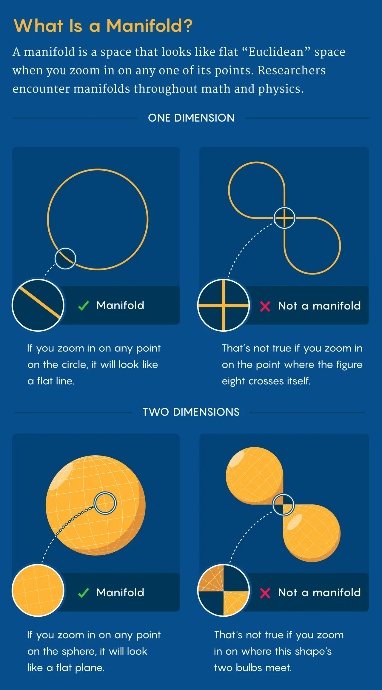



## Parametric surfaces

 

🔧 The images are generated with [parametric_surfaces.js](https://github.com/zhendrikse/science/blob/main/mathematics/parametric_surfaces.js). 

    <canvas class="applicationCanvas" id="surfaceCanvas"></canvas>

<canvas class="applicationCanvas" id="ringCanvas" style="aspect-ratio: 4 / 1;"></canvas>

## Numeric calculation mean &amp; Gaussian curvature

 

We use **central differences of second order** for *all* derivatives as these derivatives are 

* **translation-invariant**
* **no preferred direction**
* stable for curvature calculations

This is essential for:

* correct **signs** of k₁ and k₂
* correct ratio between both k₁ and k₂

Note that **forward differencing** is asymmetric and leads to an error in the curvature calculation.

For central differences we use:

$$X_{uu} = \frac{X(u+e)-2X(u)+X(u-e)}{e^2}$$

$$X_{uv} = \frac{ X(u+e,v+e)-X(u+e,v-e)-X(u-e,v+e)+X(u-e,v-e)}{4e^2}$$

### Comparison with analytic Gaussian curvature of a torus

For a torus with major radius `R` and minor radius  `r` we have the following parametrization:

$$X(u,v) = \begin{pmatrix} (R + r\cos v)\cos u \\ (R + r\cos v)\sin u \\ r\sin v \end{pmatrix}$$

⭐ The **Gaussian curvature** is given by:

$$K(v) = \frac{\cos v}{r (R + r \cos v)}$$

👉 Note that this curvature

* is **independent of u**,
* is zero at $v = \pm\frac{\pi}{2}$,
* and has a change of sign between the blue ↔ red transition.

👉 For the coloring this means that:

* 🔴 **Outside** where $\theta = 0 \rightarrow \cos\theta = 1 \rightarrow K > 0$: **elliptic**, i.e. red

* 🔵 **Inside** where $\theta = \pi \rightarrow \cos\theta = -1 \rightarrow K < 0$: **hyperbolic**, i.e. blue

* ⚪ **Side lines** where $\theta = \pm \dfrac{\pi}{2} \rightarrow K = 0$: **parabolic**

👉 For the principal curvatures k₁ and k₂ we see that

* **$k_1$**

  * 🔴 **Outside** strongly positive (red)
  * 🔵 **Inside**: strongly negative (blue)

* **$k_2$**

  * Everywhere the same sign
  * Varying intensity

🧠 Summarizing, a torus has

* both **positive and negative Gaussian curvature**
* **two closed K = 0-contours** (the so-called “equatorial” circles)
* no contours where the _mean_ curvature $H = 0$

## Introduction to manifolds

 

From: [Behold the Manifold, the Concept that Changed How Mathematicians View Space](https://www.wired.com/story/behold-the-manifold-the-concept-that-changed-how-mathematicians-view-space/):

> The term “manifold” comes from Riemann’s Mannigfaltigkeit, which is German for “variety” or “multiplicity.”
>
> A manifold is a space that looks Euclidean when you zoom in on any one of its points. 
For instance, a circle is a one-dimensional manifold. 
Zoom in anywhere on it, and it will look like a straight line. 
An ant living on the circle will never know that it’s actually round. 
But zoom in on a figure eight, right at the point where it crosses itself, 
and it will never look like a straight line. The ant will realize at that intersection point 
that it’s not in a Euclidean space. A figure eight is therefore not a manifold.
>
> Similarly, in two dimensions, the surface of the Earth is a manifold; 
zoom in far enough anywhere on it, and it’ll look like a flat 2D plane. 
But the surface of a double cone — a shape consisting of two cones connected 
at their tips — is not a manifold.

<figure>
  
  <figcaption>From
    <a href="https://www.wired.com/story/behold-the-manifold-the-concept-that-changed-how-mathematicians-view-space/">
      Behold the Manifold, the Concept that Changed How Mathematicians View Space.
    </a>
  </figcaption>
</figure>

## References

- [The core of differential geometry](https://dibeos.net/2025/04/12/the-core-of-differential-geometry/)

