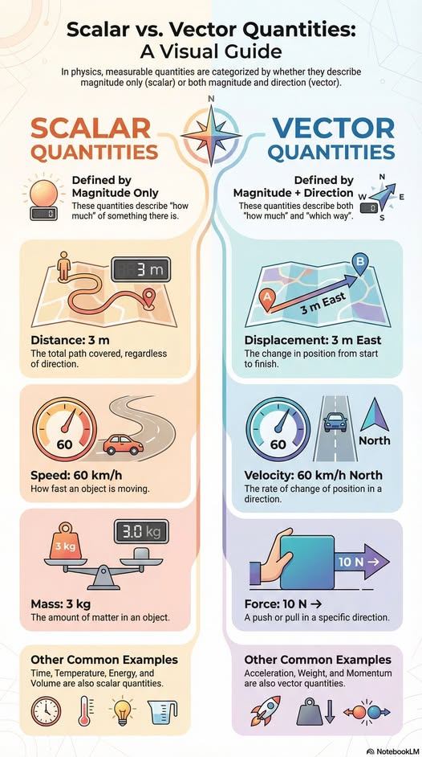



## Vector fields &amp; implied flow
<div class="header_line"><br/></div>

[](https://github.com/zhendrikse/science/blob/main/mathematics/quiver_plot.js)&nbsp;&nbsp;
[](https://en.wikipedia.org/wiki/JavaScript)&nbsp;&nbsp;

🎯 Dynamic visualization of vector fields $\phi: \mathbb{R}^3 \rightarrow \mathbb{R}^3$

<div class="equationDiv" id="vectorFieldEquation"></div>
<div class="canvasWrapper" id="quiverContainer">
    <canvas class="applicationCanvas" id="quiverCanvas"></canvas><br/>
</div>
<div class="guiContainer" id="gui-container"></div>
<script type="module" src="quiver_plot.js"></script>

<p style="clear: both;"></p>

### Scalar vis-à-vis vector quantities
<div class="header_line"><br/></div>

<figure style="text-align: center;">
  
  <figcaption>This excellent visual guide originates from 
    <a href="https://www.facebook.com/HouseOfPhysics/">House of Physics</a>.
  </figcaption>
</figure>

## What do the colors show?
<div class="header_line"><br/></div>

Given a vector field $F = (u, v, w)$, the divergence is defined by

$$
\nabla \cdot \mathbf{F}
= \frac{\partial u}{\partial x} +
\frac{\partial v}{\partial y} +
\frac{\partial w}{\partial z}
$$

Interpretation:

🔴 positive → **source**<br/>
🔵 negative → **sink**<br/>
⚪ zero → incompressible 

The curl is defined by

$$
\nabla \times \mathbf{F}
$$

For the color we use the magnitude of the curl:
$$
||\nabla \times \mathbf{F}||
$$

Interpretation:

* local magnitude of **rotation behavior**
* vortex-structures become directly visible

The vector field is **sampled on a lattice**, so we apply **central differences**. 

For the divergence this leads to

```text
∂u/∂x ≈ (u(x+dx) − u(x−dx)) / (2dx)
∂u/∂y ≈ (u(y+dy) − u(y−dy)) / (2dy)
∂u/∂z ≈ (u(z+dz) − u(z−dz)) / (2dz)
```

and the curl

```text
curl_x = ∂w/∂y − ∂v/∂z
curl_y = ∂u/∂z − ∂w/∂x
curl_z = ∂v/∂x − ∂u/∂y
```

Summarizing:

| Property   | Channel           |
|------------|-------------------|
| Direction  | Arrow orientation |
| Strength   | length            |
| Divergence | color             |
| Rotation   | curl-color        |
| Time       | animation         |

### Possible extensions

In the future, the following may be added:

🧭 **streamlines / pathlines**<br/>
🧠 Helmholtz-decompositie<br/>
📊 interactieve colorbar<br/>
⚡ GPU finite differences (shader)<br/>
🌀 curl-vectors as opposed to magnitude<br/>


