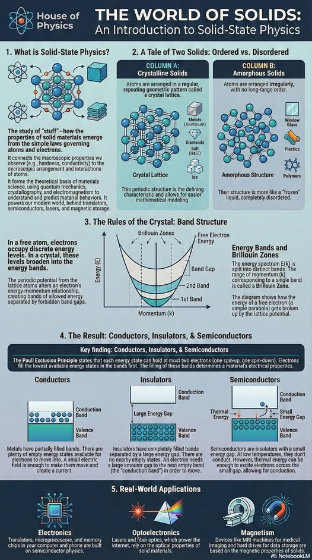



## Cubic lattice model

 

🔧 [Original code](https://www.glowscript.org/#/user/wlane/folder/Let'sCodePhysics/program/atoms-array) by [Let&apos;s code physics](https://www.youtube.com/@LetsCodePhysics) 
🛠  Refactored and ported to [cubic_lattice.js](https://github.com/zhendrikse/science/blob/main/molecularphysics/cubic_lattice.js) with [Three.js](https://threejs.org/) 
👉 A similar [VPython](https://vpython.org/) version is available as [molecules.py](https://github.com/zhendrikse/pysics-in-python/blob/main/vpython/cubic_lattice.py).

<canvas class="applicationCanvas" id="simulationCanvas" style="aspect-ratio: 1/1"></canvas> 

    <button id="pauseButton">&nbsp;Pause&nbsp;</button>
    <button id="bondTypeButton">Bonds as springs</button>

### The world of solids

 

<figure style="text-align: center;">
  
  <figcaption>This excellent visual guide originates from 
    <a href="https://www.facebook.com/HouseOfPhysics/">House of Physics</a>.
  </figcaption>
</figure>


