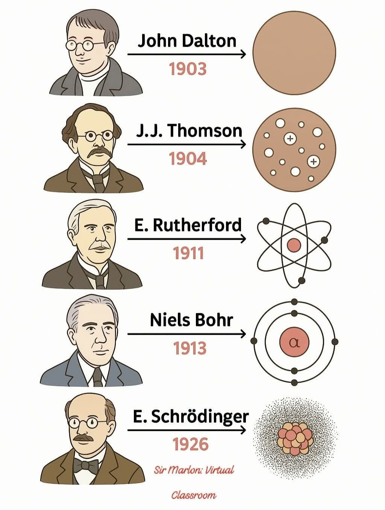



## Rutherford scattering

 

> The Geiger–Marsden experiments (also called the Rutherford gold foil experiment) were a landmark series 
of experiments by which scientists learned that every atom has a nucleus where all of its positive charge 
and most of its mass is concentrated. They deduced this after measuring how an alpha particle beam is 
scattered when it strikes a thin metal foil. &mdash;[Wikipedia](https://en.wikipedia.org/wiki/Geiger-Marsden_experiments)

In this animation, a disk is used as source of alpha particles which scatter off gold nucleus.
The position of the gold nucleus changes as the alpha particles pass by, but it is
repositioned after each event.



### Infographic: history of the atomic model

 

<figure style="text-align: center;">
  
  <figcaption>Source <a href="https://www.facebook.com/SirMD.8/">Sir Marlon: Virtual Classroom</a>.</figcaption>
</figure>

1. _John Dalton’s Model_ (1803) &mdash; Solid Sphere Model 
   **Overview**: 
   Dalton proposed that all matter is made up of indivisible particles called atoms. 
   He imagined atoms as tiny, solid spheres &mdash; like billiard balls. 
   **Key Ideas**: 
   Atoms of the same element are identical in mass and properties. 
   Atoms cannot be created, divided, or destroyed. 
   Compounds form when atoms of different elements combine in fixed ratios. 
   **Importance**: 
   First scientific model of the atom based on experimental evidence (like gas laws). 
   Laid the groundwork for modern chemistry.
2. _J.J. Thomson’s Model_ (1904) &mdash; Plum Pudding Model 
   **Overview**: 
   After discovering the electron, Thomson proposed that atoms are made of a positively charged substance with negatively charged electrons scattered within it &mdash; like raisins in pudding. 
   **Key Ideas**: 
   Atoms are divisible. 
   Electrons are negatively charged subatomic particles. 
   The rest of the atom is a blob of positive charge to balance the electrons. 
   **Importance**: 
   First model to show that atoms have internal structure. 
   Introduced the idea of subatomic particles.
3. _Ernest Rutherford’s Model_ (1911) &mdash; Nuclear Model 
   **Overview**: 
   Conducted the gold foil experiment where alpha particles were fired at a thin sheet of gold. 
   Most passed through, but some were deflected at large angles. 
   **Key Ideas**: 
   Atoms are mostly empty space. 
   A small, dense, positively charged nucleus is at the center. 
   Electrons orbit around this nucleus. 
   **Importance**: 
   Disproved the plum pudding model. 
   Introduced the concept of a nucleus.
4. _Niels Bohr’s Model_ (1913) &mdash; Planetary Model 
   **Overview**: 
   Bohr expanded on Rutherford’s model using discoveries from quantum theory. 
   **Key Ideas**: 
   Electrons orbit the nucleus in fixed paths or “energy levels.” 
   Each level has a specific amount of energy. 
   Electrons can jump to higher levels when energy is absorbed and fall back down when energy is released (as light). 
   **Importance**: 
   Explained why atoms emit light in specific colors (atomic spectra). 
   Added the concept of quantized energy levels.
5. _Erwin Schrödinger’s Model_ (1926) &mdash; Quantum Mechanical Model (Electron Cloud Model) 
   **Overview**: 
   Schrödinger used complex math to describe the behavior of electrons as waves, not particles in orbits. 
   **Key Ideas**: 
   Electrons exist in regions called orbitals (not fixed paths). 
   Orbitals show where an electron is most likely to be found. 
   The exact location and speed of an electron cannot be known at the same time (Heisenberg Uncertainty Principle). 
   **Importance**: 
   Most accurate and widely accepted model today. 
   Forms the basis of quantum chemistry and modern physics.



