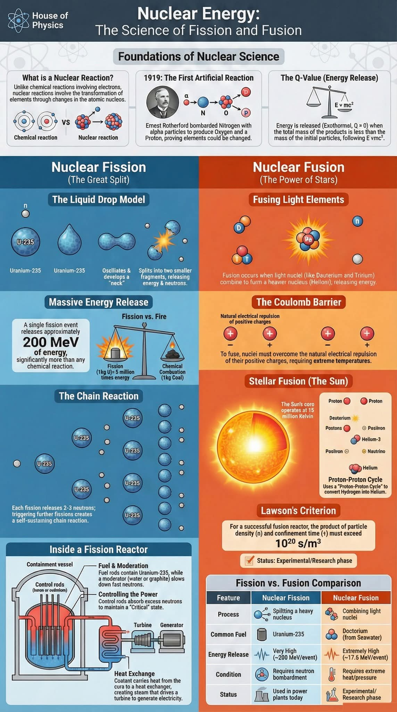



## Fission of radio active uranium 235 ☢️

 



### The science of fission and fusion

 

<figure style="text-align: center;">
  
  <figcaption>This excellent visual guide originates from 
    <a href="https://www.facebook.com/HouseOfPhysics/">House of Physics</a>.
  </figcaption>
</figure>

