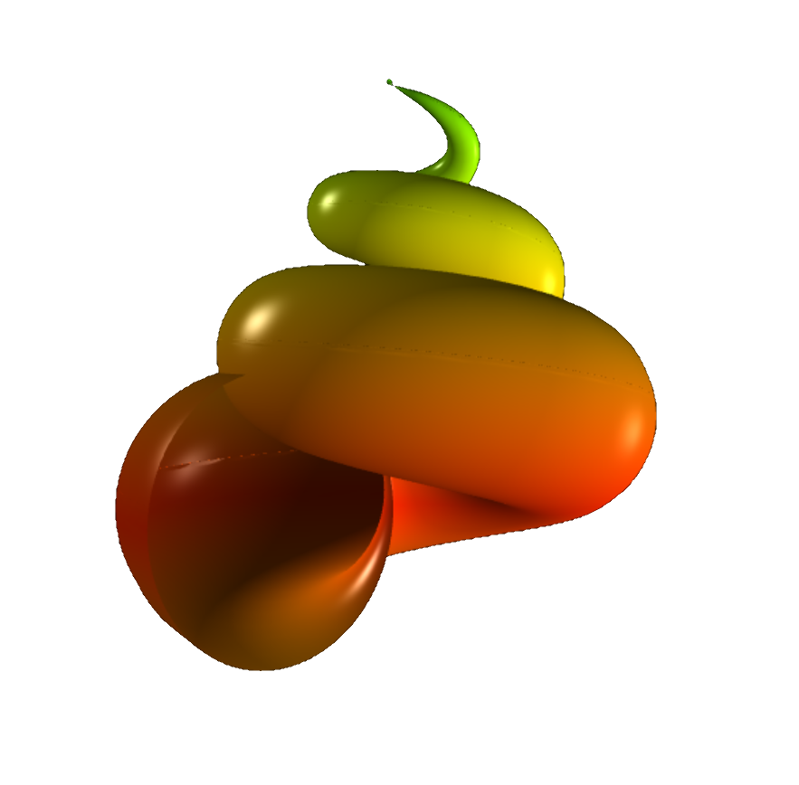

# Nature models

 

The code pertaining to the demos in this section is available under the 
[miscellaneous tab](https://www.glowscript.org/#/user/zeger.hendrikse/folder/MyPrograms/)
on [glowscript.org](https://glowscript.org/#/user/zeger.hendrikse/).

### Flocking birds &amp; seashells

 

<figure style="float: left; width: 50%; text-align: center">
  
  <figcaption>Simulation of a flock of birds: "Eagles commonly fly alone. They are crows, daws, 
  and starlings that flock together" &mdash; John Webster </figcaption>
</figure>
<figure style="float: left; width: 50%; text-align: center">
  
  <figcaption>"As water finds its way back to the sea, I find a way 
  back to me &mdash; <a href="https://ktolnoe.com/en-nl">K. Tolnoe</a>.
  For more surfaces, visit the <a href="geometry.html">Math Art Gallery</a>.</figcaption>
</figure>

### Modelling falling raindrops and the DNA

 

<figure style="float: left; width: 40%; text-align: center">
  
  <figcaption>"There are holes in the sky. Where the rain gets in. But they're ever so small. 
  That's why the rain is thin" &mdash; Spike Milligan.</figcaption>
</figure>

<figure style="float: right; width: 55%; text-align: center">
  
  <figcaption>"It has not escaped our notice that the specific pairing we have postulated immediately suggests a possible copying mechanism for the genetic material."
James Watson Francis Crick. Nature, 171: 737. April 25, 1953.</figcaption>
</figure>

