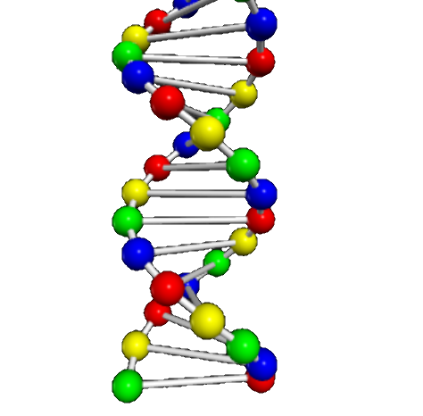

# [Mathematics](mathematics/index.html)

 

  

    <h2><a href="mathematics/index.html">3D function plots</a></h2>
    

      <figure class="left_image">
        &nbsp;&nbsp;&nbsp;
      </figure>
      <figure class="right_image">
        
      </figure>
    

    

      <figure class="left_image">
        
      </figure>
      <figure class="right_image">
        
      </figure>
    

  

  

    <h2><a href="mathematics/index.html">Topological surfaces</a></h2>
    

      <figure class="left_image">
        
      </figure>
      <figure class="right_image">
        
      </figure>
    

    

      <figure class="left_image">
        
      </figure>
      <figure class="right_image">
        
      </figure>
    

  

# Physics

 

  

    <h2><a href="astrophysics/index.html">Astrophysics</a></h2>
    

      <figure class="left_image">
        
      </figure>
      <figure class="right_image">
        
      </figure>
    

    

      <figure class="left_image">
        
      </figure>
      <figure class="right_image">
        <!-- RESERVED FOR FUTURE APPLICATION -->
      </figure>
    

  

  

    <h2><a href="molecularphysics/index.html">Atomic &amp; molecular physics</a></h2>
    

      <figure class="left_image">
       
      </figure>
      <figure class="right_image">
       
      </figure>
    

    

      <figure class="left_image">
        
      </figure>
      <figure class="right_image">
        
      </figure>
    

  

  

    <h2>Atomic &amp; molecular physics</h2>
    
Some text..

    

      <figure class="left_image">
        
      </figure>
      <figure class="right_image">
        
      </figure>
    

  

  

    <h2>Atomic &amp; molecular physics</h2>
    
Some text..

  

