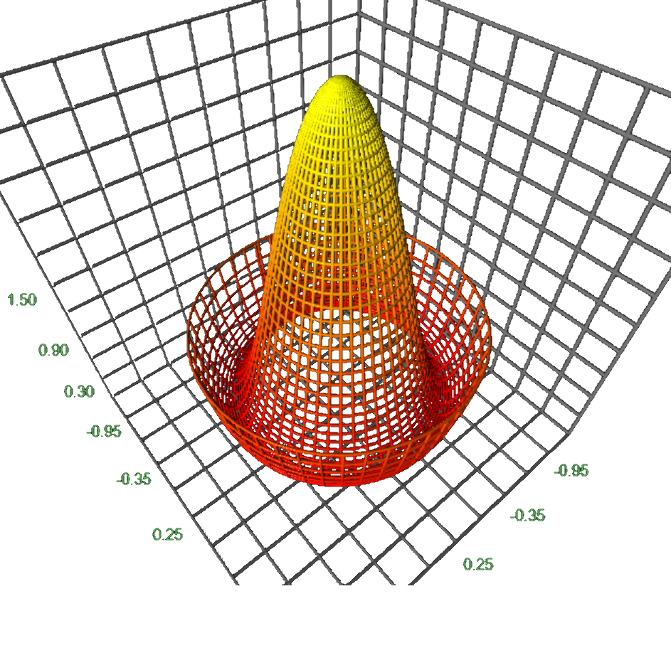
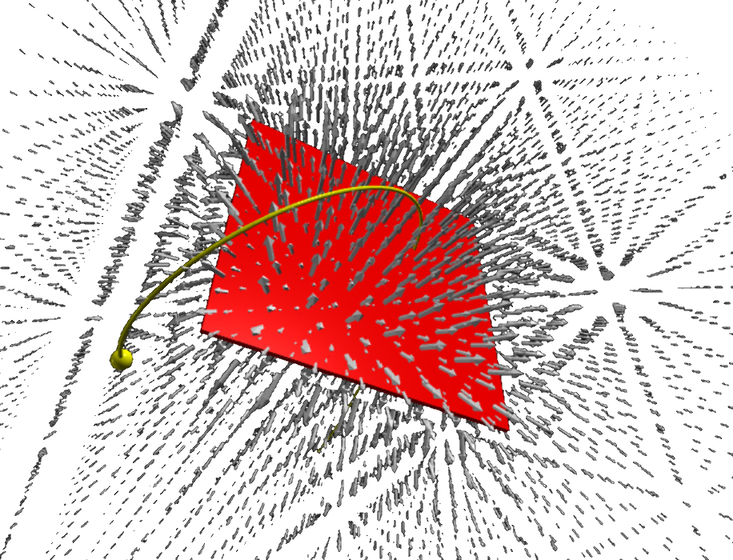

# Mathematics

  

    <h2>3D function plots</h2>
    

      <figure class="left_image">
        &nbsp;&nbsp;&nbsp;
      </figure>
      <figure class="right_image">
        
      </figure>
    

    

      <figure class="left_image">
        
      </figure>
      <figure class="right_image">
        
      </figure>
    

  

  

    <h2>3D function plots</h2>
    

      <figure class="left_image">
        
      </figure>
      <figure class="right_image">
        
      </figure>
    

    

      <figure class="left_image">
        
      </figure>
      <figure class="right_image">
        
      </figure>
    

  

# Physics

  

    <h2>Electromagnetism</h2>
    
Some text..

    

      <figure class="left_image">
        
        <figcaption>Electron moving around a charged sheet.</figcaption>
      </figure>
      <figure class="right_image">
        
        <figcaption>If the atomic nucleus were a charged ring&#x2026;</figcaption>
      </figure>
    

  

  

    <h2>Atomic &amp; molecular physics</h2>
    
Some text..

  

