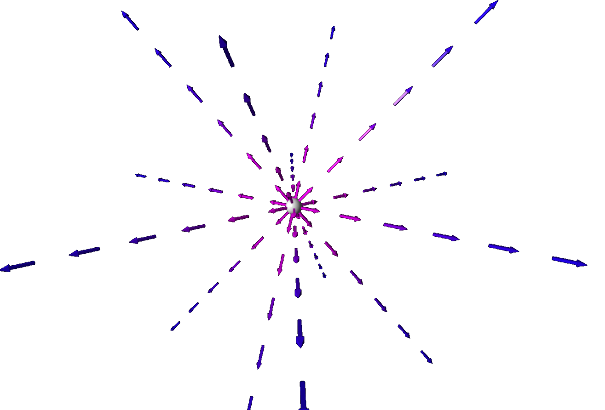
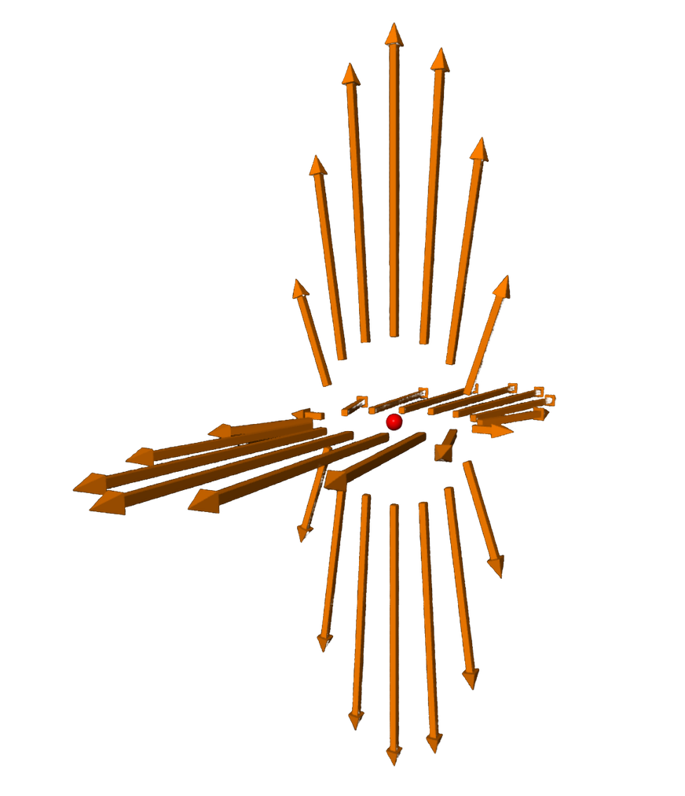
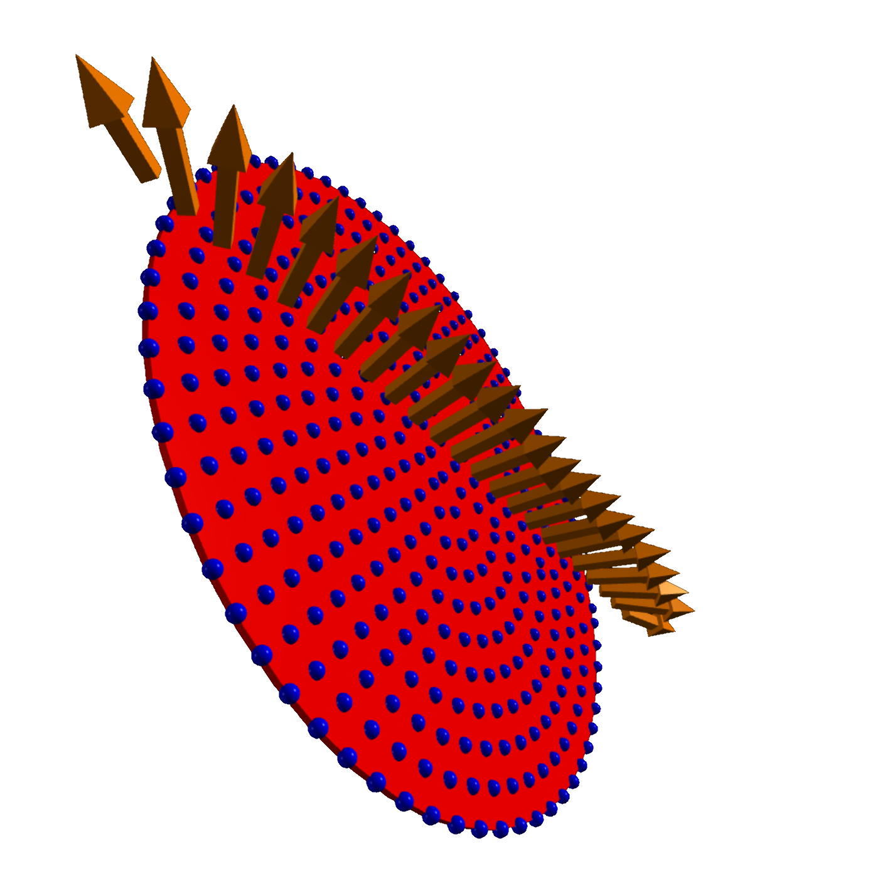
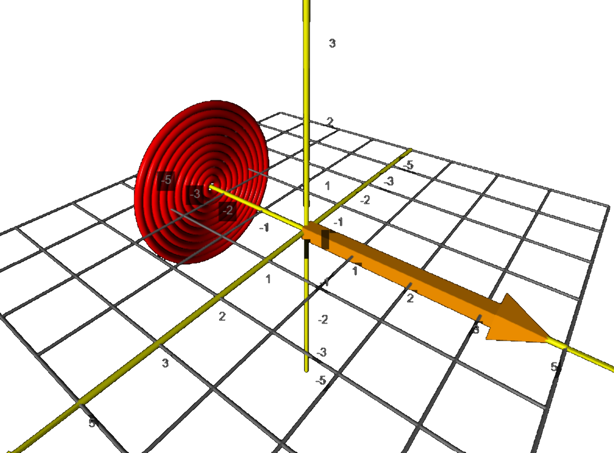
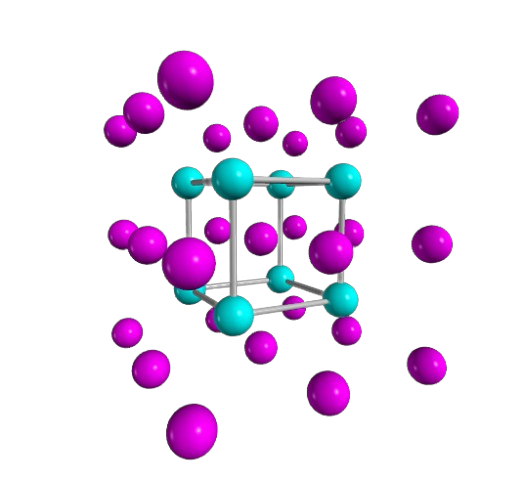
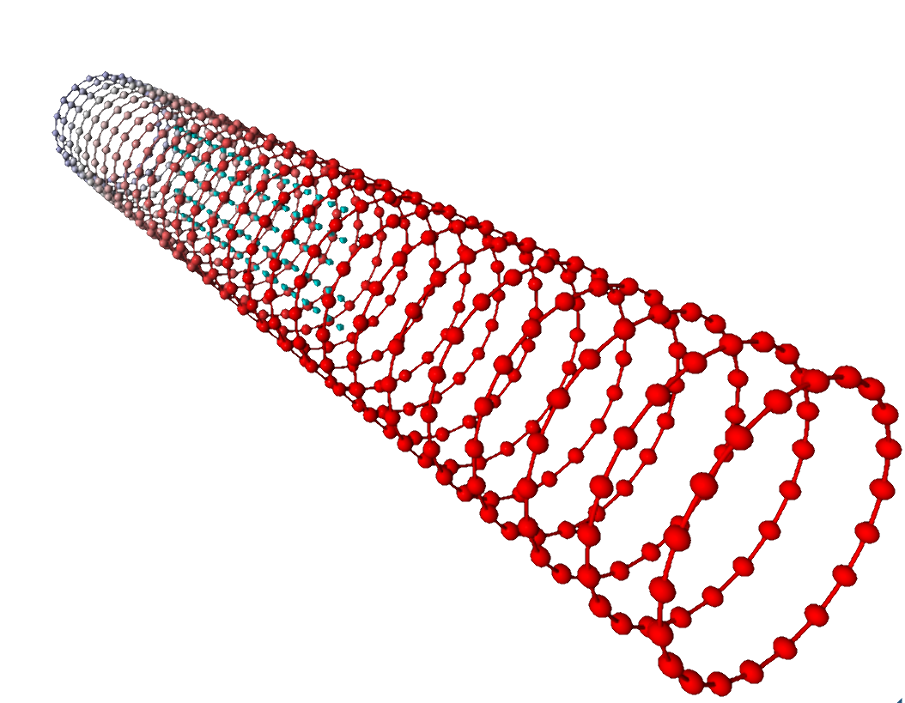
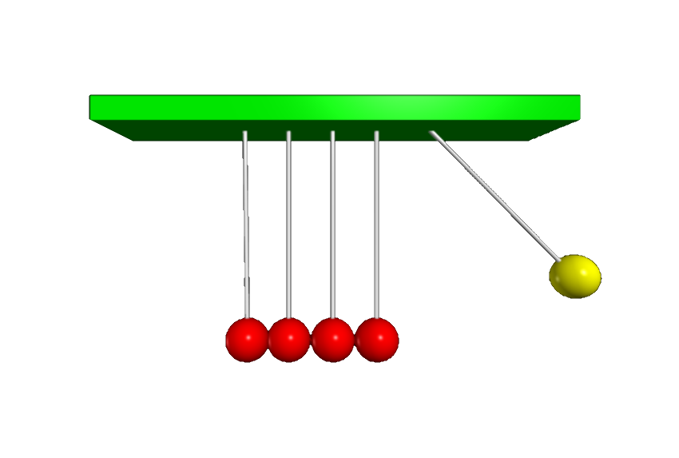



# Obsolete

 

### Static and moving point charges

 

<figure class="left_image">
  
  <figcaption><a href="https://en.wikipedia.org/wiki/Electric_dipole_moment">Electric field around a point charge.</a></figcaption>
</figure>
<figure class="right_image">
  
  <figcaption>An electric field of a fast moving (relativistic) proton.</figcaption>
</figure>

### Charged disk and accompanying builder

 

<figure class="left_image">
  
  <figcaption>Visualization of the electric field around a disk.</figcaption>
</figure>
<figure class="right_image">
  
  <figcaption>Build up an electric field yourself by incrementally adding a charged rings.</figcaption>
</figure>

### Cubic crystal symmetry &amp; charged rings

 

<figure class="left_image">
  
  <figcaption> “There’s poetry in nature. A symmetry. It&apos;s like our senses are fused.” &mdash; 
  Saffron A. Kent, Gods & Monsters.
  </figcaption>
</figure>
<figure class="right_image">
    
  <figcaption>Visualization of an electric field inside a series of charged rings.</figcaption>
</figure>

### Newton&apos;s cradle

 

<figure class="left_image">
  
  <figcaption>"[...] and to every action there is always an equal and opposite or contrary, reaction”
  &mdash; <a href="https://en.wikipedia.org/wiki/Isaac_Newton">Isaac Newton</a>.</figcaption>
</figure>
<figure class="right_image">
  <!-- RESERVED FOR FUTURE APPLICATION
    -->
</figure>


