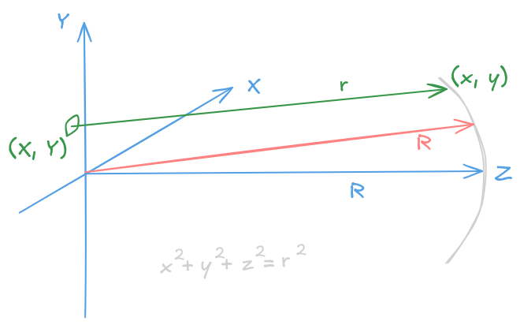



## Diffraction pattern of a circular aperture 

 

Below you'll find a diffraction pattern of a circular aperture far away from a screen. 
The intensity is calculated as the square of the amplitude of the electric field. 
Since the resulting diffraction pattern is too faint to be discerned on a computer screen, 
a 'fake' intensity image of the diffraction pattern is shown as well, where the intensity
is calculated by using the absolute value of the amplitude of the electric field instead.



## Instructions given in the video

 

Below you find a copy of the original set of instructions that accompany the video.

$\begin{eqnarray}r &=& \sqrt{(x-X)^2 + (y-Y)^2 +z^2} \\ &=& \sqrt{x^2+y^2+z^2-2xX-2yY+X^2+Y^2} \\ &=& R\sqrt{1-\dfrac{2xY+2yY}{R^2}+\dfrac{X^2+Y^2}{R^2}}\end{eqnarray}$

For a small aperture we have $X^2+Y^2 \ll  R^2$, so we can write

$\begin{eqnarray}r &\approx& R\sqrt{1-\dfrac{2xY+2yY}{R^2}} \\ &\approx& R\left(1-\dfrac{2xY+2yY}{R^2}\right)\end{eqnarray}$

### I. Introduction

 

This homework is to find the diffraction pattern of a circular aperture far from the screen. Assume there
is a circular aperture of diameter $d=100 \mu m$ and there is a spherical screen at $R=1m$ away. The light source is
of wavelength $\lambda=500nm$. To obtain the diffraction pattern, you can assume there are many point light sources
at the lattice points, sitting at the cross points of the $N=100$ vertical lines and $N=100$ horizontal lines, each 
separated by $s=d/N=1\mu m$ apart. If the lattice point's position is within the circular aperture, then it is allowed
to radiate light. Then on the screen you add all the electric field contributions from the light sources of the grid points, 
and you  will be able to obtain the diffraction intensity pattern by squaring the electric field (the detailed derivation is
listed in the next page). 

In addition to generating the intensity plot of the diffraction pattern, also find and print the
radius of the first dark ring and check whether the Rayleigh criterion $\theta=1.22\lambda / d$ is satisfied. Also notice
that, to calculate intensity is to do the square of the amplitude. However, the 'real' diffraction pattern is really
faint to be observed on the computer screen. Therefore, we also do a 'false' intensity image of the diffraction pattern
by taking the absolute value of the amplitude as the intensity. Of course, when you want to calculate the 
radius of the first dark ring, you should use the 'real' intensity image.

### II. Theoretical background

 

The amplitude of the electric field at position $(x, y)$ on the screen gets its contribution from all point
sources sitting inside the aperture

$\begin{equation}E(x, y) =\int\int_{\text{aperture}} \dfrac{1}{r}\sin(\omega t - kr)dXdY\end{equation}$

Next, we substitute the expression for $r$ found in the previous section to obtain

$\begin{equation}E(x, y) \approx \int\int\dfrac{1}{R\left(1 - \dfrac{xX + yY}{R^2}\right)}\sin\left(\omega t - kR\left(1 -\dfrac{xX + yY}{R^2}\right)\right)dXdY\end{equation}$

Now let $\theta_x=x/R, \theta_y=y/R, k_x=k\theta_x, k_y=k\theta_y$, then

$\begin{equation}E(\theta_x, \theta_y) \approx \int\int \frac{1}{R}\sin(\omega t -kR +k_x X + k_y Y)dXdY\end{equation}$

Applying some basic trigonometry we get

$\begin{equation}E(\theta_x, \theta_y) \approx \int\int \frac{1}{R}\sin(\omega t -kR)\cos(k_x X + k_y Y)dXdY + \int\int \frac{1}{R}\cos(\omega t -kR)\sin(k_x X + k_y Y)dXdY\end{equation}$

which is equivalent to

$\begin{equation}E(\theta_x, \theta_y) \approx \sin(\omega t -kR)\int\int \frac{1}{R}\cos(k_x X + k_y Y)dXdY + \cos(\omega t -kR)\int\int \frac{1}{R}\sin(k_x X + k_y Y)dXdY\end{equation}$

As we have

$\begin{equation}\int\int \frac{1}{R}\sin(k_x X + k_y Y)dXdY=0\end{equation}$ 

due to the symmetry of the integration on the "circular" aperture 
(between quotes, since we
have approximated it by a square area in our code), we get

$\begin{equation}E(\theta_x, \theta_y) \approx \sin(\omega t -kR)\int\int \frac{1}{R}\cos(k_x X + k_y Y)dXdY = A \cdot \sin(\omega t -kR)\end{equation}$

where

$A = \int\int_\text{aperture} \frac{1}{R}\cos(k_x X + k_y Y)dXdY$

is the amplitude of the electric field on the spherical screen, which is 
the one you should calculate by summation over all the grid points on the aperture.

