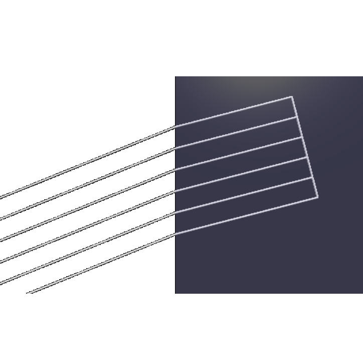



### Light refraction 

 

  <figure class="left_image">
    
    <figcaption><a href="https://en.wikipedia.org/wiki/Snell%27s_law">Snell&apos;s law.</a></figcaption>
  </figure>
  <figure class="right_image">
    
    <figcaption><a href="https://en.wikipedia.org/wiki/Thin-film_interference">Thin film interference.</a></figcaption>
  </figure>

