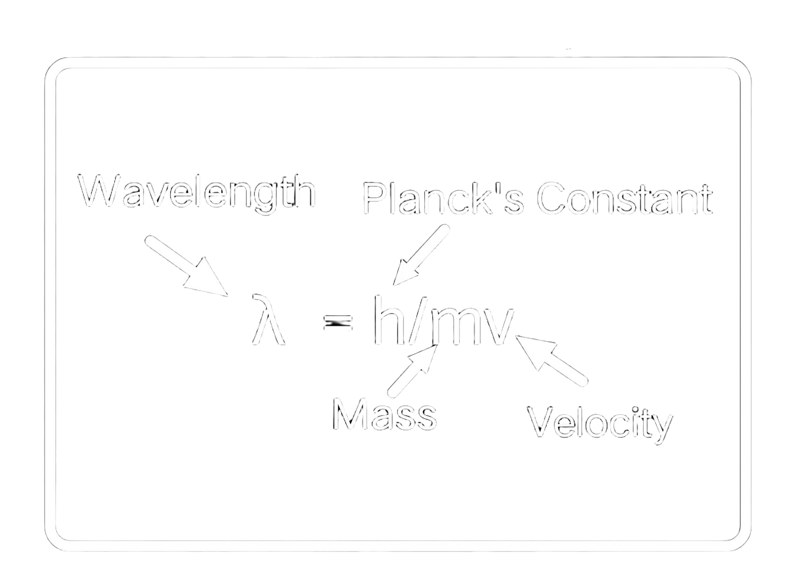



## [Young&apos;s interference experiment](https://en.wikipedia.org/wiki/Double-slit_experiment)
<div class="header_line"><br/></div>

### Dynamic visualization
<div class="header_line"><br/></div>

In this visualization, the interference pattern is generated "dynamically", i.e. by calculating
the propagation of the waves using a [finite difference method](https://pythonnumericalmethods.studentorg.berkeley.edu/notebooks/chapter23.03-Finite-Difference-Method.html).

🔧 Original [double slit experiment.py](https://github.com/NelsonHackerman/Random_python_ideas/blob/main/double%20slit%20experiment.py) by [Nelson Hackerman](https://github.com/NelsonHackerman) <br/>
🔧 Ported to Javascript and [three.js](https://threejs.org/) by [Zeger Hendrikse](https://github.com/zhendrikse/), see [dynamic_double_slit.js](https://github.com/zhendrikse/science/blob/main/quantumphysics/dynamic_double_slit.js) <br/>
👉 [VPython](https://vpython.org/) version available as [dynamic_double_slit.py](https://github.com/zhendrikse/physics-in-python/blob/main/vpython/dynamic_double_slit.py), but significantly slower!

<div class="canvasWrapper" id="canvas-wrapper">
    <canvas class="applicationCanvas" id="doubleSlitCanvas"></canvas>
</div>
<div class="buttonRow">
    <button id="resetButton">🔄 Reset View</button>&nbsp;&nbsp;
    <label for="slitSizeSlider"><input type="range" min="3" max="25" value="6" class="slider" id="slitSizeSlider"/> Slit size</label>
</div>
<script type="module" src="dynamic_double_slit.js"></script>
<p style="clear: both;"></p>

### Static visualization
<div class="header_line"><br/></div>

In this visualization, the interference pattern is generated "statically", i.e. by calculating
the path difference between the beams originating from each source and setting the (pixel) color 
of the background accordingly.

The two slits are represented by the two cylinders that also now firing particles at the screen/detector 
in the simulation, so that the difference in the behavior of particles and waves can be clearly seen.

🔧 [Original VPython version](https://www.glowscript.org/#/user/wlane/folder/Modern-Physics/program/Double-Slit) by [Let&apos;s code physics](https://www.youtube.com/@LetsCodePhysics)<br/>
🔧 Refactored and ported to [double_slit.js](https://github.com/zhendrikse/science/blob/main/quantumphysics/double_slit.js) <br/>
👉 See also [his accompanying video](https://www.youtube.com/watch?v=Zjmg6n7Wc8I)<br/>
👉 [VPython](https://vpython.org/) version available as [double_slit.py](https://github.com/zhendrikse/physics-in-python/blob/main/vpython/double_slit.py)

<canvas id="slitExperimentCanvas" class="applicationCanvas" style="aspect-ratio: 19/12"></canvas>
<div>
    <label for="wavelengthSlider">Wavelength:</label>
    <input type="range" id="wavelengthSlider" min="0.1" max="2" step="0.01" value="0.5">
    <span id="wavelengthValue">0.5</span>
</div>
<script type="module" src="double_slit.js"></script>
<p style="clear: both;"></p>

#### How the interference pattern is generated

The intensity is given by:

$$
I = \cos^2\left(\frac{\pi , \Delta r}{\lambda}\right)
$$

This is easily translated in code as follows:

```js
this._position.set(x, y, 0);
const r1 = this._position.distanceTo(this._slit1);
const r2 = this._position.distanceTo(this._slit2);
const pathDiff = Math.abs(r1 - r2);
const rAverage = (r1 + r2) * 0.5;
const envelope = 1 / (1 + 0.1 * rAverage);

const brightness = Math.pow(Math.cos(Math.PI * pathDiff / this._wavelength), 2) * envelope;
```

## Background information
<div class="header_line"><br/></div>

In 1801, Thomas Young was the first to perform an experiment that made it unequivocally clear
that light is a wave, since the interference pattern he observed was exactly similar to
an interference pattern that would have been produced by water waves.

<figure style="text-align: center;">
  <a href="https://energywavetheory.com/explanations/double-slit-experiment/">
    
  </a>
  <figcaption>Picture illustrating the wave-like nature of light.</figcaption>
</figure>
<p style="clear: both;"></p>

### Videos on the mystery of the double slit experiment
<div style="border-top: 1px solid #999999"><br/></div>

The following videos are recommended to learn more about the double slit experiment
and its repercussions for our view on the reality of nature:

- [Single Photon Interference](https://www.youtube.com/watch?v=GzbKb59my3U) by [Veritassium](https://www.youtube.com/@veritasium), where the experiment is actually performed!
- [The Quantum Experiment that Broke Reality](https://www.youtube.com/watch?v=p-MNSLsjjdo) by [PBS Space Time](https://www.youtube.com/@pbsspacetime), with a more in-depth explanation.
- [Dr.Quantum &mdash; Double slit experiment](https://www.youtube.com/watch?v=Q1YqgPAtzho), a video that is more accessible to the public.

<div class="double_image">
<figure class="left_image">
  <a href="https://www.youtube.com/watch?v=p-MNSLsjjdo">
    
  </a>
  <figcaption>Scene from <a href="">The Quantum Experiment that Broke Reality</a> by 
  <a href="https://www.youtube.com/@pbsspacetime">PBS Space Time</a>.</figcaption>
</figure>
<figure class="right_image">
  <a href="https://www.youtube.com/watch?v=Q1YqgPAtzho">
    
  </a>
  <figcaption>Scene from the video: 
  <a href="https://www.youtube.com/watch?v=Q1YqgPAtzho">Dr.Quantum &mdash; Double slit experiment</a>.</figcaption>
</figure> 
</div>
<p style="clear: both;"></p>

### Particle-wave duality
<div style="border-top: 1px solid #999999"><br/></div>

<figure style="text-align: center;">
  <a href="https://www.threads.net/@omshah117/post/C9rk0S1yzdO/">
    
  </a>
  <figcaption>Picture illustrating the relation between wavelength and mass.</figcaption>
</figure>
<p style="clear: both;"></p>





    