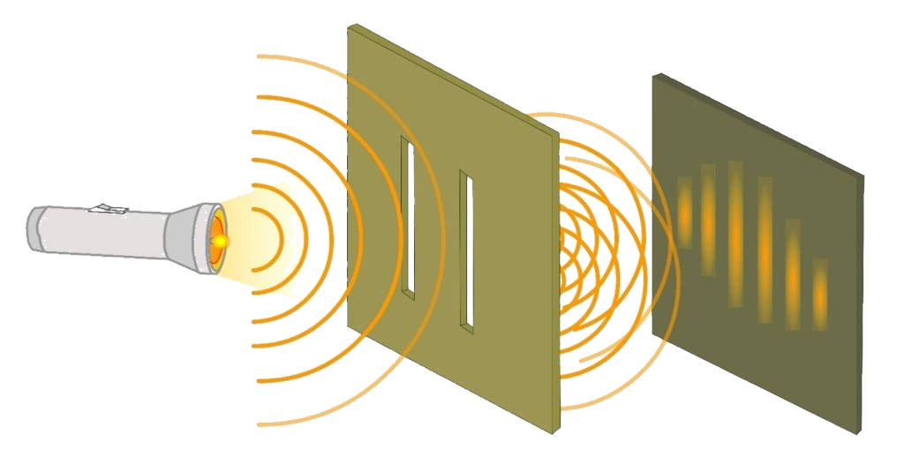
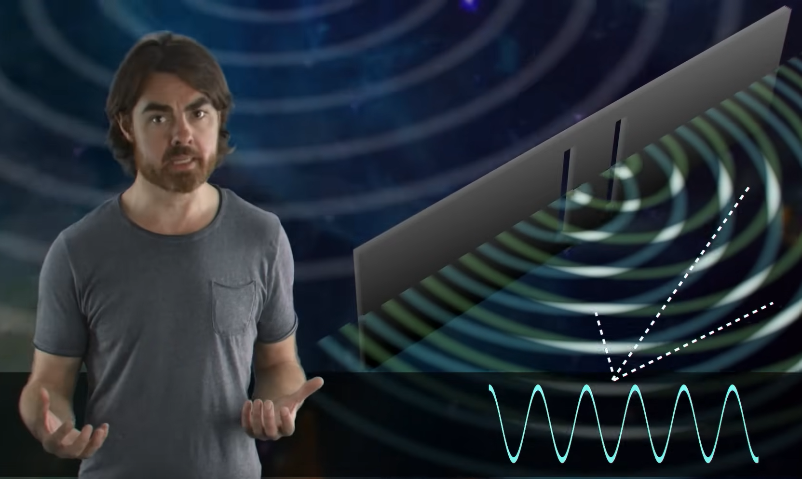
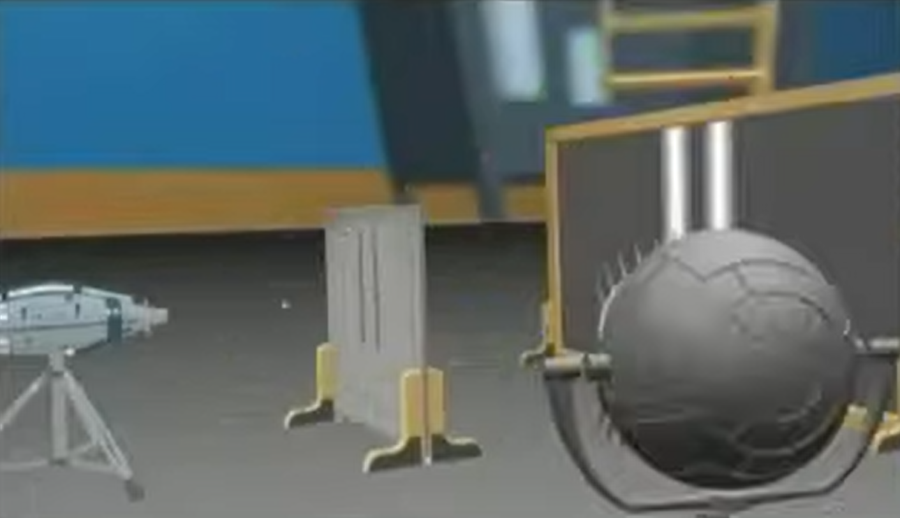
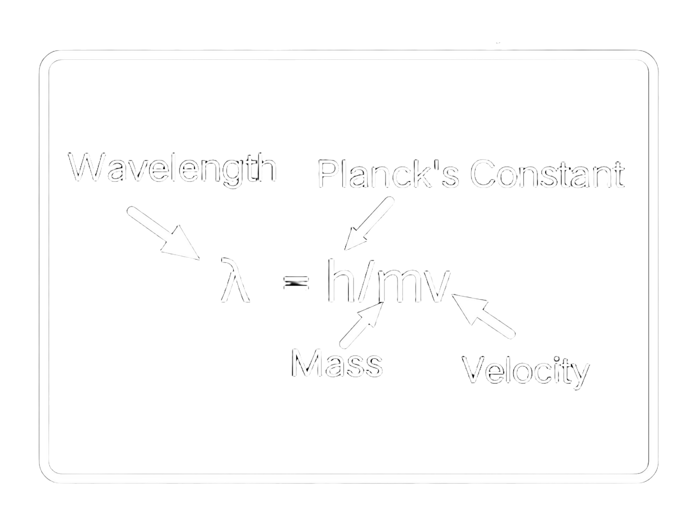

## Background information

 

In 1801, Thomas Young was the first to perform an experiment that unequivocally demonstrated
the wave-like nature of light, because the interference pattern he observed was exactly similar to
an interference pattern that would have been produced by water waves.

<figure style="float: center; text-align: center;">
  
  <figcaption>Picture illustrating the wave-like nature of light.</figcaption>
</figure>

### Videos on the mystery of the double slit experiment

 

The following videos are recommended to learn more about the double slit experiment:

- [Single Photon Interference](https://www.youtube.com/watch?v=GzbKb59my3U) by [Veritassium](https://www.youtube.com/@veritasium), where the experiment is actually performed!
- [The Quantum Experiment that Broke Reality](https://www.youtube.com/watch?v=p-MNSLsjjdo) by [PBS Space Time](https://www.youtube.com/@pbsspacetime), with a more in-depth explanation.
- [Dr.Quantum &mdash; Double slit experiment](https://www.youtube.com/watch?v=Q1YqgPAtzho), a video that is more accessible to the public.

<figure class="left_image">
  
  <figcaption>Scene from <a href="">The Quantum Experiment that Broke Reality</a> by 
  <a href="https://www.youtube.com/@pbsspacetime">PBS Space Time</a>.</figcaption>
</figure>
<figure class="right_image">
  
  <figcaption>Scene from the video: 
  <a href="https://www.youtube.com/watch?v=Q1YqgPAtzho">Dr.Quantum &mdash; Double slit experiment</a>.</figcaption>
</figure> 

### Particle-wave duality

 

<figure style="float: center; text-align: center;">
  
  <figcaption>Picture illustrating the relation between wavelength and mass.</figcaption>
</figure>

