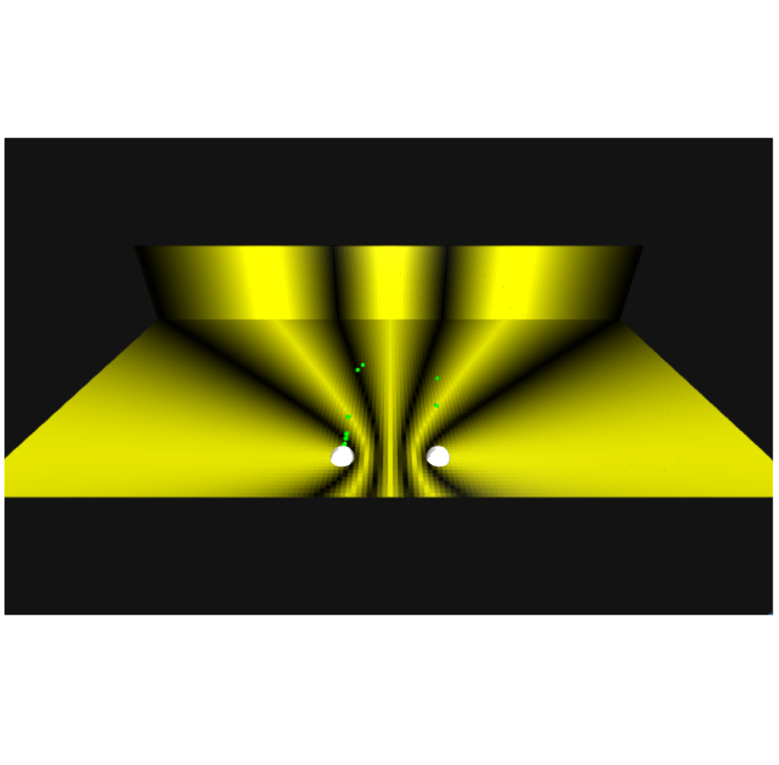
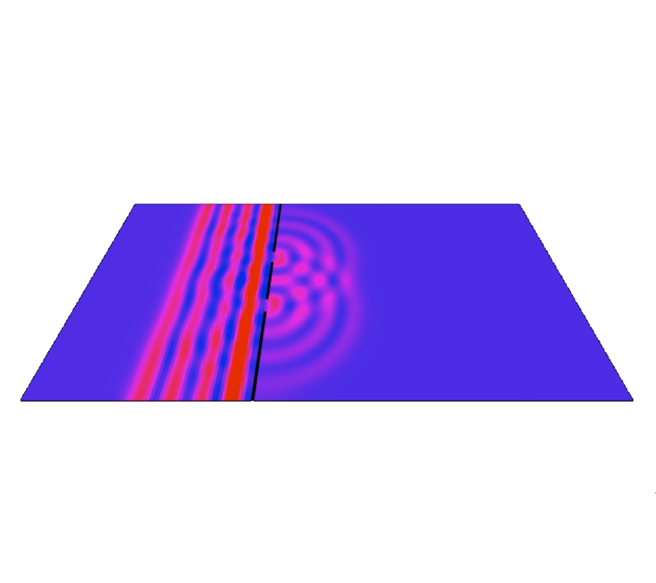



# Particle and quantum physics

 

<blockquote>
If you think you understand quantum mechanics, you don't understand quantum mechanics.
&mdash; <a href="https://en.wikipedia.org/wiki/Richard_Feynman">Richard P. Feynman</a> 
</blockquote> 

###  Plane waves &amp; the particle in a box

 

<figure class="left_image">
  
  <figcaption>Visualizing plane waves, which 
  play a pivotal role in quantum mechanics!</figcaption>
</figure>
<figure class="right_image">
  
  <figcaption>One-dimensional quantum particle bound by an infinite square well.</figcaption>
</figure>

  
<a>&dArr; For a plane wave, we can easily derive the Schr&#246;dinger equation &uArr;</a>

According to <a href="https://en.wikipedia.org/wiki/Matter_wave">De Broglie</a> we have:

$$p = \dfrac{h}{\lambda} = \dfrac{h}{2\pi} \dfrac{2\pi}{\lambda} = \hbar k \Rightarrow \hbar k = \hbar \dfrac{\partial}{\partial x} \psi(x,t) = p \psi(x, t) \Rightarrow p = \hbar \dfrac{\partial}{\partial x}$$

The Kinetic energy can be expressed as:

$$K = \dfrac{p^2}{2m} = -\dfrac{\hbar^2}{2m}\dfrac{\partial^2}{\partial x^2} \psi(x,t)$$

The total energy is given by the <a href="https://en.wikipedia.org/wiki/Planck_relation">Planck-Einstein relation</a>:

$$E = hf = \dfrac{h}{2\pi}\dfrac{2\pi}{T} = \hbar \omega \Rightarrow -i\hbar\dfrac{\partial}{\partial t} \psi(x,t) = E \psi(x,t) \Rightarrow E = -i\hbar\dfrac{\partial}{\partial t}$$

From this we arrive at the <a href="https://en.wikipedia.org/wiki/Schr%C3%B6dinger_equation">Schr&#246;dinger equation</a>:

$$(KE + PE)\Psi(x,,t) = E\Psi(x,t) = -i\hbar \dfrac{\partial}{\partial t}\Psi(x, t) = -\dfrac{\hbar^2}{2m}\dfrac{\partial^2}{\partial x^2} \Psi(x,t) + V(x)\Psi(x,t)$$

In three-dimensional space this is then generalized to:

$$i\hbar\dfrac{\partial}{\partial t}\Psi(\vec{r}, t) = \left(-\frac{\hbar^2}{2m}\nabla^2 + V(\vec{r, t}\right)\Psi(\vec{r}, t)$$

<a>&dArr; Background: particle in a box, i.e. confined by a infinite square well &uArr;</a>

Although the one-dimensional particle-in-a-box problem does not correspond to any
real-world system, it illustrates quite well some (fundamental) 
quantum mechanical features nonetheless.

The box is modeled by an infinite square well, so that the particle cannot escape 
beyond the boundaries of the box.

Inside the box, the potential energy $V$ is zero (or constant). Substituting this together with the
formula for the plane wave $\psi(x,t) = Ae^{ik x}e^{-i\omega t}$ into the Schrödinger equation, we get:

$$\dfrac{\partial^2\psi}{\partial x^2} + \dfrac{8\pi^2m}{h^2}(E - 0)\psi=0 \Rightarrow \bigg(\dfrac{-h^2}{8\pi^2m}\bigg)\dfrac{\partial^2\psi}{\partial x^2}=E\psi$$

Which function does give itself (times $E$) when differentiated twice _and_ is zero at both boundaries of the box?

$$\psi = A\sin(ax) \Rightarrow \dfrac{h^2a^2}{8\pi^2m}\psi=E\psi \Rightarrow E=\dfrac{h^2a^2}{8\pi^2m}$$

To get $a$, we note that the wave function equals zero at the box boundaries:

$$\psi=A\sin(ax) = 0 \Rightarrow a=\dfrac{n\pi}{L} \Rightarrow \psi_n = A\sin\bigg(\dfrac{n\pi x}{L}\bigg) \Rightarrow E_n=\dfrac{h^2n^2}{8mL^2}$$

Normalizing the wave function results in an expression for $A$:

$$\int_0^L \psi \cdot  \psi dx = 1 \Rightarrow A^2 \int_0^L\sin^2\bigg(\dfrac{n\pi x}{L}\bigg) dx=1 \Rightarrow A^2\bigg(\dfrac{L}{2}\bigg)=1 \Rightarrow A=\sqrt{\dfrac{2}{L}}$$

So summarizing, we have

$$E=\dfrac{h^2a^2}{8\pi^2m} \text{ and } \psi_n=\sqrt{\dfrac{2}{L}}\sin(nkx), \text{where } k=\dfrac{\pi}{L}$$

These energy eigenstates (and superpositions thereof) are used in the visualization software.

### The quantum harmonic oscillator 

 

<figure class="left_image">
  
  <figcaption>The quantum harmonic oscillator is visualized in a semi-classical way below.</figcaption>
</figure>
<figure class="right_image">
  <!-- SPACE RESERVED FOR FUTURE APPLICATION
    -->
</figure> 

### [Young&apos;s interference experiment](https://en.wikipedia.org/wiki/Double-slit_experiment)

 

<figure class="left_image">
  
  <figcaption>The double slit experiment, stressing the <em>wave-particle duality</em>. 
  The interference pattern is generated statically.</figcaption>
</figure>
<figure class="right_image">
  
  <figcaption>Dynamic simulation of the experiment, stressing the formation of the 
  <em>interference pattern</em>.</figcaption>
</figure> 


