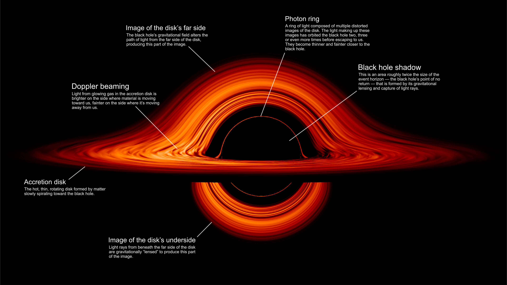



## Rendering a black hole using ray tracing

 



### Image rendition explained

 

<figure>
   
   <figcaption>Black hole picture explained (<a href="https://svs.gsfc.nasa.gov/13326">nasa.gov</a>)</figcaption>
</figure>

### Real images of black holes

 

For comparison, below are some real images of black holes, 
showing a bright ring formed as light bends in the intense gravity around a black hole.

  <figure class="left_image">
    &nbsp;&nbsp;&nbsp;&nbsp;&nbsp;&nbsp;&nbsp;&nbsp;&nbsp;
    <figcaption>On May 12, 2022, the 
    <a href="https://eventhorizontelescope.org/">Event Horizon Telescope</a> 
    managed to reveal Sagittarius A*, 
    the supermassive black hole at the center of our Milky Way.</figcaption>
  </figure>
  <figure class="right_image">
    &nbsp;&nbsp;&nbsp;&nbsp;&nbsp;&nbsp;&nbsp;&nbsp;&nbsp;
    <figcaption>Another supermassive black hole, at the center of the galaxy M87, 
    that is 6.5 billion times more massive than the sun, taken 
    by the same <a href="https://eventhorizontelescope.org/">Event Horizon Telescope</a>.</figcaption>
  </figure>

## A concise history

 

Black holes are an outcome of the 
[Einstein field equations (EFE)](https://en.wikipedia.org/wiki/Einstein_field_equations):

$R_{\mu\nu} -\frac{1}{2}R G_{\mu\nu} + \lambda g_{\mu\nu} = k T_{\mu\nu}$

<blockquote>

The expression on the left represents the curvature of spacetime as determined by the metric; 
the expression on the right represents the stress–energy–momentum content of spacetime. 
The EFE can then be interpreted as a set of equations dictating how stress–energy–momentum 
determines the curvature of spacetime.

[&hellip;]

The equations are more complex than they appear. Given a specified distribution of matter and energy 
in the form of a stress–energy tensor, the EFE are understood to be equations for the 
metric tensor $g_{\mu\nu}$, since both the Ricci tensor and scalar curvature depend on 
the metric in a complicated nonlinear manner. When fully written out, the EFE are a 
system of ten coupled, nonlinear, hyperbolic-elliptic 
<a href="https://en.wikipedia.org/wiki/Partial_differential_equation">partial differential equations</a>.
&mdash;
<a href="https://en.wikipedia.org/wiki/Einstein_field_equations">Wikipedia</a>

</blockquote> 

This led [John Archibald Wheeler](https://en.wikipedia.org/wiki/John_Archibald_Wheeler), the 
"hero of the black hole story" according to 
[Steven Hawking](https://en.wikipedia.org/wiki/Stephen_Hawking) and the first to
coin the term [black hole](https://en.wikipedia.org/wiki/Black_hole), to state that

<blockquote>
Spacetime tells matter how to move; matter tells spacetime how to curve.
</blockquote> 

Back in 1915, [Karl Schwarzschild ](https://en.wikipedia.org/wiki/Karl_Schwarzschild) was the first to 
actually derive an exact solution to these equations, which is quite an achievement, 
even more so when you consider that he accomplished
this feat while he was serving in the German army during World War I.
He left clues in his work, clues that are now known as the 
[Schwarzschild radius](https://en.wikipedia.org/wiki/Schwarzschild_radius) 
and the existence of singularities.

Around the same time, Einstein was theorizing about the existence of what we now call black holes, when 
he tried to prove that celestial objects that are so dense that their gravity prevents even light from 
escaping, could not exist.

But in 1939, physicists [J. Robert Oppenheimer](https://en.wikipedia.org/wiki/J._Robert_Oppenheimer)
(about whom the famous movie was made) and [Hartland Snyder](https://en.wikipedia.org/wiki/Hartland_Snyder) 
published a paper called "On Continued Gravitational Contraction", which provided a 
solution to the EFE based on the [Schwarzschild metric](https://en.wikipedia.org/wiki/Schwarzschild_metric), 
which describes the collapse of an extremely massive object into a black hole.



    

