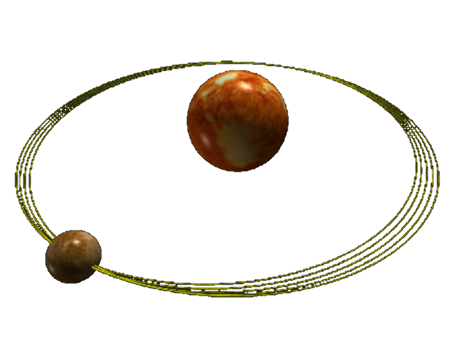



# Relativity

 

## Special relativity

 

<blockquote>
We should make things as simple as possible, but not simpler. &mdash; Albert Einstein
</blockquote> 

### Galilean transformations &amp; lightcone animation 

 

  <figure class="left_image">
    &nbsp;&nbsp;&nbsp;&nbsp;&nbsp;&nbsp;&nbsp;&nbsp;&nbsp;
    <figcaption>In Euclidean space-time, we use the classic Galilean transformation between 
    different inertial frames.</figcaption>
  </figure>
  <figure class="right_image">
    &nbsp;&nbsp;&nbsp;&nbsp;&nbsp;&nbsp;&nbsp;&nbsp;&nbsp;
    <figcaption>A three-dimensional lightcone is animated by simultaneously 
    sending off both a photon and a spaceship from the origin.</figcaption>
  </figure>

## General relativity

 

### Perihelion precession of Mercury&apos;s orbit

 

  <figure class="left_image">
    &nbsp;&nbsp;&nbsp;&nbsp;&nbsp;&nbsp;&nbsp;&nbsp;&nbsp;
    <figcaption>In Euclidean space-time, we use the classic Galilean transformation between 
    different inertial frames.</figcaption>
  </figure>
  <figure class="right_image">
    <!-- RESERVED FOR FUTURE APPLICATION 
      -->
  </figure>

