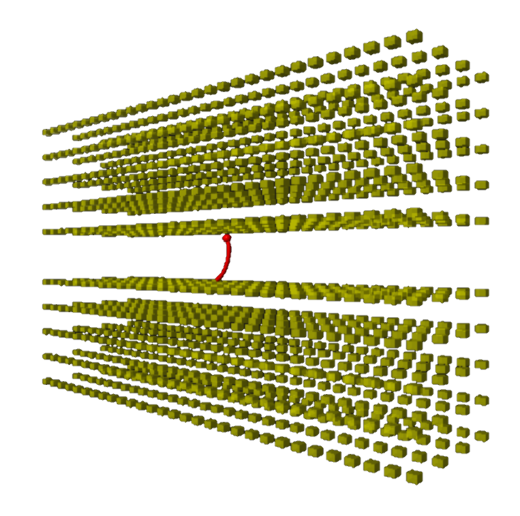
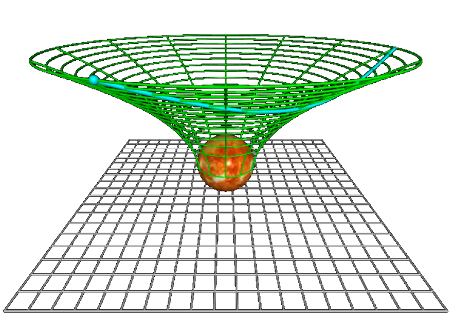



<blockquote>
The important thing is not to stop questioning. 
Curiosity has its own reason for existence. 
One cannot help but be in awe when he contemplates 
the mysteries of eternity, of life, of the marvelous 
structure of reality. It is enough if one tries 
merely to comprehend a little of this mystery 
each day. &mdash; <a href="https://en.wikipedia.org/wiki/Albert_Einstein">Albert Einstein</a>
</blockquote> 

# Special &amp; general relativity

 

If you want to learn about the special theory of relativity, check out the
[Special Relativity For Dummies: An Intuitive Introduction](https://profoundphysics.com/special-relativity-for-dummies-an-intuitive-introduction/).
On the same site, you will find that their 
[General Relativity For Dummies: An Intuitive Introduction](https://profoundphysics.com/general-relativity-for-dummies/)
is of an equally exceptional level of quality.

## Special relativity

 

<blockquote>
Henceforth space by itself, and time by itself,
are doomed to fade away into mere shadows,
and only a kind of union of the two will preserve an independent reality.
&mdash; <a href="https://en.wikipedia.org/wiki/Hermann_Minkowski">Hermann Minkowski.</a>
</blockquote> 

### Galilean transformations &amp; lightcone animation 

 

  <figure class="left_image">
    
    <figcaption>In Euclidean space-time, we use the classic Galilean transformation between 
    different inertial frames.</figcaption>
  </figure>
  <figure class="right_image">
    &nbsp;&nbsp;&nbsp;&nbsp;&nbsp;&nbsp;&nbsp;&nbsp;&nbsp;
    <figcaption>A three-dimensional lightcone is animated by simultaneously 
    sending off both a photon and a spaceship from the origin.</figcaption>
  </figure>

### Length contraction

 

  <figure class="left_image">
    
    <figcaption>Visualization of length contraction for a relativistic particle.</figcaption>
  </figure>
  <figure class="right_image">
    
    <figcaption>Observers in inertial frames equipped with photon clocks.</figcaption>
  </figure>

### Lorentz transformation of electromagnetic fields

 

  <figure class="left_image">
    
    <figcaption>Illustration of the 
    <a href="https://en.wikipedia.org/wiki/Lorentz_transformation">Lorentz transformation</a> 
    of a magnetic field around a wire.</figcaption>
  </figure>
  <figure class="right_image">
    <!-- RESERVER FOR FUTURE APPLICATION
      -->
  </figure>

## General relativity

 

<blockquote>
Since the mathematicians have invaded the theory of relativity,
I do not understand it myself anymore. &mdash; Albert Einstein
</blockquote> 

<figure style="float: center; text-align: center;">
    
</figure>

### Local space-time near Earth &amp; black hole ray tracing

 

  <figure class="left_image">
    
    <figcaption>Local space-time near Earth. This really is space-<em>time</em>, i.e.  
    the black lines represent a spatial coordinate, whereas the
    red lines the time axis!</figcaption>
  </figure>
  <figure class="right_image">
    
    <figcaption>Black hole image generated with ray tracing techniques, hence it 
    may take some time for the page to render!</figcaption>
  </figure>

### Spaghettification &amp; Mercury&apos;s perihelion precession

 

  <figure class="left_image">
    
    <figcaption>One of the <a href="https://en.wikipedia.org/wiki/Tests_of_general_relativity">three classic tests</a> 
    of general relativity: Mercury&apos;s perihelion precession.</figcaption>
  </figure>
  <figure class="right_image">
    
    <figcaption>A fictional astronaut, passing within a black hole's event horizon, is "stretched like spaghetti". 
    &mdash; <a href="https://en.wikipedia.org/wiki/Stephen_Hawking">Stephen Hawking</a>, from 
    <a href="https://en.wikipedia.org/wiki/A_Brief_History_of_Time">A Brief History of Time</a>. 
    </figcaption>
  </figure>

### Schwarzschild space-time

 

  <figure class="left_image">
    
    <figcaption>Visualization of a comet moving in Schwarzschild space-time.</figcaption>
  </figure>
  <figure class="right_image">
    <!-- RESERVED FOR FUTURE APPLICATION -->
  </figure>


