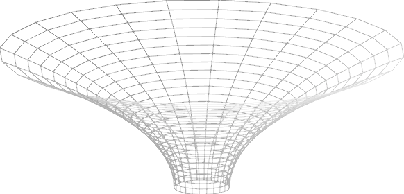



## A comet moving in Schwarzschild space-time
<div class="header_line"><br/></div>



<p style="clear: both;"></p>

### Visualization explained
<div style="border-top: 1px solid #999999"><br/></div>

The Schwarzschild metric describes a gravitational field of a non-rotating 
spherical mass (and without electric charge), see [Wikipedia](https://en.wikipedia.org/wiki/Schwarzschild_metric):

$ds^2=cd\tau^2=\left(1-\dfrac{r_s}{r}\right)c^2dt^2-\left(1-\dfrac{r_s}{r}\right)^{-1}dr^2-r^2d\Omega^2$

where

$d\Omega^2=\left(d\theta^2 + \sin^2\theta d\phi^2\right) \text{, } r_s=\dfrac{2GM}{c^2}$

and $G$ is Newton’s gravitational constant, $c$ the speed of light and $M$ is the 
mass of the non-rotating spherical object.

When we assume the time to be constant ($dt=0$), we get:

$ds^2 = \dfrac{dr^2}{1 - \dfrac{2GM}{c^2r}} +r^2d\phi^2$

Now, according to [Ryston&apos;s article](https://iopscience.iop.org/article/10.1088/1742-6596/1286/1/012049):

<blockquote>
<p>
In order to visualize the curvature in the 𝑟 direction, we embed this surface into
the three-dimensional Cartesian space (where 𝑟 and 𝜑 are identical to polar coordinates and the third,
vertical Cartesian coordinate 𝑧 is used to visualize the actual curvature – see figure 1 below). As a result, 
we get an equation for the 𝑧 coordinate as a function of 𝑟:</p>

<p>
$z(r)=\sqrt{\dfrac{8GMr}{c^2} - \dfrac{16m^2g^2}{c^4}}$
</p>

<p>Of course, this equation 𝑟 and 𝑧 are in meters, which is not very convenient for visualizing large
regions of space. For this reason, geometricized units where 𝑐 = 𝐺 = 1 are often used. Then we get the
simpler form:</p>

<p>
$z(r) = \sqrt{8Mr - 16M^2}$. 
</p>

<figure>

<figcaption><b>Figure 1:</b>The-exterior t=const equatorial plane of a Schwarzschild Black Hole.</figcaption>
</figure>
</blockquote>

<p style="clear:both;"></p>

This is the quintessential formula that is used in this visualization:

```python
class SchwarzschildSpaceTime:
    def __init__(self, mass, grid_y_offset=-10):
        self._mass = mass
        # ...
    
    # ...

    def z_as_function_of(self, r):
        return sqrt(8 * self._mass * r - 16 * self._mass * self._mass)


```
