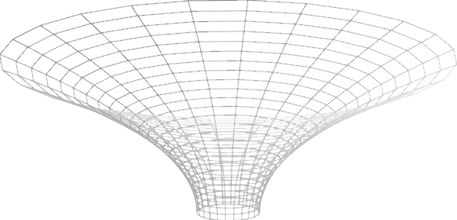
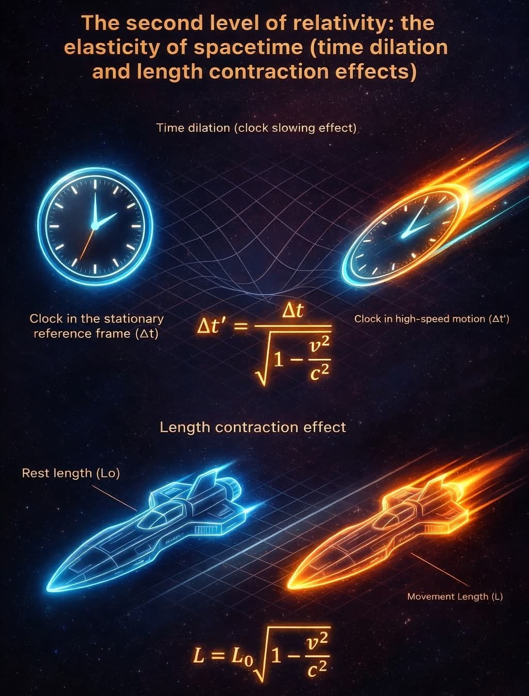
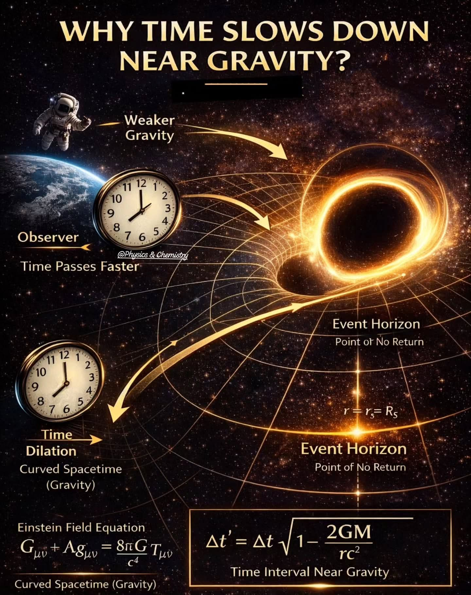



## A comet moving in Schwarzschild space-time
<div class="header_line"><br/></div>

[](https://github.com/zhendrikse/science/blob/main/relativity/schwarzschild_space_time.js)&nbsp;&nbsp;
[](https://en.wikipedia.org/wiki/JavaScript)&nbsp;&nbsp;
[](https://threejs.org/)&nbsp;&nbsp;

⭐ Original [idea and code](https://www.glowscript.org/#/user/Luinthoron/folder/English/program/embedding-diagram) by M. Ryston (Department of Physics Education)<br/>
👉 Described in [Interactive animations as a tool in teaching general relativity [...]](https://iopscience.iop.org/article/10.1088/1742-6596/1286/1/012049)<br/>
👉 The closer to the sun, the greater the difference between the Newtonian and relativistic trajectories

<div class="canvasWrapper" id="spaceTimeCanvasWrapper"  style="aspect-ratio: 3/2">
    <canvas id="spaceTimeCanvas" class="applicationCanvas" style="width: 800px; aspect-ratio: 3/2;"></canvas>
    <div class="overlayText" id="spaceTimeOverlayText">
        <span style="color: white">Click to start the animation!</span>
    </div>
</div>

<div class="buttonRow">
    <label for="gridButton">Grid: </label><input type="checkbox" checked id="gridButton"/>
    <label for="coneButton">Cone: </label><input type="checkbox" checked id="coneButton"/>
    <label for="orbitButton">Make orbit: </label><input type="checkbox" id="orbitButton"/>
</div>
<div class="buttonRow">
    <!--
    <label for="massSlider">Mass:&nbsp;</label>
    <input type="range" id="massSlider" min="0.001" max="0.1" step="0.001" value="0.025">
    -->
    <label for="distanceSlider">Distance:&nbsp;</label>
    <input type="range" id="distanceSlider" min="25.1" max="64" step=".1" value="33">
    <span id="distanceSliderValue">33</span>
</div>

<script type="module" src="./schwarzschild_space_time.js"></script>
<p style="clear: both;"></p>

- <span style="color: cyan">cyan</span> → geodetic motion on embedding surface
- <span style="color: red">cyan</span> → flat motion (Newtonian projected trail)
- <span style="color: orange">orange</span> → real motion (4D geodesic in Schwarzschild coordinates)

## Theoretical background
<div style="border-top: 1px solid #999999"><br/></div>

The Schwarzschild metric describes a gravitational field of a non-rotating 
spherical mass (and without electric charge), see [Wikipedia](https://en.wikipedia.org/wiki/Schwarzschild_metric):

$$\begin{equation}
ds^2=cd\tau^2=\left(1-\dfrac{r_s}{r}\right)c^2dt^2-\left(1-\dfrac{r_s}{r}\right)^{-1}dr^2-r^2d\Omega^2
\end{equation}$$

where

$$\begin{equation}
d\Omega^2=\left(d\theta^2 + \sin^2\theta d\phi^2\right) \text{, } r_s=\dfrac{2GM}{c^2}
\end{equation}$$

and $G$ is Newton’s gravitational constant, $c$ the speed of light and $M$ is the 
mass of the non-rotating spherical object.

When we assume the time to be constant ($dt=0$), we get:

$$\begin{equation}
ds^2 = \dfrac{dr^2}{1 - \dfrac{2GM}{c^2r}} +r^2d\phi^2
\end{equation}$$

Now, according to [Ryston&apos;s article](https://iopscience.iop.org/article/10.1088/1742-6596/1286/1/012049):

> In order to visualize the curvature in the 𝑟 direction, we embed this surface into
> the three-dimensional Cartesian space (where 𝑟 and 𝜑 are identical to polar coordinates and the third,
> vertical Cartesian coordinate 𝑧 is used to visualize the actual curvature – see figure 1 below). As a result, 
> we get an equation for the 𝑧 coordinate as a function of 𝑟:
> $$z(r)=\sqrt{\dfrac{8GMr}{c^2} - \dfrac{16M^2g^2}{c^4}}$$
> Of course, this equation 𝑟 and 𝑧 are in meters, which is not very convenient for visualizing large
> regions of space. For this reason, geometricized units where 𝑐 = 𝐺 = 1 are often used. Then we get the
> simpler form: $$z(r) = \sqrt{8Mr - 16M^2}$$

<figure>

<figcaption><b>Figure 1:</b>The exterior t=const equatorial plane of a Schwarzschild Black Hole from 
<a href="https://www.researchgate.net/publication/1977049_Spacetime_Embedding_Diagrams_for_Black_Holes">Spacetime Embedding Diagrams for Black Holes</a>.
</figcaption>
</figure>

<p style="clear:both;"></p>

This is the quintessential formula that is used in this visualization:

```js
class SchwarzschildSurface extends Group {
    static zAsFunctionOf = (r, M) => 
            Math.sqrt(Math.max(0, 8 * M * r - 16 * M * M));

    constructor(M) {
        super();
        this._mass = M;

        // Code
    }
}
```

### Circular orbit conditions
<div class="header_line"><br/></div>

A real circular orbit implies:

* $ r = \text{constant} $
* $ \dot r = 0 $
* $ \ddot r = 0 $

So:

* No radiale drift
* centripetal balance exact

We only need one equation: **radiale acceleration = 0**

The following equation is used:

$$\begin{equation}
\ddot r = -\frac{M}{r^3}(r-2M) {\dot t}^2 + \frac{M}{r(r-2M)} {\dot r}^2 + (r-2M) {\dot \phi}^2
\end{equation}$$

For a circular orbit we have $\dot r = 0$, so all terms with $\dot r$ vanish:

$$\begin{equation}
0 = -\frac{M}{r^3}(r-2M) {\dot t}^2 + (r-2M) {\dot \phi}^2
\end{equation}$$

Factor $(r-2M) \neq 0$:


$$\begin{equation}
0 = -\frac{M}{r^3} {\dot t}^2 + {\dot \phi}^2 \Rightarrow
\frac{M}{r^3} {\dot t}^2 = {\dot \phi}^2 \Rightarrow
\boxed{
  \dot\phi = \frac{\dot t}{r^{3/2}} \sqrt{M}
}
\end{equation}$$

In order to obtain $\dot t$, we note that in Schwarzschild we have the normalization:

$$\begin{equation}
-1 = -(1 - 2M/r) {\dot t}^2 + r^2 {\dot \phi}^2
\end{equation}$$

Substitution of $\dot \phi$ gives us:

$$\begin{equation}
-1 = -(1 - 2M/r) {\dot t}^2 + r^2 \frac{M}{r^3} {\dot t}^2 = -(1 - 2M/r) {\dot t}^2 + \frac{M}{r} {\dot t}^2
\end{equation}$$

Pulling ${\dot t}^2$ out of the brackets we get:

$$\begin{equation}
-1 = -{\dot t}^2 (1 - \frac{2M}{r} - \frac{M}{r} ) = -{\dot t}^2 (1 - \frac{3M}{r} ) 
\end{equation}$$

The solution for $\dot t$ is therefore:

$$\begin{equation}
\boxed{
\dot t = \frac{1}{\sqrt{1 - 3M/r}}
}
\end{equation}$$

As a consequence, for $\dot \phi$ we obtain:

$$\begin{equation}
\boxed{
\dot \phi =
\frac{\sqrt{M}}{r^{3/2} \sqrt{1 - 3M/r}}
}
\end{equation}$$

### Important result

A stable circular orbit only exists if $r > 3M$!

For:

* $ r = 3M $ → photon sphere (instable light orbit)
* $ r < 3M $ → no stable circular orbit possible

### In the code

```js 
const tDot = 1 / Math.sqrt(1 - 3 * sun.mass / r);
const rDot = 0;
const phiDot = Math.sqrt(sun.mass) / 
        (r ** 1.5 * Math.sqrt(1 - 3 * sun.mass / r));
```

## How gravity shapes the universe
<div class="header_line"><br/></div>

<div class="double_image">
<figure class="left_image">
  <a href="images/elasticity_of_spacetime.jpg">
    
  </a>
</figure>
<figure class="right_image">
  <a href="images/time_near_black_hole.jpg">
    
  </a>
</figure>
</div>

