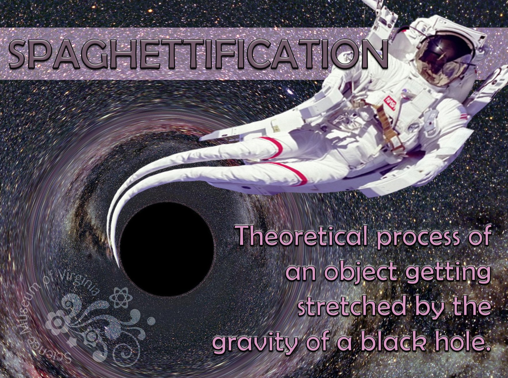



## Spaghettification 🍝

 

> In astrophysics, spaghettification (sometimes referred to as the noodle effect) 
is the vertical stretching and horizontal compression of objects into long thin shapes 
(rather like spaghetti) in a very strong, non-[homogeneous](https://en.wikipedia.org/wiki/Homogeneous)
[gravitational field](https://en.wikipedia.org/wiki/Gravitational_field). 
It is caused by extreme [tidal forces](https://en.wikipedia.org/wiki/Tidal_force). 
In the most extreme cases, near a [black hole](ttps://en.wikipedia.org/wiki/Black_hole), 
the stretching and compression are so powerful that no object can resist it. 
Within a small region, the horizontal compression balances the vertical stretching 
so that a small object being spaghettified experiences no net change in volume. &mdash; [Wikipedia](https://en.wikipedia.org/wiki/Spaghettification)

<canvas class="applicationCanvas" id="planetsCanvas" style="aspect-ratio: 19 / 12;"></canvas>

🔧 [spaghettification.js](https://github.com/zhendrikse/science/blob/main/relativity/spaghettification.js) refactored and ported to JavaScript by [Zeger Hendrikse](https://www.hendrikse.name/) 
👉 Based on [spaghettification.py](https://www.mso.anu.edu.au/pfrancis/simulations/spaghettification.py) by [Paul Francis](http://www.mso.anu.edu.au/pfrancis/simulations/) 

### Visualization by the Science Museum of Virginia

 



