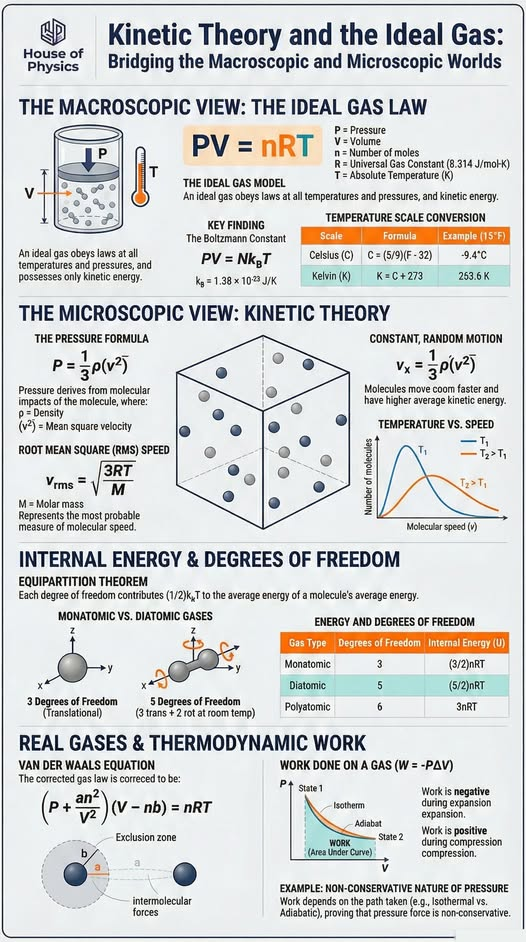



## Ideal gas velocity distribution

 

Theoretical and averaged speed distributions (meters/sec).
Initially all atoms have the same speed, but collisions
change the speeds of the colliding atoms. One of the atoms is
marked and leaves a trail so you can follow its path.
The theoretical probability function for the velocities in
a tiny volume $dV$ is given by the Maxwell-Boltzmann distribution

$f(\vec{v}) d^3\vec{v} = \bigg(\dfrac{m}{2\pi k_b T} \bigg)^{3/2} \exp \bigg (-\dfrac{mv^2}{2 k_b T} \bigg) d^3\vec{v}$

for a system containing a large number of identical non-interacting,
non-relativistic classical particles in thermodynamic equilibrium.



### Kinetic theory and the ideal gas

 

<figure style="text-align: center;">
  
  <figcaption>This excellent visual guide originates from 
    <a href="https://www.facebook.com/HouseOfPhysics/">House of Physics</a>.
  </figcaption>
</figure>



